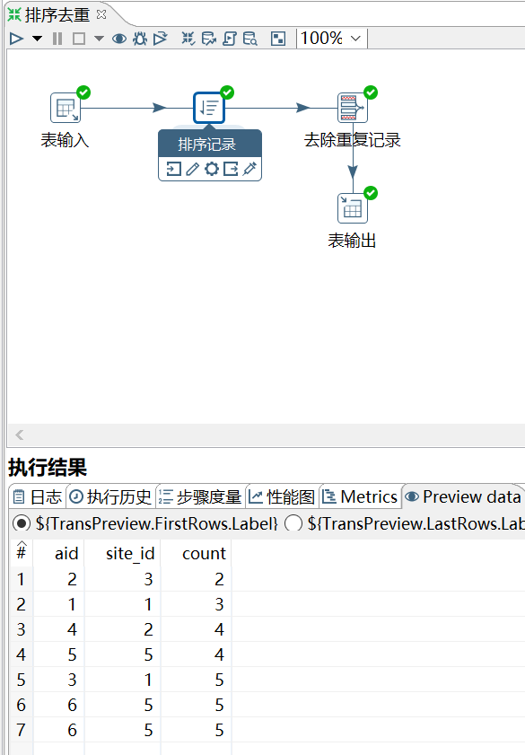
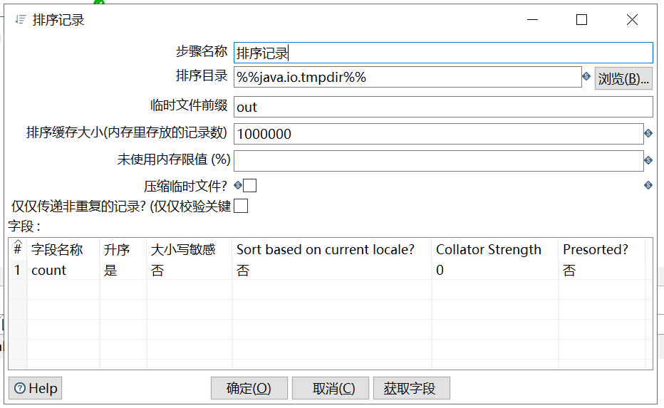
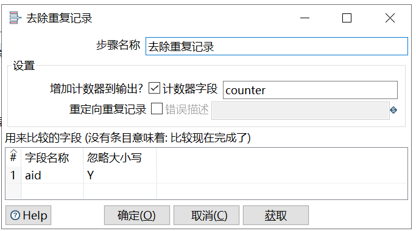

# 排序记录&去除重复记录

功能：

去除重复记录：去除数据流里面相同的数据行。但是此控件使用之前要求必须先对数
据进行排序。

排序记录：按照指定字段的升序或者降序对数据流进行排序。

因此排序记录+去除重复记录控件常常配合组队使用。

需求：对表 access_log_bk，按照 count 字段升序排序，并按照 aid 字段去重。

```sql
mysql> select * from access_log_bk;
+-----+---------+-------+------------+
| aid | site_id | count | date       |
+-----+---------+-------+------------+
|   1 |       1 |     3 | 2016-05-10 |
|   2 |       3 |     2 | 2016-05-13 |
|   3 |       1 |     5 | 2016-05-14 |
|   4 |       2 |     4 | 2016-05-14 |
|   5 |       5 |     4 | 2016-05-14 |
|   6 |       5 |     5 | 2016-05-12 |
|   6 |       5 |     5 | 2016-05-12 |
+-----+---------+-------+------------+
7 rows in set (0.00 sec)
```

操作过程：





`排序目录`：存放临时文件的目录，以备需要时使用；默认目录是系统的标准临时目录。

`排序缓存大小`：在内存中存储的行越多，排序过程就越快，因为必须使用的临时文件越少，生成的I/O也越少。

`未使用的内存阈值`：如果排序算法发现它的可用空闲内存少于指定的值，开始溢写磁盘。

`压缩临时文件`：当需要完成排序时，压缩临时文件。

`仅仅传递非重复的记录`：如果只想将唯一的行传递给输出流，则启用。



`重定向重复记录`：选择此选项将重复的行作为错误处理，并将它们重定向到步骤的错误流。如果不选择此选项，重复的行将被删除。

查看结果：

```sql
mysql> select * from access_log_bk2;
+------+---------+-------+---------+
| aid  | site_id | count | counter |
+------+---------+-------+---------+
|    2 |       3 |     2 |       1 |
|    1 |       1 |     3 |       1 |
|    4 |       2 |     4 |       1 |
|    5 |       5 |     4 |       1 |
|    3 |       1 |     5 |       1 |
|    6 |       5 |     5 |       2 |
+------+---------+-------+---------+
6 rows in set (0.00 sec)
```

【这里的counter记录的应该是每行数据的重复项数，如aid=6在原纪录中有两条，所以counter=2】