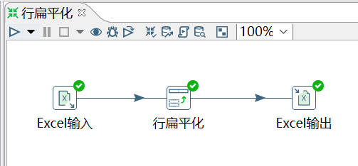
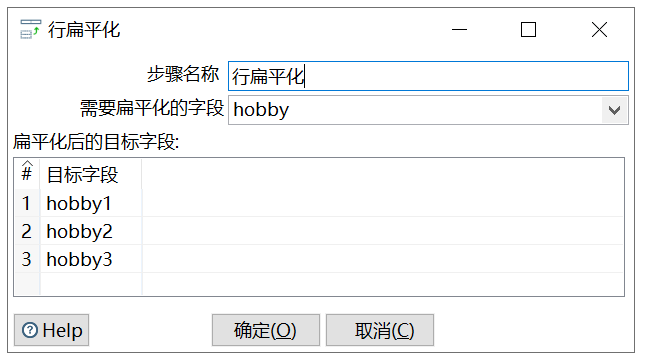

# 行扁平化

功能：把同一组的多行数据合并成为一行，可以理解为列拆分为多行的逆向操作。

注意：每个分组的数据条数要保证一致，否则数据会有错乱。

需求：将 09_行扁平化.xlsx 的数据按照 hobby 字段进行扁平化

输入：

	id	name	    age	  hobby
	1	zhangsan	20	  basketball
	1	zhangsan	20	  football
	1	zhangsan	20	  pingpang
	2	lisi	    25	  basketball
	2	lisi	    25	  football
	2	lisi	    25	  baseball
	3	wangwu	    24	  football
	3	wangwu	    24	  baseball
	3	wangwu	    24	  basketball

操作过程：

查看结果：

	id	name	    age	  hobby1	    hobby2	    hobby3
	1	zhangsan	20	  basketball	football	pingpang
	2	lisi	    25	  basketball	football	baseball
	3	wangwu	    24	  football	    baseball	basketball
