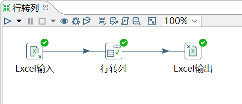

# 行转列

功能：把数据字段的字段名转换为一列，把数据行变为数据列。我们也可以简单理解为行转列控件是列转行控件的逆向操作。

需求：将 11_行转列.xlsx 用 excel 控件输入，然后行转列。

输入：

	姓名  周一  周二  周三  周四  周五  周六  周日
	张三	  8.0   9.0	 9.0   8.0	 8.0  0.0	0.0
	李四	  8.0	9.0	 9.0   8.0	 8.0  3.0	3.0

操作过程：

1． Key 字段：行转列，生成的列名字段名

2． 字段名称：原本数据流中的字段名

3． Key 值：Key 字段的值，这个是自己自定义的，一般都跟前面的字段名称一样

4． Value 字段：对应的 Key 值的数据列的列名

注意：转换前后的字段名称

查看输出：

	姓名	  星期	工作小时
	张三	  周一	8.0
	张三   周二	 9.0
	张三   周三	 9.0
	张三	  周四	8.0
	张三	  周五	8.0
	张三	  周六	0.0
	张三	  周日	0.0
	李四	  周一	8.0
	李四	  周二	9.0
	李四	  周三	9.0
	李四	  周四	8.0
	李四	  周五	8.0
	李四	  周六	3.0
	李四	  周日	3.0
