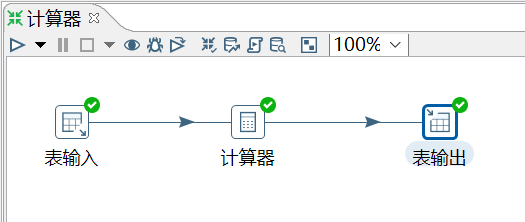
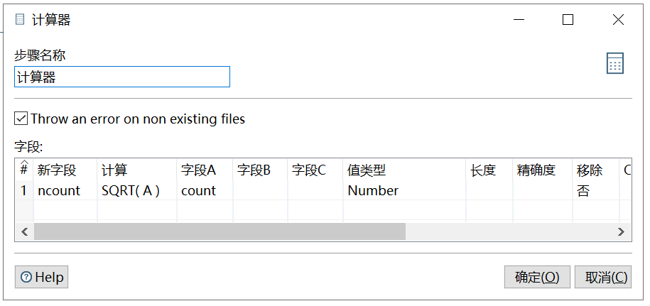

# 计算器

功能：使用一个函数集合来创建新的字段，还可以设置字段是否移除（临时字段）。

需求：对表 access_log_bk 的 count 字段求平方根。

```sql
mysql> select * from access_log_bk;
+-----+---------+-------+------------+
| aid | site_id | count | date       |
+-----+---------+-------+------------+
|   1 |       1 |     3 | 2016-05-10 |
|   2 |       3 |     2 | 2016-05-13 |
|   3 |       1 |     5 | 2016-05-14 |
|   4 |       2 |     4 | 2016-05-14 |
|   5 |       5 |     4 | 2016-05-14 |
|   6 |       5 |     5 | 2016-05-12 |
|   6 |       5 |     5 | 2016-05-12 |
+-----+---------+-------
```

操作过程：





查看结果：

```sql
mysql> select * from access_log_bk2;
+------+---------+-------+---------------------+--------+
| aid  | site_id | count | date                | ncount |
+------+---------+-------+---------------------+--------+
|    1 |       1 |     3 | 2016-05-10 00:00:00 |      2 |
|    2 |       3 |     2 | 2016-05-13 00:00:00 |      1 |
|    3 |       1 |     5 | 2016-05-14 00:00:00 |      2 |
|    4 |       2 |     4 | 2016-05-14 00:00:00 |      2 |
|    5 |       5 |     4 | 2016-05-14 00:00:00 |      2 |
|    6 |       5 |     5 | 2016-05-12 00:00:00 |      2 |
|    6 |       5 |     5 | 2016-05-12 00:00:00 |      2 |
+------+---------+-------+---------------------+--------+
7 rows in set (0.00 sec)
```
