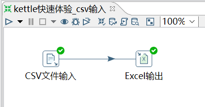
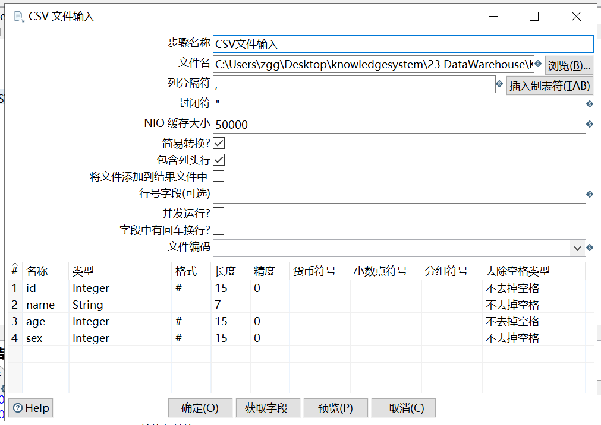

# CSV 文件输入

需求：将 01_kettle快速体验.csv 文件转换成 01_kettle快速体验.xls 文件

操作过程：

【"字段"可以使输出 Excel 中的值是'0'类型，而不是'0.0'类型。在上图中的"文件"、"内容"、"格式"和"字段"四个 tab 页中可以设置输出 Excel 表的具体属性。如，"格式"中设置输出字体大小和类型。】

① 步骤名称：可以修改，但是在同一个转换里面要保证唯一性，见名知意； 

② 文件名：选择对应的 csv 文件； 

③ 列分隔符：默认是逗号；

④ 封闭符：结束行数据的读写；

⑤ NIO 缓存大小：文件如果行数过多，需要调整此参数；

⑥ 包含列头行：意思是文件中第一行是字段名称行，表头不进行读写；

⑦ 行号字段：如果文件第一行不是字段名称或者需要从某行开始读写，可在此输入行号。

⑧ 并发运行？：选择并发，可提高读写速度；

⑨ 字段中有回车换行？：不要选择，会将换行符做数据读出；

⑩ 文件编码：如果预览数据出现乱码，可更换文件编码；