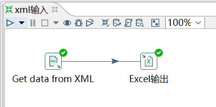
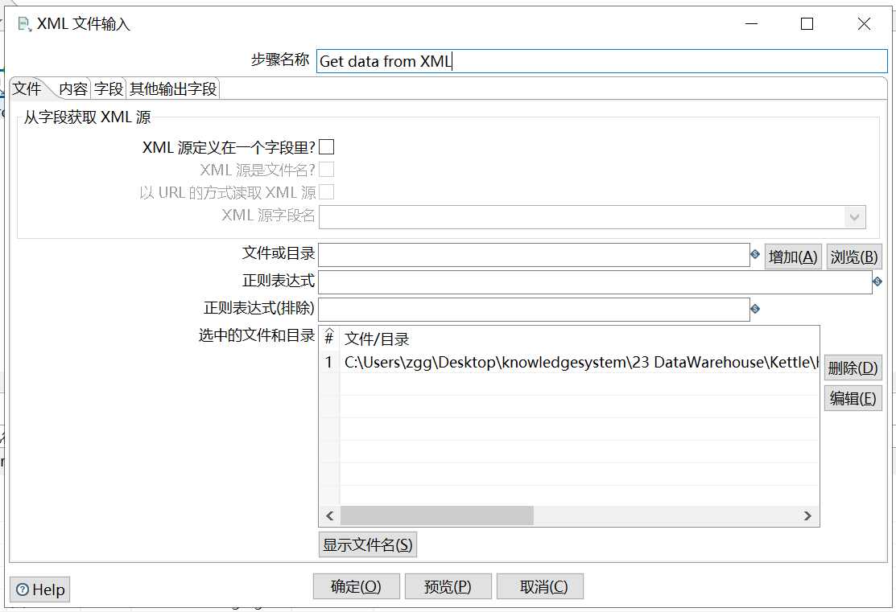
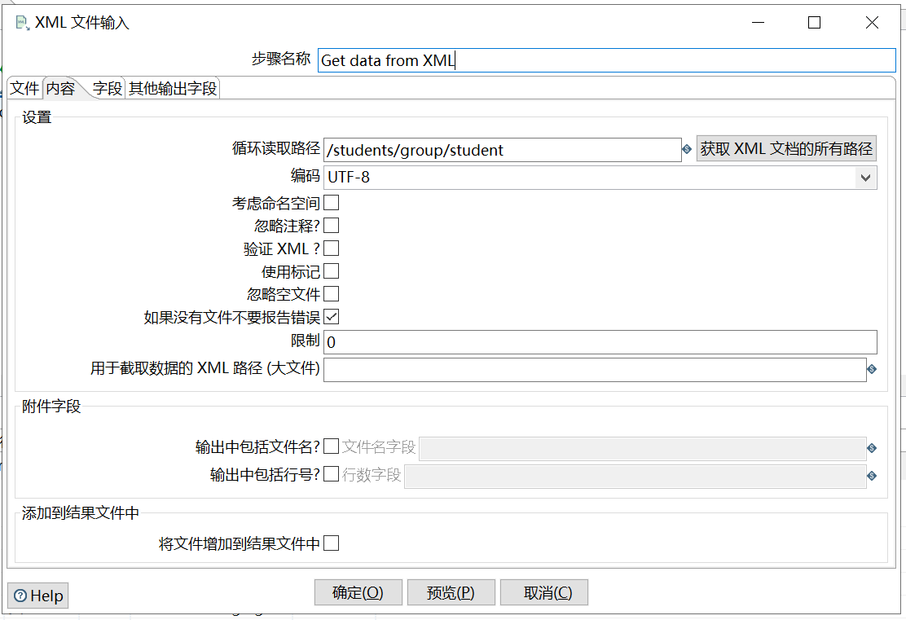
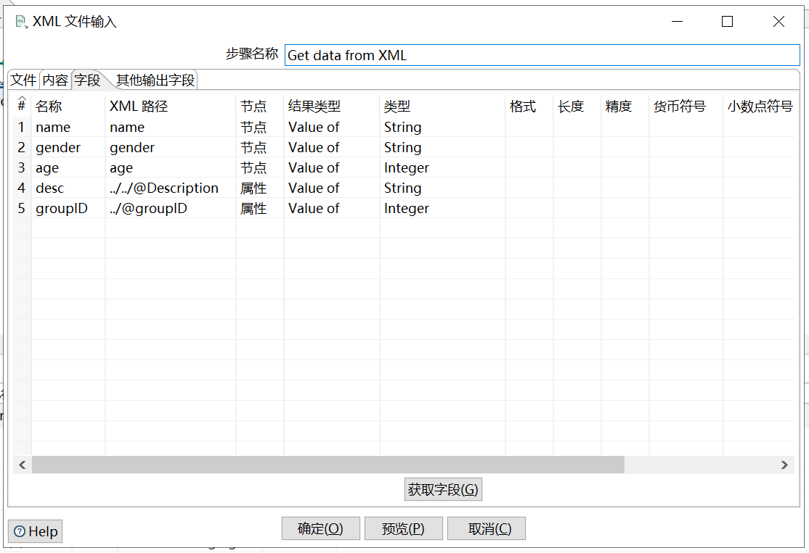

# XML 输入

需求：将 XML 文件的学生数据写到 excel 文件中

输入数据：

```xml
<?xml version="1.0" encoding="UTF-8"?>
<students Description="students of atguigu">
    <group groupID="1">
         <student>
            <name>孙悟空</name>
            <gender>男</gender>
            <age>500</age>
         </student>
         <student>
            <name>猪八戒</name>
            <gender>男</gender>
            <age>250</age>
         </student>
         <student>
            <name>沙和尚</name>
            <gender>男</gender>
            <age>150</age>
         </student>
    </group>
    <group groupID="2">
         <student>
            <name>武大郎</name>
            <gender>男</gender>
            <age>48</age>
         </student>
         <student>
            <name>潘金莲</name>
            <gender>女</gender>
            <age>18</age>
         </student>
    </group>
</students>  
```
操作过程：







`循环读取路径`：

对于我们在XML文件中找到的每一个“循环XPath”位置，我们将输出一行数据。

这是我们用来平坦XML文件的主要规范。可以使用“Get XPath nodes”按钮在XML文档中搜索可能的重复节点。

请注意，如果XML文档很大，这可能需要一些时间。



注意：xpath匹配规则。

查看结果：

	name	gender	age	  desc	             groupID
	孙悟空	 男	    500	students of atguigu	   1
	猪八戒	 男	    250	students of atguigu	   1
	沙和尚	 男	    150	students of atguigu	   1
	武大郎	 男	    48	students of atguigu	   2
	潘金莲	 女	    18	students of atguigu	   2
