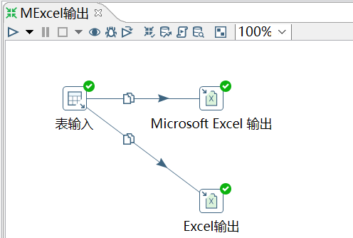

# Microsoft Excel 输出

Kettle 中自带了两个 Excel 输出，一个 Excel 输出，另一个是 Microsoft Excel 输出。

Excel 输出只能输出 xls 文件（适合 Excel2003），Microsoft Excel 输出可以输出 xls 和 xlsx 文
件（适合 Excel2007 及以后）

需求：使用表输入控件，将 access_log 表的数据，以复制的方式输出到 xls 和 xlsx 文件中

```sql
mysql> select * from access_log;
+-----+---------+-------+------------+
| aid | site_id | count | date       |
+-----+---------+-------+------------+
|   1 |       1 |     3 | 2016-05-10 |
|   2 |       3 |     2 | 2016-05-13 |
|   3 |       1 |     5 | 2016-05-14 |
|   4 |       2 |     4 | 2016-05-14 |
|   5 |       5 |     4 | 2016-05-14 |
|   6 |       5 |     5 | 2016-05-12 |
|   6 |       1 |     1 | 9999-12-12 |
|   6 |       5 |     5 | 2016-05-12 |
+-----+---------+-------+------------+
```

操作过程：



查看结果：

	aid	site_id	count
	 1	 1	      3
	 2	 3	      2
	 3	 1	      5
	 4	 2	      4
	 5	 5	      4
	 6	 5	      5
	 6	 1	      1
	 6	 5	      5
