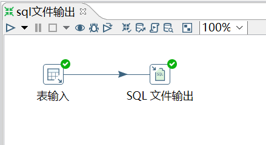
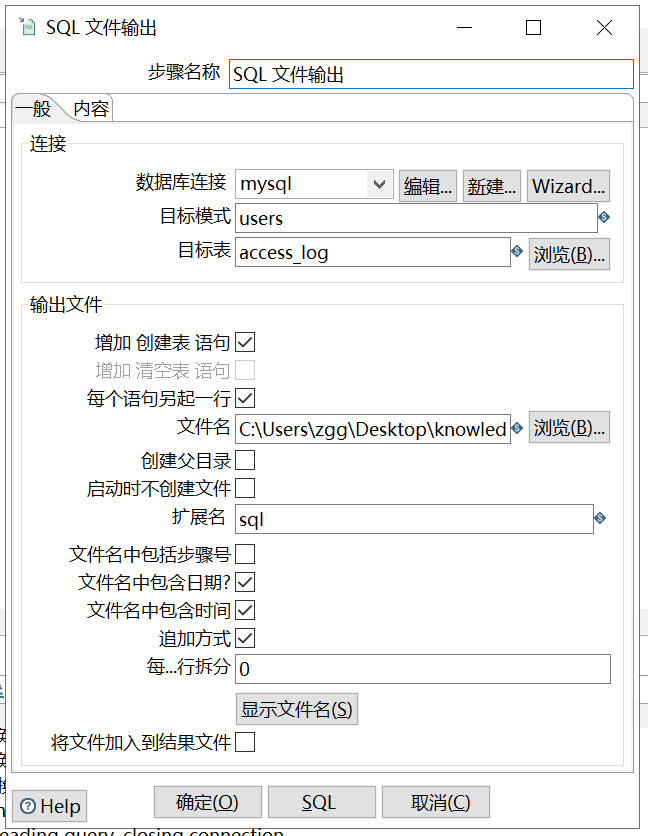

# SQL 文件输出

功能：一般跟表输入做连接，然后将数据库表的表结构和数据以 sql 文件的形式导出，然后做数据库备份的这么一个工作。

需求：将 access_log 表的表结构和数据利用 kettle 导出成 sql 文件备份

```sql
mysql> select * from access_log;
+-----+---------+-------+------------+
| aid | site_id | count | date       |
+-----+---------+-------+------------+
|   1 |       1 |     3 | 2016-05-10 |
|   2 |       3 |     2 | 2016-05-13 |
|   3 |       1 |     5 | 2016-05-14 |
|   4 |       2 |     4 | 2016-05-14 |
|   5 |       5 |     4 | 2016-05-14 |
|   6 |       5 |     5 | 2016-05-12 |
|   6 |       1 |     1 | 9999-12-12 |
|   6 |       5 |     5 | 2016-05-12 |
+-----+---------+-------+------------+
```

操作过程：






查看结果：

```sql
-- 文件名：09_sql文件输出_20210108_224821
CREATE TABLE users.access_log
(
  aid INTEGER
, site_id INTEGER
, count INTEGER
, date TIMESTAMP
)
;

INSERT INTO users.access_log(aid, site_id, count, date) VALUES (1,1,3,'2016-05-10');
INSERT INTO users.access_log(aid, site_id, count, date) VALUES (2,3,2,'2016-05-13');
INSERT INTO users.access_log(aid, site_id, count, date) VALUES (3,1,5,'2016-05-14');
INSERT INTO users.access_log(aid, site_id, count, date) VALUES (4,2,4,'2016-05-14');
INSERT INTO users.access_log(aid, site_id, count, date) VALUES (5,5,4,'2016-05-14');
INSERT INTO users.access_log(aid, site_id, count, date) VALUES (6,5,5,'2016-05-12');
INSERT INTO users.access_log(aid, site_id, count, date) VALUES (6,1,1,'9999-12-12');
INSERT INTO users.access_log(aid, site_id, count, date) VALUES (6,5,5,'2016-05-12');

```