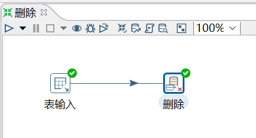
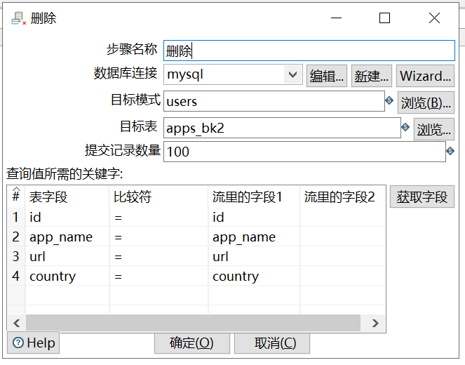

# 删除

功能：删除数据库表中指定条件的数据。

企业里一般用此控件做数据库表数据删除或者跟另外一个表数据做对比，然后进行去重的操作。

需求：删除 apps_bk2 表格中 apps_bk 表里面已有的数据（按照 apps_bk 表对 apps_bk2 表数据进行去重）

来自 apps_bk 表的数据流到 apps_bk2 表，判断是不是数据在 apps_bk2 表已存在，是的话，就删除。

```sql
mysql> select * from apps_bk;
+------+-------------+--------------------------+---------+
| id   | app_name    | url                      | country |
+------+-------------+--------------------------+---------+
|    1 | QQ APP      | http://im.qq.com/        | CN      |
|    2 | 微博 APP    | http://weibo.com/        | CN      |
|    3 | 淘宝 APP    | https://www.taobao.com/  | CN      |
|    4 | meituan APP | http://www.meituan.com   | CN      |
|    5 | facebook    | http://www.facebook.com/ | USA     |
+------+-------------+--------------------------+---------+

mysql> select * from apps_bk2;
+------+-------------+--------------------------+---------+
| id   | app_name    | url                      | country |
+------+-------------+--------------------------+---------+
|    1 | QQ APP      | http://im.qq.com/        | CN      |
|    2 | 微博 APP    | http://weibo.com/        | CN      |
|    3 | 淘宝 APP    | https://www.taobao.com/  | CN      |
|    4 | meituan APP | http://www.meituan.com   | CN      |
|    5 | facebook    | http://www.facebook.com/ | USA     |
+------+-------------+--------------------------+---------+
```

操作过程：






查看结果：

```sql
mysql> select * from apps_bk2;
Empty set (0.00 sec)

```