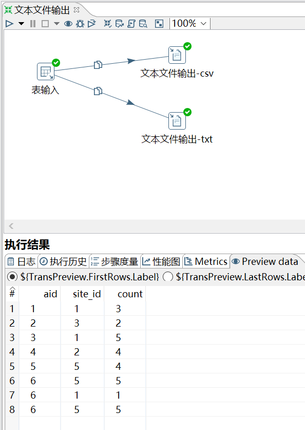

# 文本文件输出

功能：将数据输出成文本

需求：将 access_log 表的数据复制两份，导出成 txt 和 csv 文件

```sql
mysql> select * from access_log;
+-----+---------+-------+------------+
| aid | site_id | count | date       |
+-----+---------+-------+------------+
|   1 |       1 |     3 | 2016-05-10 |
|   2 |       3 |     2 | 2016-05-13 |
|   3 |       1 |     5 | 2016-05-14 |
|   4 |       2 |     4 | 2016-05-14 |
|   5 |       5 |     4 | 2016-05-14 |
|   6 |       5 |     5 | 2016-05-12 |
|   6 |       1 |     1 | 9999-12-12 |
|   6 |       5 |     5 | 2016-05-12 |
+-----+---------+-------+------------+
```

操作过程：



注意：分隔符