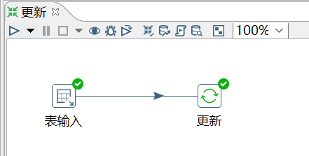
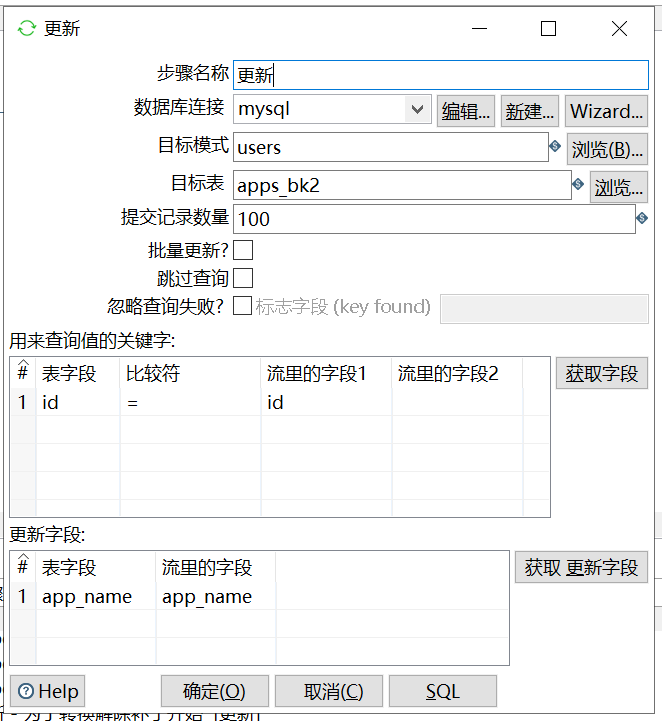
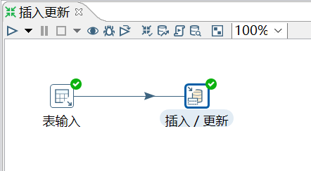
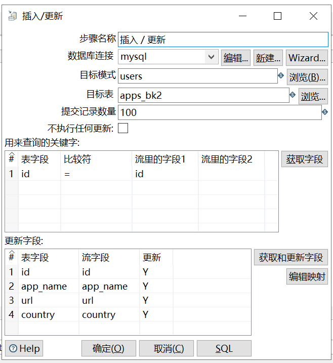

# 更新&插入/更新

更新和插入/更新: kettle 提供的将数据库已经存在的记录与数据流里面的记录进行对比的控件。

企业级 ETL 经常会用到这两个控件来进行数据库更新的操作。

两者区别：

- 更新是将数据库表中的数据和数据流中的数据做对比，如果不同就更新，如果数据流中的数据比数据库表中的数据多，那么就报错。

- 插入/更新的功能和更新一样，只不过优化了数据不存在就插入的功能，因此企业里更多的也是使用插入/更新。

需求1：使用表 apps_bk 的数据更新表 apps_bk2

```sql
mysql> select * from apps_bk;
+------+-------------+-------------------------+---------+
| id   | app_name    | url                     | country |
+------+-------------+-------------------------+---------+
|    1 | QQ APP      | http://im.qq.com/       | CN      |
|    2 | 微博 APP    | http://weibo.com/       | CN      |
|    3 | 淘宝 APP    | https://www.taobao.com/ | CN      |
|    4 | meituan APP | http://www.meituan.com  | CN      |
+------+-------------+-------------------------+---------+

-- meituan APP  修改成了  mtuan APP
mysql> select * from apps_bk2;
+------+------------+-------------------------+---------+
| id   | app_name   | url                     | country |
+------+------------+-------------------------+---------+
|    1 | QQ APP     | http://im.qq.com/       | CN      |
|    2 | 微博 APP   | http://weibo.com/       | CN      |
|    3 | 淘宝 APP   | https://www.taobao.com/ | CN      |
|    4 | mtuan APP  | http://www.meituan.com  | CN      |
+------+------------+-------------------------+---------+
```

操作过程：





注意：哪个是表中字段(apps_bk2)，哪个是流中字段(apps_bk)

查看结果：

```sql
mysql> select * from apps_bk2;
+------+-------------+-------------------------+---------+
| id   | app_name    | url                     | country |
+------+-------------+-------------------------+---------+
|    1 | QQ APP      | http://im.qq.com/       | CN      |
|    2 | 微博 APP    | http://weibo.com/       | CN      |
|    3 | 淘宝 APP    | https://www.taobao.com/ | CN      |
|    4 | meituan APP | http://www.meituan.com  | CN      |
+------+-------------+-------------------------+---------+
```

需求2：使用表 apps_bk 的数据更新表 apps_bk2

```sql
-- apps_bk添加一行
mysql> select * from apps_bk;
+------+-------------+--------------------------+---------+
| id   | app_name    | url                      | country |
+------+-------------+--------------------------+---------+
|    1 | QQ APP      | http://im.qq.com/        | CN      |
|    2 | 微博 APP    | http://weibo.com/        | CN      |
|    3 | 淘宝 APP    | https://www.taobao.com/  | CN      |
|    4 | meituan APP | http://www.meituan.com   | CN      |
|    5 | facebook    | http://www.facebook.com/ | USA     |
+------+-------------+--------------------------+---------+
```

操作过程：






查看结果：

```sql
mysql> select * from apps_bk2;
+------+-------------+--------------------------+---------+
| id   | app_name    | url                      | country |
+------+-------------+--------------------------+---------+
|    1 | QQ APP      | http://im.qq.com/        | CN      |
|    2 | 微博 APP    | http://weibo.com/        | CN      |
|    3 | 淘宝 APP    | https://www.taobao.com/  | CN      |
|    4 | meituan APP | http://www.meituan.com   | CN      |
|    5 | facebook    | http://www.facebook.com/ | USA     |
+------+-------------+--------------------------+---------+
```