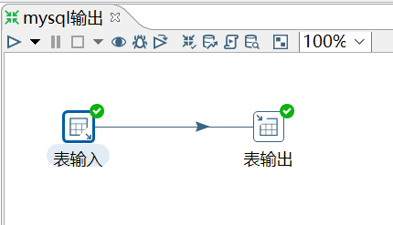
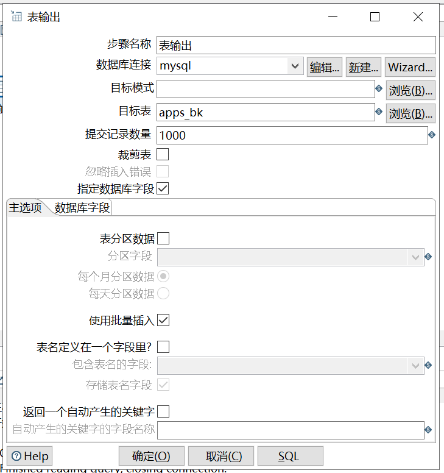
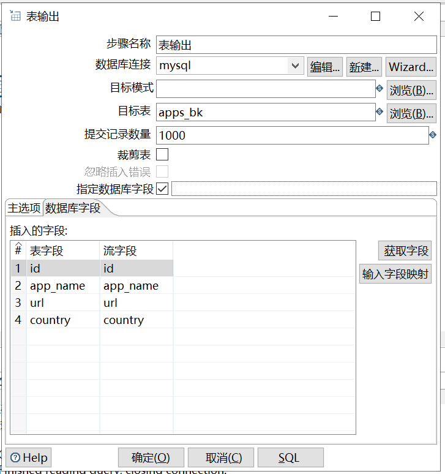

# 表输出

功能：将 kettle 数据行中的数据直接写入到数据库中的表中。

需求：将 student 表的数据导入到 student2 表中，要求利用 kettle 现场创建 student2 表

```sql
mysql> select * from apps;
+----+-------------+-------------------------+---------+
| id | app_name    | url                     | country |
+----+-------------+-------------------------+---------+
|  1 | QQ APP      | http://im.qq.com/       | CN      |
|  2 | 微博 APP    | http://weibo.com/       | CN      |
|  3 | 淘宝 APP    | https://www.taobao.com/ | CN      |
|  4 | meituan APP | http://www.meituan.com  | CN      |
+----+-------------+-------------------------+---------+
```

操作过程：







`数据库字段`：指定输出表的字段。

查看结果：

```sql
mysql> select * from apps_bk;
+------+-------------+-------------------------+---------+
| id   | app_name    | url                     | country |
+------+-------------+-------------------------+---------+
|    1 | QQ APP      | http://im.qq.com/       | CN      |
|    2 | 微博 APP    | http://weibo.com/       | CN      |
|    3 | 淘宝 APP    | https://www.taobao.com/ | CN      |
|    4 | meituan APP | http://www.meituan.com  | CN      |
+------+-------------+-------------------------+---------+
```