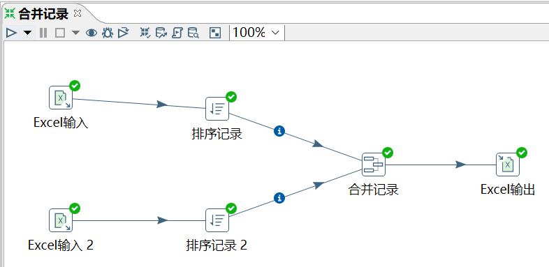
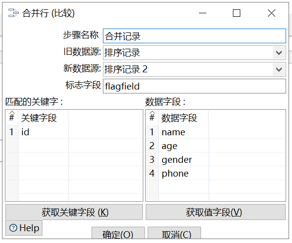
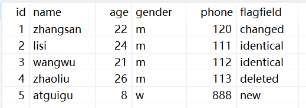

# 合并记录

功能：将两个不同来源的数据合并，这两个来源的数据分别为旧数据和新数据，该步骤将旧数据和新数据按照指定的关键字匹配、比较、合并。

注意：旧数据和新数据需要事先按照关键字段排序，并且旧数据和新数据要有相同的字段名称。

合并后的数据将包括旧数据来源和新数据来源里的所有数据，对于变化的数据，使用新数据代替旧数据，同时在结果里用一个标示字段，来指定新旧数据的比较结果。

标志字段：设置标志字段的名称，标志字段用于保存比较的结果，比较结果有下列几种：

- ① “identical” – 旧数据和新数据一样
- ② “changed” – 数据发生了变化
- ③ “new” – 新数据中有而旧数据中没有的记录
- ④ “deleted” –旧数据中有而新数据中没有的记录

需求：比较合并新旧 excel 的数据，并预览数据，查看标志字段的内容。

旧数据源：

新数据源：

操作过程：

`匹配的关键字`是定位判断两个数据源中的同一条记录的字段

`数据字段`是要比较的字段

结果查看：

