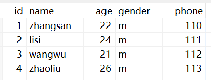
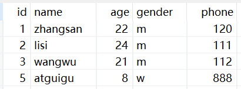
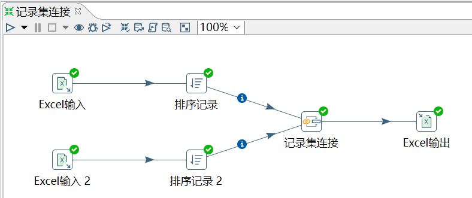
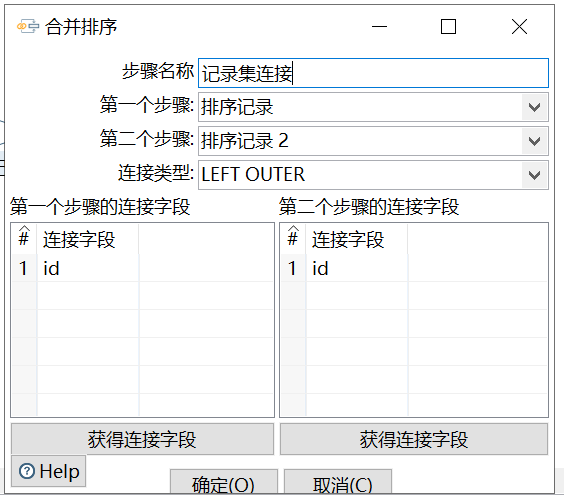
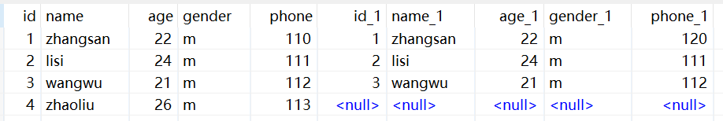

# 记录集连接

功能：对两个步骤中的数据流进行左连接、右连接、内连接、外连接。

注意：在进行记录集连接之前，需要对记录集的数据进行排序，并且排序的字段还一定要选两个表关联的字段，否则数据错乱，出现 null 值

需求：以旧 excel 为主表，左连接新 excel，以 id 为连接字段。

旧数据源：

新数据源：

操作过程：

`第一个步骤`是主表。

`连接字段`是前面排序的字段。

结果查看：

