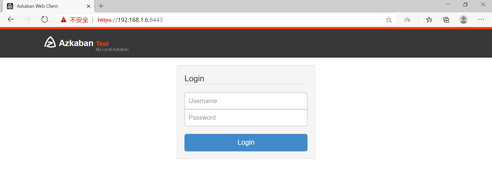
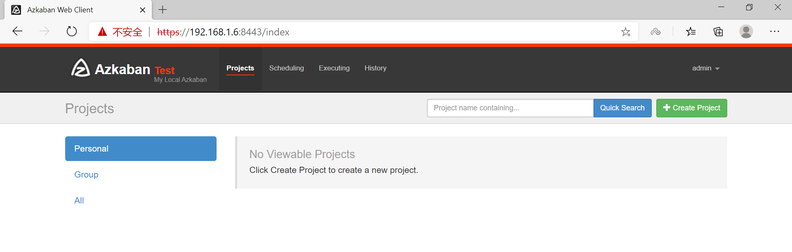

# 环境搭建：单机

[TOC]

## 1、安装

下载、解压、重命名

	azkaban-web-server-2.5.0.tar.gz
	azkaban-executor-server-2.5.0.tar.gz
	azkaban-sql-script-2.5.0.tar.gz

其中，azkaban-web-server-2.5.0.tar.gz是服务器，azkaban-executor-server-2.5.0.tar.gz是执行服务器，azkaban-sql-script-2.5.0.tar.gz是执行的sql脚本。

```sh
[root@zgg azkaban]# ls
azkaban-executor-2.5.0  azkaban-sql-2.5.0  azkaban-web-2.5.0
```

## 2、mysql创建表

分别把他们解压安装后。我们还需要在mysql中创建数据库，然后运行azkaban提供的sql脚本来创建azkaban所需要的表。

```sh
MariaDB [(none)]> create database azkaban;
Query OK, 1 row affected (0.00 sec)

MariaDB [(none)]> grant all on root.* to 'root'@'%' identified by 'root';
Query OK, 0 rows affected (0.00 sec)

MariaDB [(none)]> flush privileges;
Query OK, 0 rows affected (0.00 sec)

MariaDB [(none)]> use azkaban;
Database changed

MariaDB [(none)]> show databases;
+--------------------+
| Database           |
+--------------------+
| information_schema |
| azkaban            |
| hive               |
| mysql              |
| performance_schema |
| test               |
+--------------------+
6 rows in set (0.00 sec)

MariaDB [azkaban]> source /opt/azkaban-sql-2.5.0/create-all-sql-2.5.0.sql ;
Query OK, 0 rows affected (0.00 sec)
...


```

## 3、创建SSL配置

	keytool -keystore keystore -alias jetty -genkey -keyalg RSA     (设置，并记住密码)

	tzselect   使用交互式命令设置时区(Asia/Shanghai, 选北京就是上海)

	cp keystore /opt/azkaban/azkaban-web-2.5.0   将当前目录生成 keystore证书文件拷贝到web服务器根目录中

	cp /usr/share/zoneinfo/Asia/Shanghai /etc/localtime   拷贝该时区文件，覆盖系统本地时区配置

```sh
[root@zgg opt]# keytool -keystore keystore -alias jetty -genkey -keyalg RSA
输入密钥库口令:  
再次输入新口令: 
您的名字与姓氏是什么?
  [Unknown]:  a
您的组织单位名称是什么?
  [Unknown]:  a
您的组织名称是什么?
  [Unknown]:  a
您所在的城市或区域名称是什么?
  [Unknown]:  a
您所在的省/市/自治区名称是什么?
  [Unknown]:  a
该单位的双字母国家/地区代码是什么?
  [Unknown]:  a
CN=a, OU=a, O=a, L=a, ST=a, C=a是否正确?
  [否]:  y

输入 <jetty> 的密钥口令
        (如果和密钥库口令相同, 按回车):  
再次输入新口令: 

Warning:
JKS 密钥库使用专用格式。建议使用 "keytool -importkeystore -srckeystore keystore -destkeystore keystore -deststoretype pkcs12" 迁移到行业标准格式 PKCS12。
[root@zgg opt]# tzselect   
Please identify a location so that time zone rules can be set correctly.
Please select a continent or ocean.
 1) Africa
 2) Americas
 3) Antarctica
 4) Arctic Ocean
 5) Asia
 6) Atlantic Ocean
 7) Australia
 8) Europe
 9) Indian Ocean
10) Pacific Ocean
11) none - I want to specify the time zone using the Posix TZ format.
....
```
## 4、azkaban web服务器配置及用户配置, 进入web服务器安装目录conf

web服务器配置如下:

	vi azkaban.properties

	#Azkaban Personalization Settings
	azkaban.name=Test
	azkaban.label=My Local Azkaban
	azkaban.color=#FF3601
	azkaban.default.servlet.path=/index
	web.resource.dir=web/
	default.timezone.id=Asia/Shanghai

	#Azkaban UserManager class
	user.manager.class=azkaban.user.XmlUserManager
	user.manager.xml.file=conf/azkaban-users.xml

	#Loader for projects
	executor.global.properties=conf/global.properties
	azkaban.project.dir=projects

	database.type=mysql
	mysql.port=3306
	mysql.host=192.168.1.6
	mysql.database=azkaban
	mysql.user=root
	mysql.password=root
	mysql.numconnections=100

	# Velocity dev mode
	velocity.dev.mode=false

	# Azkaban Jetty server properties.
	jetty.maxThreads=25
	jetty.ssl.port=8443
	jetty.port=8081
	jetty.keystore=keystore
	# 之前设置的密码
	jetty.password=azkaban   
	jetty.keypassword=azkaban
	jetty.truststore=keystore
	jetty.trustpassword=azkaban

	# Azkaban Executor settings
	executor.port=12321

	# mail settings
	# 发送邮箱
	mail.sender=
	#发送邮箱smtp地址
	mail.host=
	# 任务失败时发送邮件的地址
	job.failure.email=
	# 任务成功时发送邮件的地址
	job.success.email=

	lockdown.create.projects=false

	cache.directory=cache

用户配置如下:

	vi azkaban-users.xml

	<azkaban-users>
        <user username="azkaban" password="azkaban" roles="admin" groups="azkaban" />
        <user username="metrics" password="metrics" roles="metrics"/>

 		<!-- 新增一行：设置登录 https://ip:8443的账号和密码 -->
        <user username="admin" password="admin" roles="admin,metrics"/>
        <role name="admin" permissions="ADMIN" />
        <role name="metrics" permissions="METRICS"/>
	</azkaban-users>

## 5、azkaban executor服务器配置, 进入执行服务器安装目录conf

	vi azkaban.properties

	#Azkaban
	default.timezone.id=Asia/Shanghai

	# Azkaban JobTypes Plugins
	azkaban.jobtype.plugin.dir=plugins/jobtypes

	#Loader for projects
	executor.global.properties=conf/global.properties
	azkaban.project.dir=projects

	database.type=mysql
	mysql.port=3306
	mysql.host=192.168.1.6
	mysql.database=azkaban
	mysql.user=root
	mysql.password=root
	mysql.numconnections=100

	# Azkaban Executor settings
	executor.maxThreads=50
	executor.port=12321
	executor.flow.threads=30

## 6、启动各个服务器

azkaban web服务器的启动与关闭, 注意: 只能在web服务器根目录运行

	bin/azkaban-web-start.sh

	bin/azkaban-web-shutdown.sh

azkaban executor服务器的启动与关闭, 注意: 只能在执行服务器根目录运行

	bin/azkaban-executor-start.sh

	bin/azkaban-executor-shutdown.sh

## 7、登录Web用户界面

ip:8843

账号密码是前面在xml文件里添加的一行，即admin





## 8、出现的问题

	java.sql.SQLException: Access denied for user 'root'@'zgg' (using password: YES) --> 登陆mysql，然后授予权限，再刷新权限 (前面授予权限时，用户设置错了)

	MariaDB [azkaban]> GRANT ALL ON root.* to 'root'@'zgg' IDENTIFIED BY 'root';
	Query OK, 0 rows affected (0.00 sec)

	MariaDB [mysql]> flush privileges;
	Query OK, 0 rows affected (0.00 sec)

	-----------------------------------------------------------------------------------

	javax.net.ssl.SSLException: Unrecognized SSL message, plaintext connection? --> 使用 https://ip:8443 访问，出现警告选择 高级-继续访问

	-----------------------------------------------------------------------------------

	java.io.FileNotFoundException: conf/global.properties (没有那个文件或目录) --> 修改为绝对路径


[环境搭建参考](https://www.jianshu.com/p/8a46f2ecafa6)


