# 简单应用

[TOC]

## 1、command类型：单一job示例

	vim command.job

	# command.job
	type=command
	command=echo 'hello'

压缩成 command.zip

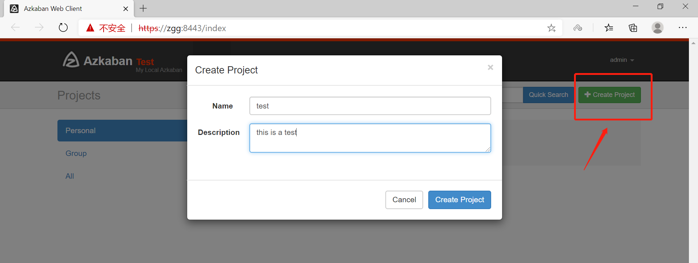

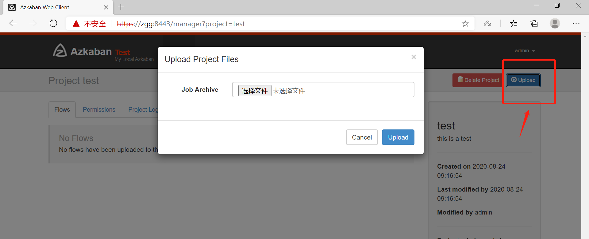

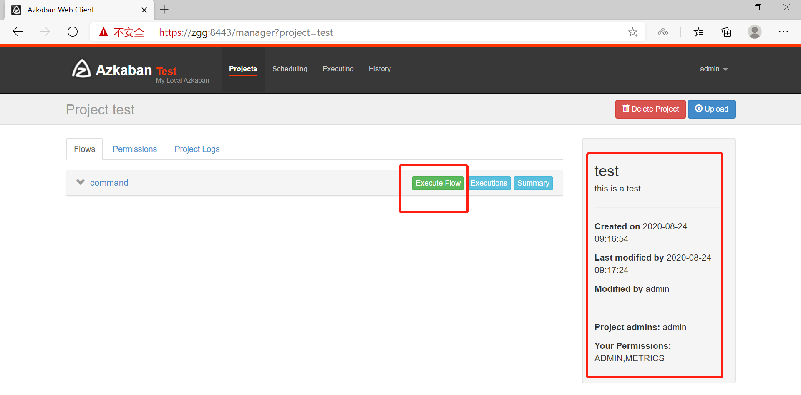

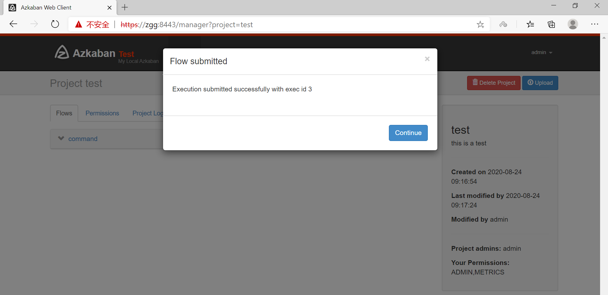

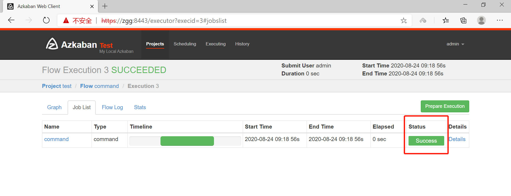

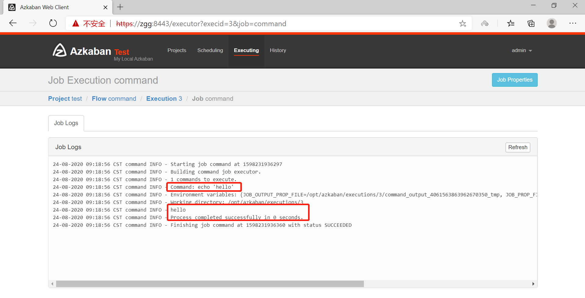

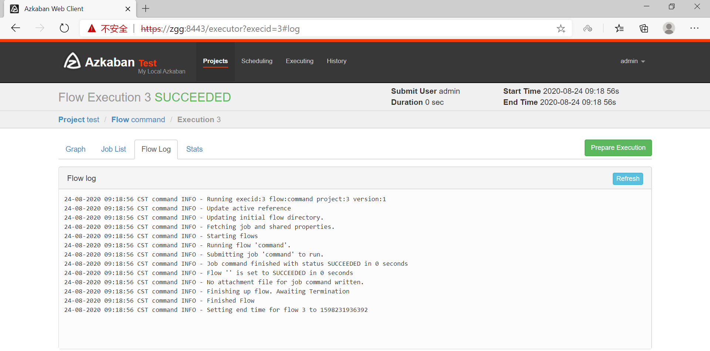

## 2、command类型：多job工作流

创建有依赖关系的多个job描述

第一个job：foo.job

	# foo.job
	type=command
	command=echo 'foo'

第二个job：bar.job依赖foo.job

	# bar.job

	type=command
	dependencies=foo
	command=echo 'bar'

将所有job资源文件打到一个zip包中

上传zip包并启动

查看

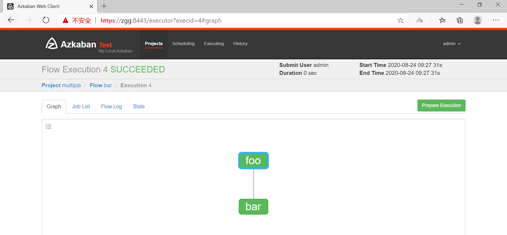

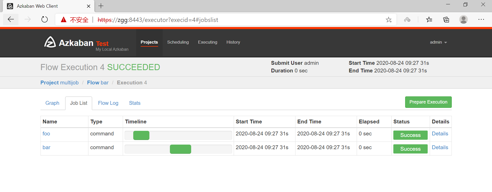

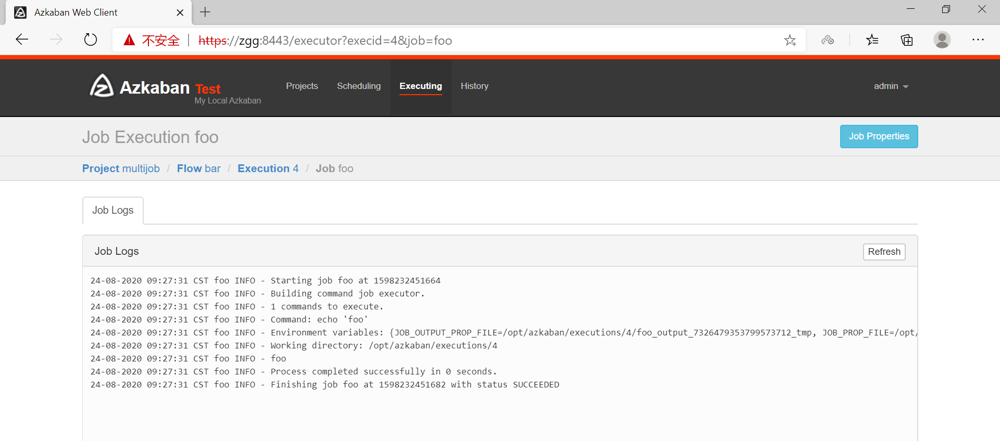

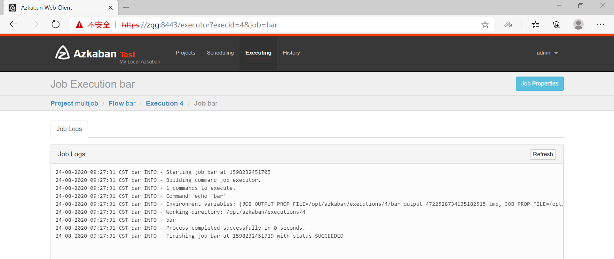

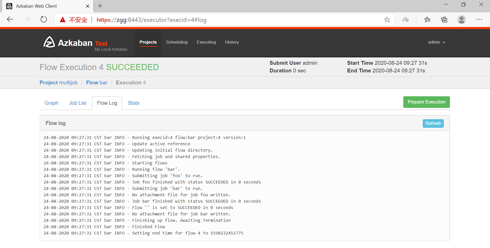

## 3、command类型：操作hadoop

	vi mapreduce_wordcount.job

	# mapreduce_wordcount.job

	type=command
	dependencies=mapreduce_pi

	command=/opt/hadoop-2.7.3/bin/hadoop jar  /opt/hadoop-2.7.3/share/hadoop/mapreduce/hadoop-mapreduce-examples-2.7.3.jar wordcount /in/wc.txt /out/wc_az

	--------------------------------------------------------------------

	vi mapreduce_pi.job

	# mapreduce_pi.job

	type=command

	command=/opt/hadoop-2.7.3/bin/hadoop jar  /opt/hadoop-2.7.3/share/hadoop/mapreduce/hadoop-mapreduce-examples-2.7.3.jar pi 5 5

打包成zip上传

启动job并查看

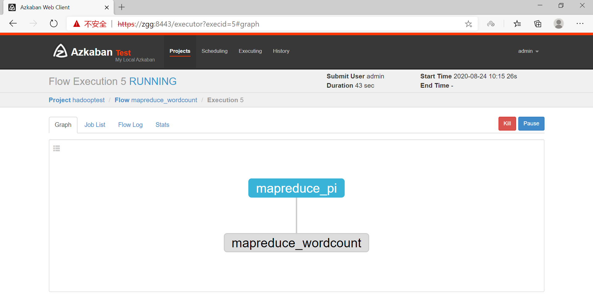

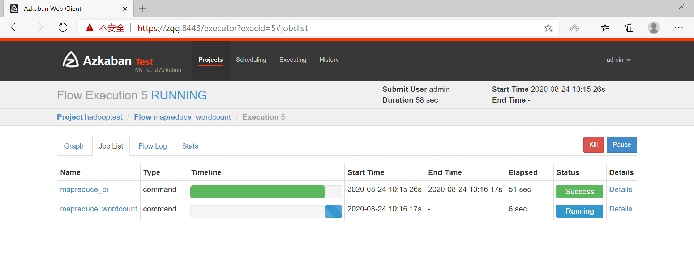

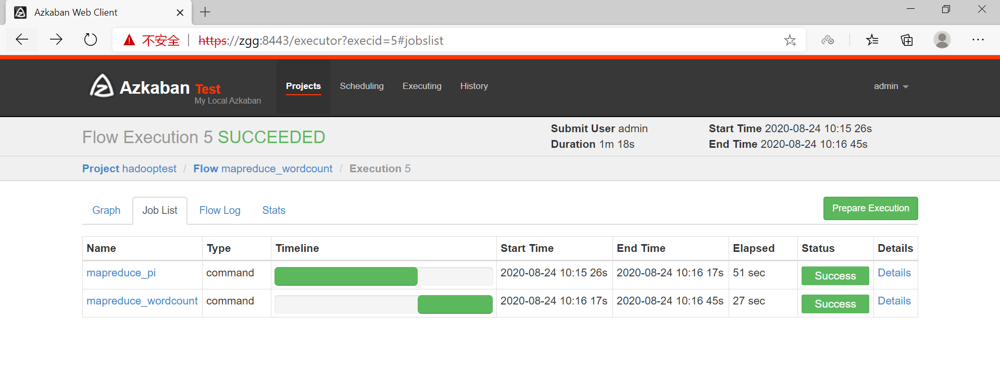

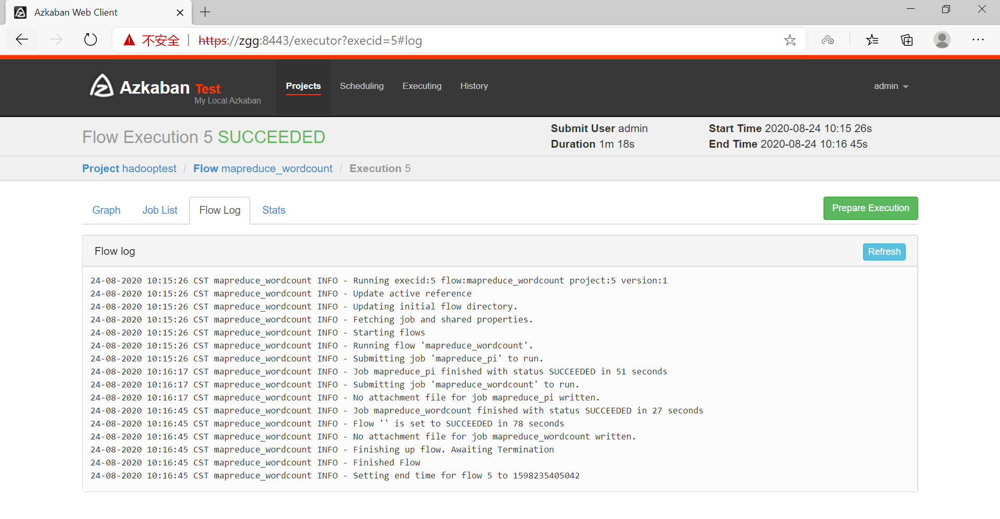

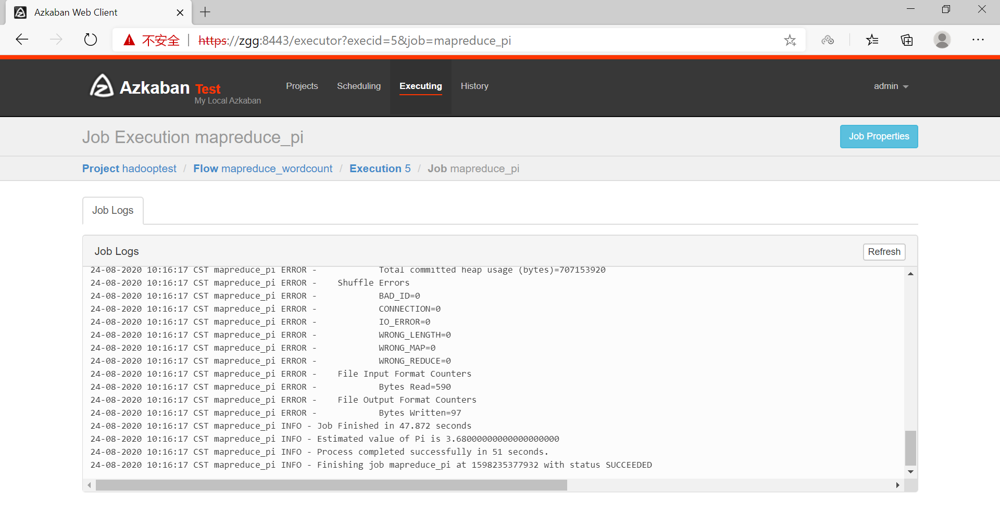

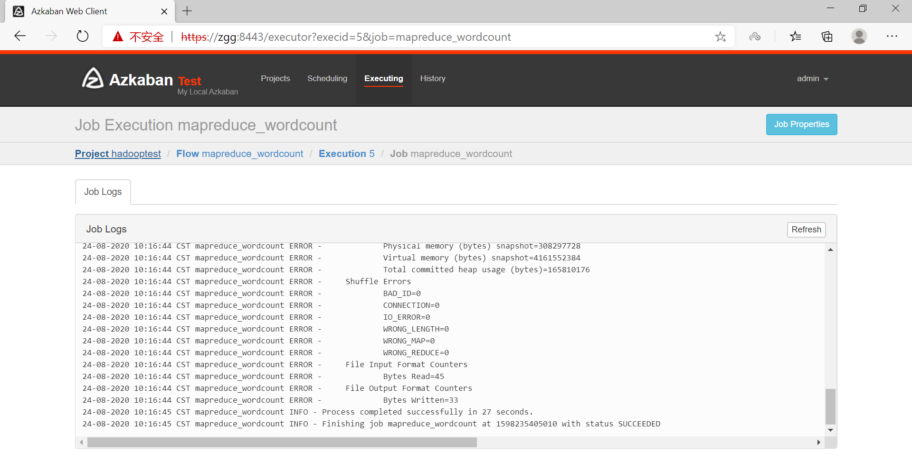

输出结果：

```sh
[root@zgg mapreduce]# hadoop fs -ls /out
Found 8 items
drwxr-xr-x   - zgg  supergroup          0 2020-07-06 22:46 /out/groupdata
drwxr-xr-x   - zgg  supergroup          0 2020-07-15 20:15 /out/mt
drwxr-xr-x   - zgg  supergroup          0 2020-07-15 20:22 /out/mtc
drwxr-xr-x   - zgg  supergroup          0 2020-07-15 20:45 /out/mtmc
drwxr-xr-x   - zgg  supergroup          0 2020-07-06 23:45 /out/partitiondata
drwxr-xr-x   - zgg  supergroup          0 2020-07-07 21:22 /out/secondsort_test
drwxr-xr-x   - root supergroup          0 2020-08-24 09:45 /out/wc
drwxr-xr-x   - root supergroup          0 2020-08-24 10:16 /out/wc_az
[root@zgg mapreduce]# hadoop fs -ls /out/wc_az
Found 2 items
-rw-r--r--   1 root supergroup          0 2020-08-24 10:16 /out/wc_az/_SUCCESS
-rw-r--r--   1 root supergroup         33 2020-08-24 10:16 /out/wc_az/part-r-00000
[root@zgg mapreduce]# hadoop fs -text /out/wc_az/part-r-00000
flink   1
hadoop  3
hello   2
spark   1
```

## 4、command类型：操作hive

	vi test.sql

	create database if not exists azkaban;
	use azkaban;
	drop table if exists student;
	create table student(id int,name string,sex string,age int,deparment string) row format delimited fields terminated by ',';
	load data local inpath '/root/data/student.txt' into table student;
	create table student_copy as select * from student;
	insert overwrite directory '/aztest/hiveoutput' select count(1) from student_copy;
	!hdfs dfs -cat /aztest/hiveoutput/000000_0;
	drop database azkaban cascade; 

	--------------------------------------------------------------------------

	vi hivef.job

	# hivef.job

	type=command
	command=/opt/hive-1.2.2/bin/hive -f 'test.sql'

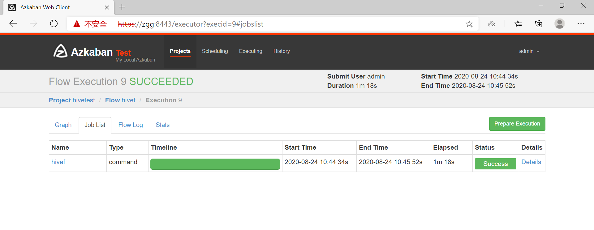

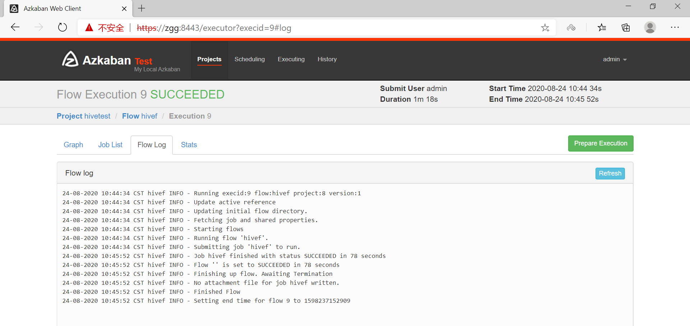

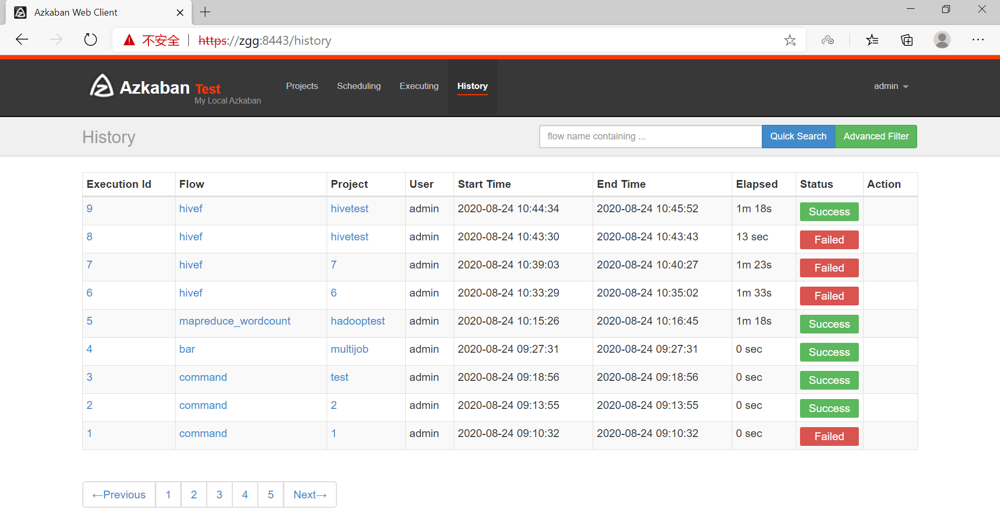

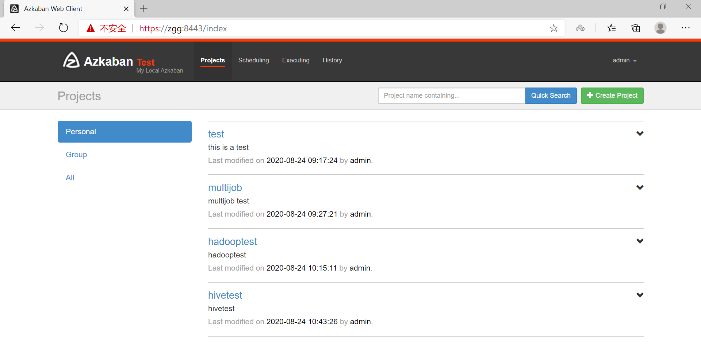

[入门练习参考1](https://www.jianshu.com/p/c7d6bf6191e7)

[入门练习参考2](https://www.cnblogs.com/frankdeng/p/9284644.html)