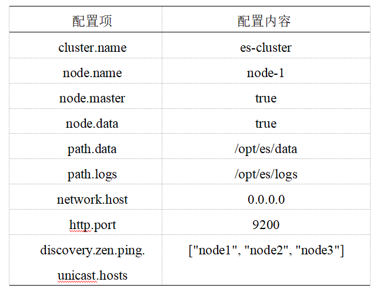
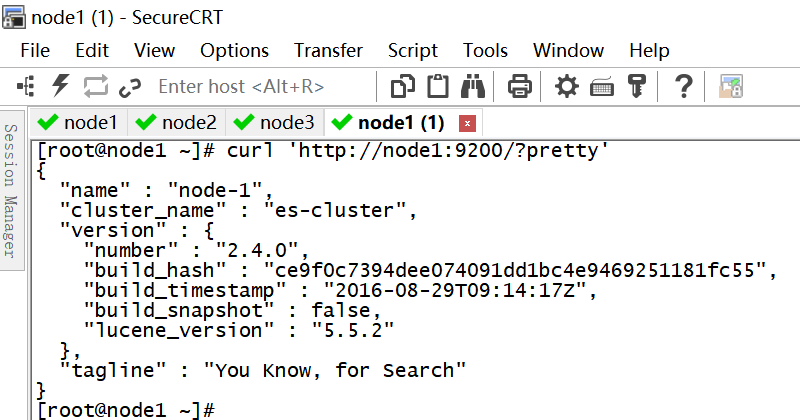
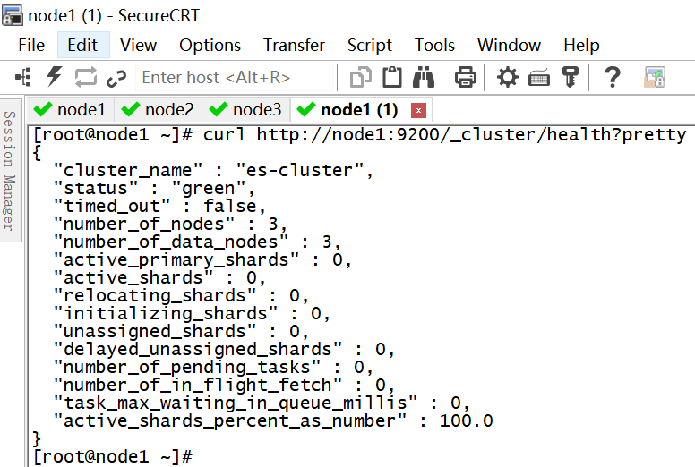

# 环境搭建：完全分布

在 node1 节点下载和解压 ElasticSearch-2.4.0 文件后，配置 config/elasticsearch.yml 文件。配置属性如下所示：

文件配置完成后，将 es 文件夹发送到 node2 和 node3 节点中，修改配置属性。执行 `bin/elasticsearch` 命令，可以启动 ES 集群。执行命令 `curl 'http://node1:9200/?pretty'`查看单节点信息。

执行命令 `curl http://node1:9200/_cluster/health?pretty` 查看集群健康状态。

执行命令 `bin/plugin install mobz/elasticsearch-head`安装集群管理工具 HEAD 插件。在浏览器输入 `http://node1:9200/_plugin/head/` 进行访问。

