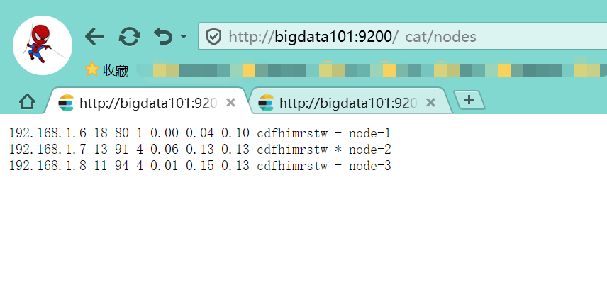
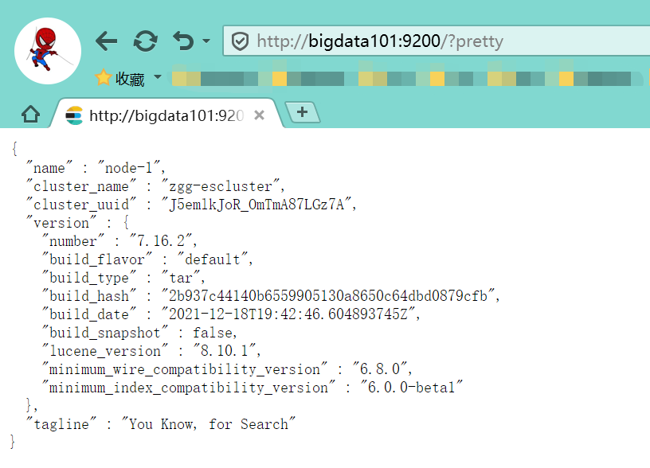
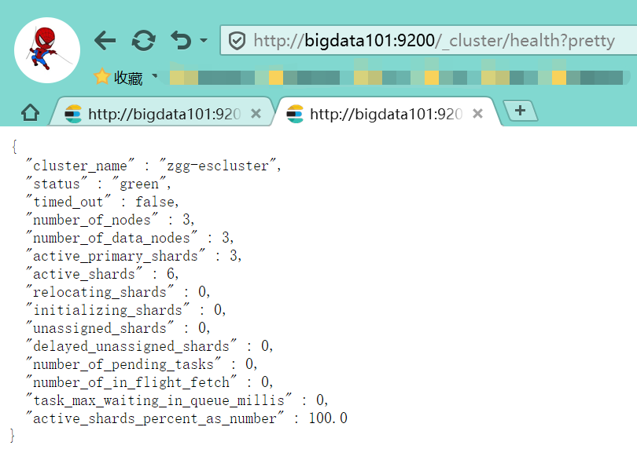

# 集群环境搭建

[TOC]

## 1 准备

节点名称| IP地址
---|:---
bigdata101   | 192.168.1.6
bigdata102   | 192.168.1.7
bigdata103   | 192.168.1.8

软件      |  版本
---       |:---
es       | es-7.16.2 

## 2 创建用户

在三个节点上，创建用户组和普通用户

```sh
[root@bigdata101 ~]# groupadd zgg
[root@bigdata101 ~]# adduser zgg
[root@bigdata101 ~]# passwd zgg
[root@bigdata101 ~]# usermod -G zgg zgg
[root@bigdata101 ~]# id zgg
uid=1000(zgg) gid=1000(zgg) 组=1000(zgg)
```

修改 `/etc/sudoers` 文件，赋予 root 权限

```sh
[root@bigdata101 opt]# cat /etc/sudoers`
## Allow root to run any commands anywhere
root    ALL=(ALL)     ALL
zgg   ALL=(ALL)     ALL
```

创建 `es/` 目录，并修改 owner 为 zgg 用户

```sh
[root@bigdata101 opt]# mkdir es/
[root@bigdata101 opt]# chown -R zgg:zgg es/
```

## 3 安装

下载、解压、重命名

```sh
[root@bigdata101 es]$ su zgg

[zgg@bigdata101 es]$ tar -zxvf elasticsearch-7.16.2-linux-x86_64.tar.gz

[zgg@bigdata101 es]$ ll
总用量 335612
drwxr-xr-x. 9 zgg  zgg        155 12月 19 03:48 elasticsearch-7.16.2
-rw-r--r--. 1 root root 343664171 12月 25 10:04 elasticsearch-7.16.2-linux-x86_64.tar.gz

[zgg@bigdata101 es]$ mv elasticsearch-7.16.2/ es-7.16.2/
```

配置 elasticsearch.yml

```sh
# bigdata101节点
cluster.name: zgg-escluster
node.name: node-1
node.master: true
node.data: true
path.data: /opt/es/es-7.16.2/data
path.logs: /opt/es/es-7.16.2/logs
bootstrap.system_call_filter: false
bootstrap.memory_lock: false
network.host: bigdata101
http.port: 9200
transport.tcp.port: 9300
http.cors.enabled : true
http.cors.allow-origin: "*"
discovery.zen.minimum_master_nodes: 2
discovery.seed_hosts: ["bigdata101", "bigdata102", "bigdata103"] 
discovery.zen.fd.ping_timeout: 1m
discovery.zen.fd.ping_retries: 5
cluster.initial_master_nodes: ["node-1"]
action.destructive_requires_name: true
action.auto_create_index: .security,.monitoring*,.watches,.triggered_watches,.watcher-history*
xpack.security.enabled: false
xpack.monitoring.enabled: true
xpack.graph.enabled: false
xpack.watcher.enabled: false
xpack.ml.enabled: false
```

```sh
# bigdata102节点
cluster.name: zgg-escluster
node.name: node-2
node.master: true
node.data: true
path.data: /opt/es/es-7.16.2/data
path.logs: /opt/es/es-7.16.2/logs
bootstrap.system_call_filter: false
bootstrap.memory_lock: false
network.host: bigdata102
http.port: 9200
transport.tcp.port: 9300
http.cors.enabled : true
http.cors.allow-origin: "*"
discovery.zen.minimum_master_nodes: 2
discovery.seed_hosts: ["bigdata101", "bigdata102", "bigdata103"]
discovery.zen.fd.ping_timeout: 1m
discovery.zen.fd.ping_retries: 5
cluster.initial_master_nodes: ["node-1"]
action.destructive_requires_name: true
action.auto_create_index: .security,.monitoring*,.watches,.triggered_watches,.watcher-history*
xpack.security.enabled: false
xpack.monitoring.enabled: true
xpack.graph.enabled: false
xpack.watcher.enabled: false
xpack.ml.enabled: false
```

```sh
# bigdata103节点
cluster.name: zgg-escluster
node.name: node-3
node.master: true
node.data: true
path.data: /opt/es/es-7.16.2/data
path.logs: /opt/es/es-7.16.2/logs
bootstrap.system_call_filter: false
bootstrap.memory_lock: false
network.host: bigdata103
http.port: 9200
transport.tcp.port: 9300
http.cors.enabled : true
http.cors.allow-origin: "*"
discovery.zen.minimum_master_nodes: 2
discovery.seed_hosts: ["bigdata101", "bigdata102", "bigdata103"]
discovery.zen.fd.ping_timeout: 1m
discovery.zen.fd.ping_retries: 5
cluster.initial_master_nodes: ["node-1"]
action.destructive_requires_name: true
action.auto_create_index: .security,.monitoring*,.watches,.triggered_watches,.watcher-history*
xpack.security.enabled: false
xpack.monitoring.enabled: true
xpack.graph.enabled: false
xpack.watcher.enabled: false
xpack.ml.enabled: false
```

进入 root 用户，修改系统配置，并分发到其他节点

```sh
[root@bigdata101 opt]# cat /etc/security/limits.conf
* soft nofile 65536
* hard nofile 131072
* soft nproc 2048
* hard nproc 4096


[root@bigdata101 opt]# cat /etc/security/limits.d/20-nproc.conf
*          soft    nproc     4096

[root@bigdata101 opt]# cat /etc/sysctl.conf 
vm.max_map_count=655360

[root@bigdata101 opt]# sysctl -p
```

分别启动三台 ES 服务

```sh
[root@bigdata101 opt]# su zgg

[zgg@bigdata101 es]$ nohup es-7.16.2/bin/elasticsearch 2>&1 &

[zgg@bigdata101 es]$ jps
2033 Elasticsearch
2214 Jps
```

在浏览器中查看

- 集群节点

	

- 单节点信息

	

- 集群健康状态

	

## 4 问题

- `Caused by: java.lang.RuntimeException: can not run elasticsearch as root`

	新建一个用户启动

- `.AccessDeniedException: /opt/es-7.16.2/config/elasticsearch.yml`

	修改 `es-7.16.2/` 目录权限 `chown -R zgg:zgg /opt/es-7.16.2/`

- `max file descriptors [4096] for elasticsearch process is too low`

	使用 root 用户在 `/etc/security/limits.conf` 文件下添加如下内容：

	`zgg hard nofile 65536`
	`zgg soft nofile 65536`

	zgg 是启动ES的用户

- `max virtual memory areas vm.max_map_count [65530] is too low`

	使用 root 用户在 `/etc/sysctl.conf` 文件下添加如下内容：

	`vm.max_map_count=262144`

	执行`/sbin/sysctl -p` 立即生效
