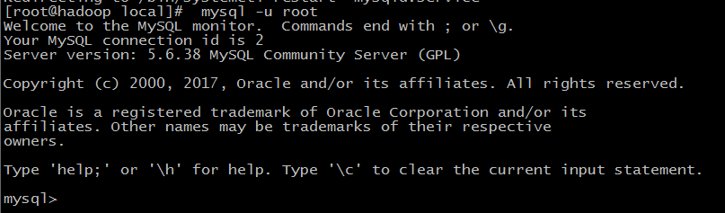
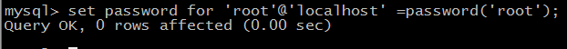
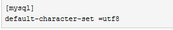
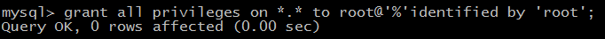

# centos7下安装mysql

1、`yum install mariadb-server mariadb`

2、启动数据库 `systemctl start mariadb`

3、初次安装mysql，root账户没有密码   `mysql -u root`



4、设置密码 `set password for 'root'@'localhost' =password('root');`



5、配置 `/etc/my.cnf` 文件

最后加上编码配置

	[mysql]
	default-character-set=utf8



6、把在所有数据库的所有表的所有权限赋值给位于所有IP地址的root用户。

`grant all privileges on *.* to root@'%' identified by 'root';`



7、[删除mysql](http://www.jb51.net/article/97516.htm)

----------------------------------------------------------------

**centos7安装mysql8.0**

## 1、清理之前安装的mysql残余

如果清理不干净，会出现错误：`Failed to start mariadb.service: Unit not found.`

```sh
[root@zgg ~]# rpm -qa| grep -i mysql
mysql-community-libs-8.0.21-1.el7.x86_64
mysql-community-server-8.0.21-1.el7.x86_64
mysql80-community-release-el7-3.noarch
mysql-community-client-8.0.21-1.el7.x86_64
mysql-community-libs-compat-8.0.21-1.el7.x86_64
mysql-community-common-8.0.21-1.el7.x86_64
[root@zgg ~]# yum remove mysql-c.....  # 卸载
[root@zgg ~]# rpm -qa | grep -i mysql   # 查看是否卸载完成  
[root@zgg opt]# find / -name mysql   # 查找、删除mysql相关目录  
/usr/bin/mysql
/usr/lib64/mysql
/usr/share/mysql
[root@zgg opt]# rm -rf /usr/bin/mysql /usr/lib64/mysql /usr/share/mysql
[root@zgg opt]# find / -name mysql
[root@zgg script]# rm -rf /var/log/mysqld.log
[root@zgg etc]# rm -f my.cnf  
```

## 2、配置Mysql8.0安装源

```sh
[root@zgg opt]# rpm -Uvh https://dev.mysql.com/get/mysql80-community-release-el7-3.noarch.rpm
获取https://dev.mysql.com/get/mysql80-community-release-el7-3.noarch.rpm
准备中...                          ################################# [100%]
正在升级/安装...
   1:mysql80-community-release-el7-3  ################################# [100%]
```

## 3、安装Mysql8.0

```sh
# 默认安装最新版本
[root@zgg opt]# yum --enablerepo=mysql80-community install mysql-community-server
已加载插件：fastestmirror
Loading mirror speeds from cached hostfile
 * base: mirrors.aliyun.com
 * extras: mirror.lzu.edu.cn
 * updates: mirrors.aliyun.com
正在解决依赖关系
...
warning: file /usr/lib64/mysql/libmysqlclient.so.18: remove failed: No such file or directory
  验证中      : mysql-community-server-8.0.21-1.el7.x86_64                                                                      1/6 
  验证中      : mysql-community-libs-8.0.21-1.el7.x86_64                                                                        2/6 
  验证中      : mysql-community-client-8.0.21-1.el7.x86_64                                                                      3/6 
  验证中      : mysql-community-common-8.0.21-1.el7.x86_64                                                                      4/6 
  验证中      : 1:mariadb-libs-5.5.65-1.el7.x86_64                                                                              5/6 
  验证中      : 1:mariadb-5.5.65-1.el7.x86_64                                                                                   6/6 

已安装:
  mysql-community-client.x86_64 0:8.0.21-1.el7                      mysql-community-libs.x86_64 0:8.0.21-1.el7                     
  mysql-community-server.x86_64 0:8.0.21-1.el7                     

作为依赖被安装:
  mysql-community-common.x86_64 0:8.0.21-1.el7                                                                                      

替代:
  mariadb.x86_64 1:5.5.65-1.el7                                  mariadb-libs.x86_64 1:5.5.65-1.el7                                 

完毕！
```

## 4、启动mysql服务

显示了 **Active: active (running)**

```sh
[root@zgg opt]# service mysqld start
Redirecting to /bin/systemctl start mysqld.service
[root@zgg opt]# service mysqld status
Redirecting to /bin/systemctl status mysqld.service
● mysqld.service - MySQL Server
   Loaded: loaded (/usr/lib/systemd/system/mysqld.service; enabled; vendor preset: disabled)
   Active: active (running) since 六 2020-09-26 18:39:54 CST; 9s ago
     Docs: man:mysqld(8)
           http://dev.mysql.com/doc/refman/en/using-systemd.html
  Process: 14520 ExecStartPre=/usr/bin/mysqld_pre_systemd (code=exited, status=0/SUCCESS)
 Main PID: 14597 (mysqld)
   Status: "Server is operational"
   CGroup: /system.slice/mysqld.service
           └─14597 /usr/sbin/mysqld

9月 26 18:39:50 zgg systemd[1]: Starting MySQL Server...
9月 26 18:39:54 zgg systemd[1]: Started MySQL Server.
```
## 5、更改临时密码

注意密码配置策略

```sh
[root@zgg opt]# grep "A temporary password" /var/log/mysqld.log
2020-09-26T10:39:51.748702Z 6 [Note] [MY-010454] [Server] A temporary password is generated for root@localhost: g/sf2lqTp4,O
[root@zgg opt]# mysql -uroot -p
Enter password: 
Welcome to the MySQL monitor.  Commands end with ; or \g.
Your MySQL connection id is 10
Server version: 8.0.21

Copyright (c) 2000, 2020, Oracle and/or its affiliates. All rights reserved.

Oracle is a registered trademark of Oracle Corporation and/or its
affiliates. Other names may be trademarks of their respective
owners.

Type 'help;' or '\h' for help. Type '\c' to clear the current input statement.

mysql> ALTER USER 'root'@'localhost' IDENTIFIED BY 'root';
ERROR 1819 (HY000): Your password does not satisfy the current policy requirements
mysql> ALTER USER 'root'@'localhost' IDENTIFIED BY 'MYsql123@'; 
Query OK, 0 rows affected (0.01 sec)
```

## 6、在MySQL 8.0中为root用户授予所有权限

和以往版本有所不同

```sh
mysql> CREATE USER 'root'@'%' IDENTIFIED BY 'MYsql123@';
Query OK, 0 rows affected (0.01 sec)

mysql> GRANT ALL PRIVILEGES ON *.* TO 'root'@'%' WITH GRANT OPTION;
Query OK, 0 rows affected (0.01 sec)

mysql> show databases;
+--------------------+
| Database           |
+--------------------+
| information_schema |
| mysql              |
| performance_schema |
| sys                |
+--------------------+
4 rows in set (0.00 sec)
```

## 7、配置 /etc/my.cnf 文件

最后加上编码配置

	[mysql]
	default-character-set=utf8

参考：

[Failed to start mariadb.service: Unit not found的错误解决](https://www.cnblogs.com/ricklz/p/12269102.html)

[Centos7安装mysql8.0教程](https://blog.csdn.net/our_times/article/details/98882701)

[在MySQL 8.0中为root用户授予所有权限](https://blog.csdn.net/architect_csdn/article/details/102489312)

## 8、问题

> 启动mysql8.0，报错，出现`ERROR 1045 (28000): Access denied for user 'root'@'localhost' (using password: YES)`

解决方法：

1、修改MySQL 登入限制

```sh
# 在/etc/my.cnf文件下的[mysqld]的末尾追加上一句：skip-grant-tables 
[root@zgg ~]# cat /etc/my.cnf
# For advice on how to change settings please see
# http://dev.mysql.com/doc/refman/8.0/en/server-configuration-defaults.html

[mysql]
default-character-set=utf8

[mysqld]
skip-grant-tables 
....
```

2、重新启动MySQL服务

```sh
[root@zgg script]# /bin/systemctl restart mysqld.service      
```

3、登入MySQL，修改密码设置规则，修改密码

```sh
[root@zgg script]# mysql
Welcome to the MySQL monitor.  Commands end with ; or \g.
Your MySQL connection id is 7
Server version: 8.0.21 MySQL Community Server - GPL

Copyright (c) 2000, 2020, Oracle and/or its affiliates. All rights reserved.

Oracle is a registered trademark of Oracle Corporation and/or its
affiliates. Other names may be trademarks of their respective
owners.

Type 'help;' or '\h' for help. Type '\c' to clear the current input statement.

mysql> flush privileges;
Query OK, 0 rows affected (0.01 sec)

mysql> select host,user,plugin,authentication_string from mysql.user;
+-----------+------------------+-----------------------+------------------------------------------------------------------------+
| host      | user             | plugin                | authentication_string                                                  |
+-----------+------------------+-----------------------+------------------------------------------------------------------------+
| localhost | mysql.infoschema | caching_sha2_password | $A$005$THISISACOMBINATIONOFINVALIDSALTANDPASSWORDTHATMUSTNEVERBRBEUSED |
| localhost | mysql.session    | caching_sha2_password | $A$005$THISISACOMBINATIONOFINVALIDSALTANDPASSWORDTHATMUSTNEVERBRBEUSED |
| localhost | mysql.sys        | caching_sha2_password | $A$005$THISISACOMBINATIONOFINVALIDSALTANDPASSWORDTHATMUSTNEVERBRBEUSED |
| localhost | root             | caching_sha2_password | $A$005$
                                                                1(z=SER s1(BQmzoDYXKEZzrJWGMJUVajerO272z57C3YQGhvN/5ou. |
+-----------+------------------+-----------------------+------------------------------------------------------------------------+
4 rows in set (0.00 sec)

mysql> ALTER user 'root'@'localhost' IDENTIFIED WITH mysql_native_password BY '123456';
ERROR 1819 (HY000): Your password does not satisfy the current policy requirements
mysql> SHOW VARIABLES LIKE 'validate_password%'; 
+--------------------------------------+--------+
| Variable_name                        | Value  |
+--------------------------------------+--------+
| validate_password.check_user_name    | ON     |
| validate_password.dictionary_file    |        |
| validate_password.length             | 8      |
| validate_password.mixed_case_count   | 1      |
| validate_password.number_count       | 1      |
| validate_password.policy             | MEDIUM |
| validate_password.special_char_count | 1      |
+--------------------------------------+--------+
7 rows in set (0.01 sec)

mysql> set global validate_password.policy=0;
Query OK, 0 rows affected (0.00 sec)

mysql> set global validate_password.length=4;
Query OK, 0 rows affected (0.00 sec)

mysql> flush privileges;
Query OK, 0 rows affected (0.00 sec)

mysql> ALTER user 'root'@'localhost' IDENTIFIED WITH mysql_native_password BY '1234';
Query OK, 0 rows affected (0.01 sec)

mysql> flush privileges;
Query OK, 0 rows affected (0.00 sec)
```

4、再次修改MySQL 登入限制

去除[mysqld] 中的skip-grant-tables ，重新启动MySQL服务。

```sh
[root@zgg script]# cat mysql_start.py 
import os

# python mysql_start.py
# password:1234
start = "/bin/systemctl start mysqld.service && mysql -uroot -p1234"

os.system(start)
   
[root@zgg script]# python mysql_start.py 
mysql: [Warning] Using a password on the command line interface can be insecure.
Welcome to the MySQL monitor.  Commands end with ; or \g.
Your MySQL connection id is 8
Server version: 8.0.21 MySQL Community Server - GPL

Copyright (c) 2000, 2020, Oracle and/or its affiliates. All rights reserved.

Oracle is a registered trademark of Oracle Corporation and/or its
affiliates. Other names may be trademarks of their respective
owners.

Type 'help;' or '\h' for help. Type '\c' to clear the current input statement.

mysql> show databases;
+--------------------+
| Database           |
+--------------------+
| information_schema |
| mysql              |
| performance_schema |
| sys                |
+--------------------+
4 rows in set (0.00 sec)

mysql> 
```

参考：[1](https://blog.csdn.net/zhouzhiwengang/article/details/87378046?utm_medium=distribute.pc_relevant.none-task-blog-BlogCommendFromMachineLearnPai2-2.channel_param&depth_1-utm_source=distribute.pc_relevant.none-task-blog-BlogCommendFromMachineLearnPai2-2.channel_param) 、[2](https://blog.csdn.net/weixin_42955916/article/details/104670182?utm_medium=distribute.pc_relevant_t0.none-task-blog-BlogCommendFromMachineLearnPai2-1.channel_param&depth_1-utm_source=distribute.pc_relevant_t0.none-task-blog-BlogCommendFromMachineLearnPai2-1.channel_param)