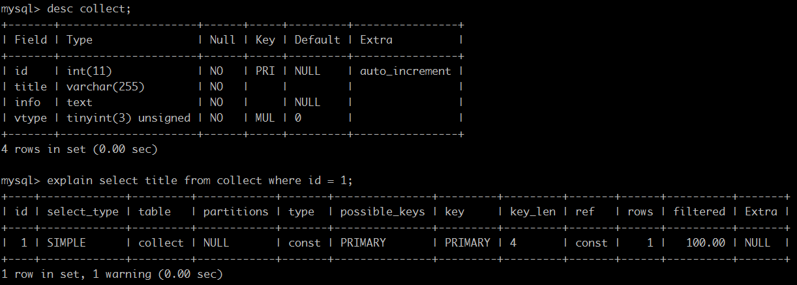

# explain命令

使用 EXPLAIN 关键字可以知道**MySQL是如何处理你的SQL语句的**。帮你分析你的查询语句或是表结构的性能瓶颈。

通过explain命令可以得到:

- 表的读取顺序
- 数据读取操作的操作类型
- 哪些索引可以使用
- 哪些索引被实际使用
- 表之间的引用
- 每张表有多少行被优化器查询

如下为实验表格：里面有1万条测试数据

EXPLAIN字段解析：

1、table：显示这一行的数据是关于哪张表的

2、**type**：这是最重要的字段之一，**显示查询使用了何种类型**。

从最好到最差的连接类型为 `system、const、eq_reg、ref、range、index、ALL`。

一般来说，得保证查询至少达到 range 级别，最好能达到 ref。

	type中包含的值：

	system、const： 可以将查询的变量转为常量. 如id=1; id为 主键或唯一键.

	eq_ref： 访问索引,返回某单一行的数据.(通常在联接时出现，查询使用的索引为主键或惟一键)

	ref： 访问索引,返回某个值的数据.(可以返回多行) 通常使用=时发生 

	range： 这个连接类型使用索引返回一个范围中的行，比如使用>或<
	查找东西，并且该字段上建有索引时发生的情况(注:不一定好于index) 

	index： 以索引的顺序进行全表扫描，优点是不用排序,缺点是还要全表扫描 

	ALL： 全表扫描，应该尽量避免

3、possible_keys：显示可能应用在这张表中的索引。如果为空，表示没有可能应用的索引。

4、key：**实际使用的索引**。如果为NULL，则没有使用索引。

    MySQL很少会选择优化不足的索引，此时可以在SELECT语句中使用FORCE INDEX（index_name）来强制使用一个索引或者用IGNORE INDEX（index_name）来强制忽略索引。

    MySQL强制使用和不使用索引：https://www.cnblogs.com/lcngu/p/6023179.html

5、key_len：**使用的索引的长度**。在不损失精确性的情况下，长度越短越好

6、ref：**显示索引的哪一列被使用了**，如果可能的话，是一个常数

7、rows：MySQL认为必须检索的用来返回请求数据的行数

8、Extra：关于MySQL如何解析查询的额外信息，主要有以下几种:

	Extra中包含的值：
	using index： 只用到索引,可以避免访问表，性能很高。 

	using where： 使用到where来过滤数据， 不是所有的where clause都要显示using where. 如以=方式访问索引。

	using tmporary： 用到临时表去处理当前的查询。

	using filesort： 用到额外的排序，此时mysql会根据联接类型浏览所有符合条件的记录，并保存排序关键字和行指针，然后排序关键字并按顺序检索行。(当使用order by v1,而没用到索引时,就会使用额外的排序)。

	range checked for eache record(index map:N)： 没有好的索引可以使用。

	Using index for group-by：表明可以在索引中找到分组所需的所有数据，不需要查询实际的表。explain select user_id from t_order group by user_id;

**见到Using temporary和Using filesort，就意味着MySQL根本不能使用索引，结果是检索会很慢，需要优化sql了。**

[原文链接](https://www.cnblogs.com/deverz/p/11066043.html)

[参考](https://blog.csdn.net/jiadajing267/article/details/81269067)