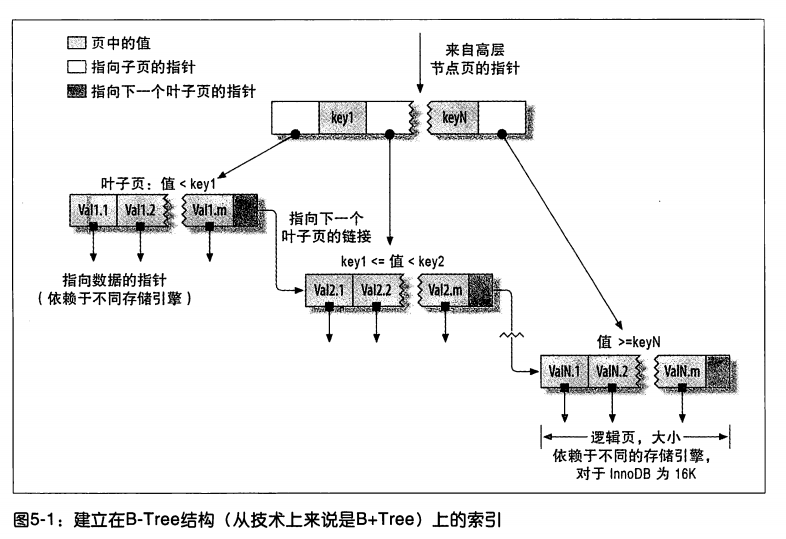
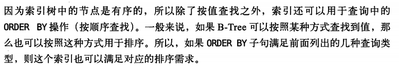
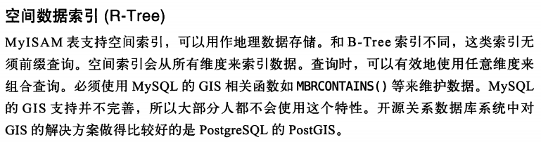
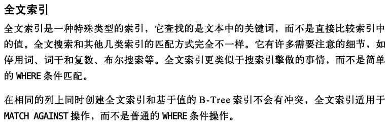

# 索引01：索引类型

[TOC]

**高性能MySql第三版**

## 1、索引基础

索引类比书的目录，如果要找第三章节，就先在目录中找到它的页码，再根据页面定位到内容。

那么，在 MySql 中，先在索引中找到对应值，再根据这个对应值找到数据行。如：

```sql
select first_name from sakila.actor where actor_id=5;
```
如果已在 actor_id 列建了索引，就会先找到 actor_id=5 行的索引，再找到这行内容。【再补充】

## 2、索引类型

在 MySql 中，索引是在存储引擎层而不是服务器层实现的。所以没用统一的索引标准：

- 不同存储引擎的索引工作方式并不相同

- 不是所有的存储引擎支持所有类型的索引

- 即使多个存储引擎支持同一类型的索引，底层实现也会不同

下面介绍 MySql 支持的索引类型。

### 2.1、B-Tree索引

#### 2.1.1、简介

谈到索引，如果没有特殊说明，一般是指 B-Tree 索引，使用 B-Tree 数据结构存储数据。大多数 MySql 存储引擎都支持这种索引。Archive 引擎直到5.1版本才开始支持索引，仅支持单个自增列索引(AUTO-INCREAMENT)。

**虽然都叫 B-Tree 索引，但不同的存储引擎使用了不同的存储结构。NDB 使用了 T-Tree；InnoDB 使用 B+Tree。**

不同的存储引擎以不同的方式使用 B-Tree 索引，所以性能也不同：（？？？）

	MyISAM：使用前缀压缩技术使索引更小；通过 数据的物理位置 引用被索引的行
	InnoDB：按照原数据格式进行存储；根据 主键 引用被索引的行

B-Tree 意味着所有的值都是按顺序存储的，并且每个叶子页到根的距离相同。【这里指的应该是B+树，其叶子结点的数据是顺序存放的；每个叶结点具有相同的深度，即树的高度h(B树性质)】



【**B树的一种变形 -- B+树 ，所有的卫星数据都保存在叶结点中，顺序存放的，只将关键字和孩子指针保存于内部结点里，因此最大化了内部结点的分支因子(横向宽度更宽，更矮胖，所以磁盘访问次数减少了)**】

由上图可知，B-Tree 索引不再需要进行全表扫描，只需要**从索引(树)的根结点开始搜索，根结点中存放了指向其孩子结点的指针，存储引擎根据指针依次向下层查找，通过比较结点页的值和要查找的值可找到合适的指针进入下层子结点**，这些指针实际定义了子结点页值的上下限。最找，存储引擎要么找到对应的值，要么该记录不存在。

上图有一点需要注意：**叶子结点包含了指向数据的指针和指向下一个叶子结点的指针。**

#### 2.1.2、示例

B-Tree 对索引列是顺序组织存储的，所以适合查找范围数据。如：

在一个基于文本域的索引树上，按字母顺序传递连续的值进行查找非常合适。所以像"找出所有以I到K开头的名字"这样的查找效率非常高。

```sql
create table People(
	last_name varchar(50) not null,
	first_name varchar(50) not null,
	dob date not null,
	gender enum('m','f') not null,
	key(last_name,first_name,dob)
);

```

上表对 `last_name,first_name,dob` 建了索引。

要注意：**索引对多个值排序的依据是 建表定义索引时列的顺序**，看最后两个条目。


`Allen Cuba 1960-01-01` 左边是字母顺序比 `Allen` 小的，这一侧 `last_name` 相同的情况下，比较`first_name`，依次往下。右边同理。

#### 2.1.3、B-Tree 索引支持的查询类型

**B-Tree 索引适用于全键值、键值范围或键前缀查找，其中键前缀查找只适用于根据最左前缀查找**。前述的索引支持如下类型的查询：

- 全值匹配

和索引中的**所有列**进行匹配，例如上面的索引可用于查找姓名为Cuba Allen、出生于1960-01-01的人。

- 匹配最左前缀

查找所有last_name为Allen的人，即只使用索引的**第一列**。

- 匹配列前缀

只匹配**某一列的值的开头部分**。例如上面的索引可用于查找 last_name 以 J 开头的人，这里也只用到了索引的第一列。

- 匹配范围值

查找 last_name 在 Allen 和 Barrymore 之间的人。这里也只用到了索引的第一列。

- 精确匹配某一列并范围匹配另外一列

查找所有 last_name 是 Allen，并且 first_name 是字母 K 开头的人。即第一列 last_name 全匹配，第二列 first_name 范围匹配。

- 只访问索引的查询

查询只需要访问索引，无需访问数据行，后面会专门讨论这种"覆盖索引的优化"。



#### 2.1.4、B-Tree 索引的限制

- **如果不是按照索引的最左列开始查找，则无法使用索引**。例如，上面的索引无法查找 first_name 是 Bill 的人，也无法查找某个特定生日的人，因为这两列都不是最左数据列。

- **不能跳过索引中的列**。上面的索引无法用于 last_name 是 Smith 、并且在某个特定日期出生的人，这里只能用到索引的第一列。

- **如果查询中有某个列的范围查询，则其右边的所有列都无法使用索引优化查询**。列入查询`WHERE last_name='Smith' AND first_name LIKE 'J%' AND  birth='1976-12-23'`，这个查询只能用到索引的前两列，因为这里的 LIKE 是一个范围条件。如果范围查询列值的数量有限，可以使用多个等于条件来代替。【或者范围查询放在最后】

所以，索引的顺序很重要。在优化性能的时候，可能需要使用相同的列但是顺序不同的索引来满足不同的查询需求。

### 2.2、哈希索引

#### 2.2.1、示例

```sql
create table testhash(
	fname varchar(50) not null,
	lname varchar(50) not null,
	key using HASH(fname)
)ENGINE=MEMORY;
```

表中数据如下：

```sh
mysql> select * from testhash;

+-------+---------+
|fname  |lname    |
+-------+---------+
|Arjen  |Lentz    |
|Baron  |Schwartz |
|Peter  |Zaitsev  |
|Vadim  |Tkachenko|
+-------+---------+
```

假设索引使用哈希函数 f()，它返回下面的值：

	f('Arjen')=2323	
	f('Baron')=7437
	f('Peter')=8784
	f('Vadim')=2458

则哈希索引的数据结构如下：

槽(Slot)|值(Value)
---|:---
2323|指向第1行的指针
7437|指向第4行的指针
8784|指向第2行的指针
2458|指向第3行的指针

这里每个槽的编号是顺序的，但数据行不是。看如下查询：

```sh
mysql> select lname from testhash where fname='Peter';
```

**MySql 先计算 'Peter' 的哈希值，并使用该值从哈希索引中寻找对应的记录指针。因为 `f('Peter')=8784` ，所以 MySql 在索引中查找 8784 ，可以找到指向第3行的指针，最后比较第三行的值是否是 'Peter'**

因为索引自身只需存储对应的哈希值，所以索引的结构十分紧凑，这也让哈希索引查找的速度非常快。

#### 2.2.2、简介

哈希索引(hash index)基于哈希表实现，只有**精确匹配 索引所有列 的查询才有效**。

对于每一行数据，存储引擎都会对所有的索引列计算一个 hash code ， hash code 是一个较小的值，并且不同键值的行计算出来的哈希码也不一样。哈希索引将**所有的 hash code  存储在索引中**，同时**在哈希表中保存指向每个数据行的指针**。 【参考上面的 哈希索引的数据结构】

在 MySQL 中，只有 Memory 引擎显示支持哈希索引。这也是 **Memory 引擎表的默认索引类型**，Memory 引擎同时也支持 B-Tree 索引。

值得一提的是，Memory 引擎是**支持非唯一哈希索引的**，这在数据库世界里面是比较与众不同的。如果多个列的哈希值相同，索引会以链表的方式存放多个记录指针到同一个哈希条目中。 

#### 2.2.3、哈希索引的限制

- 哈希索引只包含哈希值和行指针，而不存在字段值。

- 哈希索引数据并不是按照索引值顺序存储的，所以也就无法用于排序。（???）

- 哈希索引**不支持部分索引匹配查找**，因为哈希索引始终是使用索引的全部内容来计算哈希值的。例如，在数据列(A,B)上建立哈希索引，如果查询只有数据列A，则无法使用该索引。

- 哈希索引**只支持等值比较查询**，包括=、IN()、<=>。**不支持任何范围查询**，例如WHERE price > 100。

	<=>	: 严格比较两个NULL值是否相等。两个操作码均为NULL时，其所得值为1；而当一个操作码为NULL时，其所得值为0

- **访问哈希索引的数据非常快**，除非有很多哈希冲突（不同的索引列却有相同的哈希值）。当出现哈希冲突的时候，存储引擎必须遍历链表中的所有的行指针，逐行进行比较，直到找到所有符合条件的行。

- **如果哈希冲突很多的话，一些索引维护操作的代价也会很高**。例如，如果在某个选择性很低（哈希冲突很多）的列上建立哈希索引，那么当从表中删除一行时，存储引擎需要遍历对应哈希值的链表中的每一行，找到并删除对应行的引用，冲突越多，代价越大。【如在性别列上建索引】

因为这些限制，哈希索引只适用于某些特定的场合。但一旦适合哈希索引，则它带来的性能提升将非常显著。

举个例子，在数据仓库应用中有一种经典的“星型”schema，需要关联很多查询表，哈希索引就非常适合查找表的需求。

#### 2.2.4、自适应哈希索引

InnoDB 引擎有一个特殊的功能叫做**自适应哈希索引adaptive hash index**。

当 InnoDB 注意到某些索引值被使用得非常频繁时，它会在内存中基于 B-Tree 索引之上再创建一个哈希索引，这样就让B-Tree索引也具有哈希索引的一些优点，比如快速的哈希查找。

这是一个完全自动的、内部的行为，用户无法控制或者配置，不过如果有必要，完全可以关闭该功能。

适应场景：如果存储引擎不支持哈希索引，则可以模拟像 InnoDB 一样创建哈希索引，这可以享受一些哈希索引的便利，例如只需要很小的索引就可以为超长的键创建索引。 

***创建自定义哈希索引***

方法：在 B-Tree 基础上创建一个伪哈希索引。这和真正的哈希索引不是一回事，因为还是使用 B-Tree 进行查找，但是它**使用哈希值而不是键本身进行索引查找**。你需要做的就是在查询的 WHERE 子句中手动指定使用哈希函数。 

例如，需要存储大量的 URL，并需要根据URL 进行搜索查找。如果使用 B-Tree 来存储 URL，存储的内容就会很大，因为 URL 本身都很长。正常情况下会有如下查询： 

```sh
mysql> select id from url where url="http://www.mysql.com";
```
如果创建自定义哈希索引，就需要**删除原来的 URL 列上的索引，而新增一个被索引的 url_crc 列，使用 CRC32 做哈希。** 然后执行如下查询：

```sh
mysql> select id from url where url="http://www.mysql.com" and url_crc=CRC32("http://www.mysql.com");
```

**MySQL 优化器会使用这个选择性很高而体积很小的基于 url_crc 列的索引来完成查找。**

即使有多个记录有相同的索引值，查找仍然很快，只需要根据哈希值做快速的整数比较就能找到索引条目，然后一一比较返回对应的行。

如果对完整的URL字符串做索引，就会非常慢。 

**缺陷是需要维护哈希值**。

但既可以手动维护，也可以适应触发器实现。

下面的案例演示了触发器如何在插入和更新时维护 url_crc 列。首先创建如下表： 

```sql
create table pseudohash(
	id int unsigned not null auto_increment,
	url varchar(255) not null,
	url_crc int unsigned not null default 0,
	primary key(id)
);
```

然后创建触发器。先临时修改一下语句分隔符，这样就可以在触发器定义中使用分号: 

```sql
DELIMITER //
create trigger pseudohash_crc_ins before insert on pseudohash for each row BEGIN set NEW.url_crc=CRC32(NEW.url);
END
//

create trigger pseudohash_crc_UPD before update on pseudohash for each row BEGIN set NEW.url_crc=CRC32(NEW.url);
END
//

DELIMITER;
```

剩下的工作就是验证一下触发器如何维护哈希索引：

【插入、更新数据前先执行上述 `BEGIN ... END` 间的语句】

```sh
mysql> insert into pseudohash (url) values ("http://www.mysql.com")；
mysql> select * from pseudohash;
+----+-----------------------+----------+
|id  |url                    |url_crc   |
+----+-----------------------+----------+
|1   |http://www.mysql.com   |1560514994|
+----+-----------------------+----------+

mysql> update pseudohash set url='http://www.mysql.com' where id=1;
mysql> select * from pseudohash;
+----+-----------------------+----------+
|id  |url                    |url_crc   |
+----+-----------------------+----------+
|1   |http://www.mysql.com   |1558250469|
+----+-----------------------+----------+
```

使用触发器维护哈希值时，不要使用 SHA1() 和 MD5() 作为哈希函数。因为这两个函数计算出来的哈希值是非常长的字符串，会浪费大量空间，比较时也会更慢。

但是，如果数据表非常大，CRC32() 会出现大量的哈希冲突，则可以考虑自己实现一个简单的64位哈希函数。这个自定义函数要返回整数，而不是字符串。

一个简单的办法可以**使用 MD5() 函数返回值的一部分来作为自定义哈希函数**。这可能比自己写一个哈希算法的性能要差，不过这样实现最简单：

```sh
mysql> insert into pseudohash (url) values ("http://www.mysql.com")；
mysql> select conv(right(MD5('http://www.mysql.com/'),16),16,10) AS HASH64;
+----------------------+
|HASH64                |
+----------------------+
|9761173720318281581   |
+----------------------+

```

***处理哈希冲突***

当使用哈希索引进行查询的时候，必须在WHERE子句中包含常量值：

```sh
mysql> select id from url where url_crc=CRC32("http://www.mysql.com") and url="http://www.mysql.com";
```

因为一旦出现哈希冲突，就可以通过这个常量值也确定所要查找的值。

否则，如果另一个字符串的哈希值也恰好是1560514994，则下面的查询是无法正确工作的：

```sh
mysql> select id from url where url_crc=CRC32("http://www.mysql.com");
``` 

因为所谓的**生日悖论**，出现哈希冲突的概率的增长速度可能比想象的要快得多。

CRC32()返回的是32位的整数，当索引有93000条记录时出现冲突的概率是1%。

例如我们将/usr/share/dict/words中的词导入数据表并进行CRC32()计算，最后会有98569行。这就已经出现一次哈希冲突了，冲突让下面的查询返回了多条记录：

```sh
mysql> select word,crc from words where crc=CRC32('gnu');
+----------+----------+
|word      |crc       |
+----------+----------+
|codding   |1774765869|
|gnu       |1774765869|
+---------------------+
```
正确的写法应该如下： 

```sh
mysql> select word,crc from words where crc=CRC32('gnu') and word='gnu';
+----------+----------+
|word      |crc       |
+----------+----------+
|gnu       |1774765869|
+---------------------+
```

**要避免冲突问题，必须在WHERE条件中带入哈希值和对应列值**。

如果不是想查询具体值，例如值是统计记录数（不精确的），则可以不带入列值，直接使用CRC32()的哈希值查询即可。

还可以使用如FNV64()函数作为哈希函数，这是移植自Percona Server的函数，可以以插件的方式在任何MySQL版本中使用，哈希值为64位，速度快，且冲突比CRC32()要少得多。

### 2.3、其他索引







## 3、索引优缺点

最常见的 B-Tree 索引，按照顺序存储数据，所以 MYSQL 可以用来做 order by 和 group by 操作。因为数据是有序的，所以 B-Tree 也就会将相关的列值存储在一起。【？？】

最后，因为索引中存储了实际的列值，所以某些查询只使用索引就能够完成全部查询。

总结下来索引有如下三个优点：

- 索引大大减小了服务器需要扫描的数据量

【比如，哈希索引，直接根据哈希值，找到行的指针，从而查找数据，避免了全表扫描。】

- 索引可以帮助服务器避免排序和临时表

【？？】

- 索引可以将随机IO变成顺序IO

【比如，B树索引，将除根结点外的结点页写到磁盘。】

评价某一索引是否适合某个查询的三星系统：

- 一星：索引将相关的记录放到一起

- 二星：索引中的数据顺序和查找中的排列顺序一致

- 三星：索引中的列包含了查询中需要的全部列

索引是最好的解决方案吗：

- 只有索引帮助存储引擎快速查找到记录的好处大于其带来的额外工作时，索引才是有效的。

- 对于非常小的表，大部分情况下简单的全表扫描更高效。

- 对于中到大型的表，索引就非常有效。

- 对于特大型的表，建立和使用索引的代价将随之增长。这种情况下需要一种技术可以直接区分出查询需要的一组数据，而不是一条记录一条记录地匹配。例如使用分区技术。

- 如果表的数量特别多，可以建立一个元数据信息表，用来查询需要用到的某些特性。例如执行那些需要聚合多个应用分布在多个表的数据的查询，则需要记录“哪个用户的信息存储在哪个表中”的元数据，这样在查询时就可以直接忽略那些不包含指定用户信息的表。