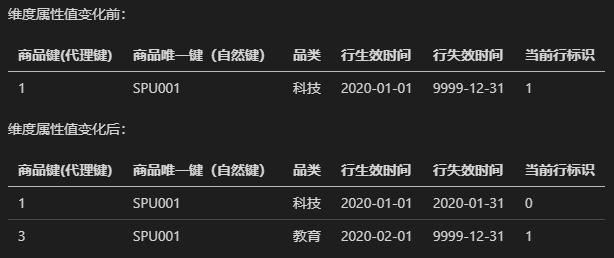
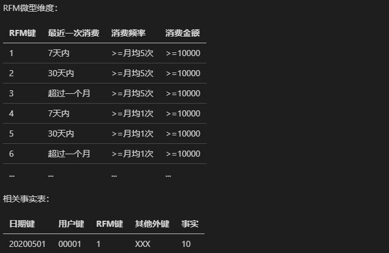
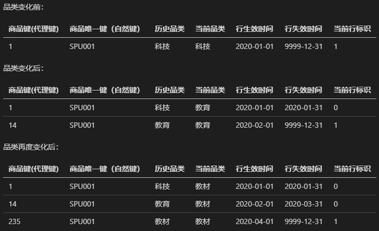
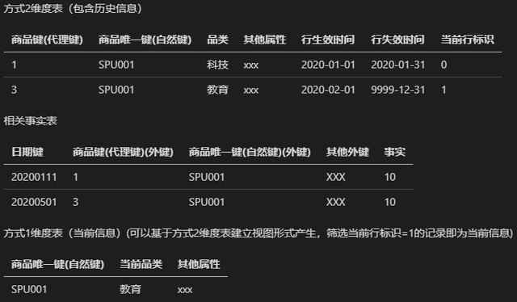

# 缓慢变化维

## 1、简介

Slowly Changing Dimensions，被简写为 SCD。

维度的属性会随着时间的流失发生缓慢的变化，这种维度称为缓慢变化维。

例如，一个员工维表，包含了员工的id、名字、任职地区。那么随着时间的变化，员工可能会从子公司A调到子公司B，那么任职地区就发生了变化。

## 2、如何处理缓慢变化维

**（0）保留原始值**

维度属性值不做更改，保留原始值。

此方式什么也不做，所以称之为方式0。

比如商品上架售卖时间：一个商品上架售卖后可能由于缺货下架，补充库存后又再次上架，此种情况产生了多个商品上架售卖时间。如果重点关注的是商品首次上架售卖时间，则采用方式0。

**（1）重写**

直接使用这个维度的新值更新覆盖旧值。

破坏了历史数据。同时，根据旧值，聚集产生的事实表需要修改。

比如：商品属于哪个品类，当商品品类发生变化时，直接重写为新品类，如果业务只关心最新的品类。

**（2）新增一行**

不修改旧值，而是根据新值，新增加一行数据。需要借助代理键，需要为新行分配新的代理键，将其作为事实表的外键。

这种方法需要在维表种，新增三列：`行有效日期/时间戳`、`行截止日期/时间戳` 和 `当前行标识`。

这样是为了防止多行数据描述同一个情况。

**（3）新增一列**

在原维表的基础上，新增加一列，用来区分新属性和旧属性。比如，员工的任职地区发生了变化，那么新增加 `新任职地区` 列。

**（4）增加微型维度**

当某维表是一个大型维度表，采用方式2时，如果某些维度属性变化相对较快，会导致该维表变得越来越大，导致存储压力和性能压力。

此时引入微型维度是一个不错的选择，将某些维度属性从该大型维表中抽离出来，单独构建微型维度。

比如将用户最近消费时间、消费频率、消费金额从用户维表中剥离出来，并结合业务以区间段形式表现，单独构建成RFM微型维度，并在相关事实表中增加 RFM 键作为外键。

**（5）微型维度与方式1支架**

该方式是方式1和方式4的结合，即建立微型维度后，微型维度的主键不仅作为事实表的外键，也作为主维度的外键。

这样微型维度的属性能够和主维度的属性一起访问，而不必通过连接事实表访问。

在主维度中，此微型维度支架以方式1处理，即每当当前微型维度发生变化时，直接覆盖微型维度支架，不保留历史信息。

如方式4中的例子，我们再将 RFM 键添加至主维度（用户维度表）中作为外键，以方式1进行更新，即为方式5。

**（6）将方式1属性增加到方式2维度**

该方式是方式1、2、3的结合，即同时增加维度行和维度列，并以方式1处理新加的维度列（当前属性，即下图中的`当前品类`）。

【当属性发生变化时，由系统自动重写与特定持久键关键的所有行。】

此种方式复杂，在少数特定迫切的场景下才会使用。

**（7）双重外键并且方式1与方式2结合**

在方式2的基础上，不仅是维度的代理键作为事实表外键，维度的自然键（如果自然键会被重新分配，发生变化，应该使用持续性超自然键）也同时作为事实表外键。

事实表通过代理键连接维表获取历史维度属性，通过自然键连接维表获取当前维度属性。

参考：

[https://baijiahao.baidu.com/s?id=1664910462456683920&wfr=spider&for=pc](https://baijiahao.baidu.com/s?id=1664910462456683920&wfr=spider&for=pc)

[数仓工具书2.5节处理缓慢变化维属性，和第5章采购]()

[https://www.cnblogs.com/charisna/p/4673866.html](https://www.cnblogs.com/charisna/p/4673866.html)