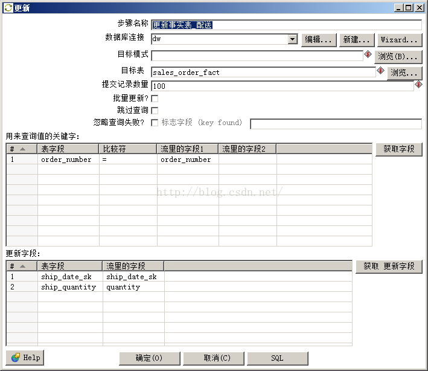

# 退化维度

[TOC]

该技术减少维度的数量，简化维度数据仓库的模式。

简单的模式比复杂的更容易理解，也有更好的查询性能。

当一个维度没有数据仓库需要的任何数据时就可以退化此维度。需要把退化维度的相关数据迁移到事实表中，然后删除退化的维度。 

## 1、如何退化订单维度

包括对数据仓库模式和定期装载脚本的修改。

### 1.1、对数据仓库模式

使用维度退化技术时你首先要做的识别数据，分析从来不用的数据列。例如，订单维度的 order_number 列就可能是这样的一列。但如果用户想看事务的细节，还需要订单号。

因此，在退化订单维度前，要把订单号迁移到 sales_order_fact 表。

>> 图（五）- 8-1显示了迁移后的模式。 


按顺序执行下面的四步退化 order_dim 维度表： 

- 1.给 sales_order_fact 表添加 order_number 列

- 2.把 order_dim 表里的订单号迁移到 sales_order_fact 表

- 3.删除 sales_order_fact 表里的 order_sk 列

- 4.删除 order_dim 表

清单（五）- 8-1 里的脚本完成所有退化订单维度所需的步骤。

```sql
USE dw;
/* adding order_number column                                    */
ALTER TABLE sales_order_fact ADD order_number INT AFTER receive_date_sk;

/* loading existing order_number                                 */
UPDATE sales_order_fact a, order_dim b 
SET a.order_number = b.order_number
WHERE a.order_sk = b.order_sk;

/* removing order_sk column                                      */
SET foreign_key_checks=0;
ALTER TABLE sales_order_fact DROP FOREIGN KEY sales_order_fact_ibfk_1;
ALTER TABLE sales_order_fact DROP order_sk;

/* removing the order_dim table                                  */
DROP TABLE order_dim;
SET foreign_key_checks=1;
 
COMMIT;
```

使用下面的语句确认 order_dim 里的 49 个订单号已经迁移到 sales_order_fact 表，查询结果如下。

```sh
mysql> select count(0) from sales_order_fact where order_number IS NOT NULL; 
+----------+ 
| count(0) | 
+----------+ 
|       49 | 
+----------+ 
1 row in set (0.00 sec) 
```

还应该使用下面的语句确认 order_sk 列已经从 sales_order_fact 表里删除了。 

```sh
mysql> desc sales_order_fact; 
+--------------------------+---------------+------+-----+---------+-------+ 
| Field                    | Type          | Null | Key | Default | Extra | 
+--------------------------+---------------+------+-----+---------+-------+ 
| customer_sk              | int(11)       | YES  | MUL | NULL    |       | 
| product_sk               | int(11)       | YES  | MUL | NULL    |       | 
| order_date_sk            | int(11)       | YES  | MUL | NULL    |       | 
| allocate_date_sk         | int(11)       | YES  |     | NULL    |       | 
| packing_date_sk          | int(11)       | YES  |     | NULL    |       | 
| ship_date_sk             | int(11)       | YES  |     | NULL    |       | 
| receive_date_sk          | int(11)       | YES  |     | NULL    |       | 
| order_number             | int(11)       | YES  |     | NULL    |       | 
| request_delivery_date_sk | int(11)       | YES  |     | NULL    |       | 
| order_amount             | decimal(10,2) | YES  |     | NULL    |       | 
| order_quantity           | int(11)       | YES  |     | NULL    |       | 
| allocate_quantity        | int(11)       | YES  |     | NULL    |       | 
| packing_quantity         | int(11)       | YES  |     | NULL    |       | 
| ship_quantity            | int(11)       | YES  |     | NULL    |       | 
| receive_quantity         | int(11)       | YES  |     | NULL    |       | 
+--------------------------+---------------+------+-----+---------+-------+ 
15 rows in set (0.01 sec) 
```

最后，使用下面的命令确认 order_dim 表已经被删除。 

```sh
mysql> show tables; 
+----------------------------+ 
| Tables_in_dw               | 
+----------------------------+ 
| allocate_date_dim          | 
| campaign_session_stg       | 
| cdc_time                   | 
| customer_dim               | 
| customer_stg               | 
| date_dim                   | 
| month_dim                  | 
| month_end_sales_order_fact | 
| order_date_dim             | 
| pa_customer_dim            | 
| packing_date_dim           | 
| product_dim                | 
| product_stg                | 
| promo_schedule_stg         | 
| receive_date_dim           | 
| request_delivery_date_dim  | 
| sales_order_fact           | 
| ship_date_dim              | 
+----------------------------+ 
18 rows in set (0.00 sec)
``` 

### 1.2、定期装载脚本的修改

修改后的脚本需要把订单号加入到销售订单事实表，而不再需要导入订单维度。

清单清单（五）- 8-2显示了修改后的定期装载脚本。 

```sql
USE dw;
 
-- 设置SCD的截止时间和生效时间
SET @pre_date = SUBDATE(CURRENT_DATE,1) ;
 
-- 设置CDC的上限时间
UPDATE cdc_time SET current_load = CURRENT_DATE ;
 
-- 装载客户维度
TRUNCATE TABLE customer_stg;
INSERT INTO customer_stg
SELECT 
  customer_number
, customer_name
, customer_street_address
, customer_zip_code
, customer_city
, customer_state
, shipping_address
, shipping_zip_code
, shipping_city
, shipping_state
FROM source.customer ;
/* 在所有地址列上 SCD2                           */
/* 置过期                          */
UPDATE customer_dim a,
    customer_stg b 
SET 
    expiry_date = @pre_date
WHERE
    a.customer_number = b.customer_number
        AND (a.customer_street_address <> b.customer_street_address
        OR a.customer_city <> b.customer_city
        OR a.customer_zip_code <> b.customer_zip_code
        OR a.customer_state <> b.customer_state
        OR a.shipping_address <> b.shipping_address
        OR a.shipping_city <> b.shipping_city
        OR a.shipping_zip_code <> b.shipping_zip_code
        OR a.shipping_state <> b.shipping_state
        OR a.shipping_address IS NULL
        OR a.shipping_city IS NULL
        OR a.shipping_zip_code IS NULL
        OR a.shipping_state IS NULL)
        AND expiry_date = '2200-01-01';
/* 加新行                          */
INSERT INTO customer_dim
SELECT
  NULL
, b.customer_number
, b.customer_name
, b.customer_street_address
, b.customer_zip_code
, b.customer_city
, b.customer_state
, b.shipping_address
, b.shipping_zip_code
, b.shipping_city
, b.shipping_state
, a.version + 1
, @pre_date
, '2200-01-01'
FROM
  customer_dim a
, customer_stg b
WHERE
    a.customer_number = b.customer_number
AND ( a.customer_street_address <> b.customer_street_address
     OR a.customer_city <> b.customer_city
     OR a.customer_zip_code <> b.customer_zip_code
     OR a.customer_state <> b.customer_state
     OR a.shipping_address <> b.shipping_address
     OR a.shipping_city <> b.shipping_city
     OR a.shipping_zip_code <> b.shipping_zip_code
     OR a.shipping_state <> b.shipping_state
     OR a.shipping_address IS NULL
     OR a.shipping_city IS NULL
     OR a.shipping_zip_code IS NULL
     OR a.shipping_state IS NULL)
AND EXISTS(
SELECT *
FROM customer_dim x
WHERE
    b.customer_number=x.customer_number
AND a.expiry_date = @pre_date )
AND NOT EXISTS (
SELECT *
FROM customer_dim y
WHERE
    b.customer_number = y.customer_number
AND y.expiry_date = '2200-01-01') ;
/* 在 customer_name 列上 SCD1                                             */
UPDATE customer_dim a, customer_stg b
SET a.customer_name = b.customer_name
WHERE a.customer_number = b.customer_number
      AND a.customer_name <> b.customer_name ;
/* 新增的客户                                                   */
INSERT INTO customer_dim
SELECT
  NULL
, customer_number
, customer_name
, customer_street_address
, customer_zip_code
, customer_city
, customer_state
, shipping_address
, shipping_zip_code
, shipping_city
, shipping_state
, 1
, @pre_date
,'2200-01-01'
FROM customer_stg
WHERE customer_number NOT IN(
SELECT y.customer_number
FROM customer_dim x, customer_stg y
WHERE x.customer_number = y.customer_number) ;
 
/* 重建PA客户维度                               */
TRUNCATE pa_customer_dim;
INSERT INTO pa_customer_dim
SELECT
  customer_sk
, customer_number
, customer_name
, customer_street_address
, customer_zip_code
, customer_city
, customer_state
, shipping_address
, shipping_zip_code
, shipping_city
, shipping_state
, version
, effective_date
, expiry_date
FROM customer_dim
WHERE customer_state = 'PA' ;
 
/* 装载产品维度                                           */
TRUNCATE TABLE product_stg ;
INSERT INTO product_stg
SELECT 
  product_code
, product_name
, product_category
FROM source.product ;
/* 在 product_name 和 product_category 列上 SCD2                                    */
/* 置过期                                 */
UPDATE
  product_dim a
, product_stg b
SET
  expiry_date = @pre_date
WHERE
    a.product_code = b.product_code
AND (   a.product_name <> b.product_name
     OR a.product_category <> b.product_category)
AND expiry_date = '2200-01-01';
/* 加新行                                */
INSERT INTO product_dim
SELECT
  NULL
, b.product_code
, b.product_name
, b.product_category
, a.version + 1
, @pre_date
,'2200-01-01'
FROM
  product_dim a
, product_stg b
WHERE
    a.product_code = b.product_code
AND (   a.product_name <> b.product_name
     OR a.product_category <> b.product_category)
AND EXISTS(
SELECT *
FROM product_dim x
WHERE     b.product_code = x.product_code
      AND a.expiry_date = @pre_date)
AND NOT EXISTS (
SELECT *
FROM product_dim y
WHERE     b.product_code = y.product_code
      AND y.expiry_date = '2200-01-01') ;
/* 新增的产品                                                    */
INSERT INTO product_dim
SELECT
  NULL
, product_code
, product_name
, product_category
, 1
, @pre_date
, '2200-01-01'
FROM product_stg
WHERE product_code NOT IN(
SELECT y.product_code
FROM product_dim x, product_stg y
WHERE x.product_code = y.product_code) ;
 
-- 装载事实表，新增前一天的订单
INSERT INTO sales_order_fact
SELECT
  customer_sk
, product_sk
, e.order_date_sk
, NULL
, NULL
, NULL
, NULL
, a.order_number
, f.request_delivery_date_sk
, order_amount
, quantity
, NULL
, NULL
, NULL
, NULL
FROM
  source.sales_order a
, customer_dim c
, product_dim d
, order_date_dim e
, request_delivery_date_dim f
, cdc_time g
WHERE
	a.order_status = 'N'
AND a.customer_number = c.customer_number
AND a.status_date >= c.effective_date
AND a.status_date < c.expiry_date
AND a.product_code = d.product_code
AND a.status_date >= d.effective_date
AND a.status_date < d.expiry_date
AND a.status_date = e.order_date
AND a.request_delivery_date = f.request_delivery_date
AND a.entry_date >= g.last_load AND a.entry_date < g.current_load ;
 
/* UPDATING the new sales order to Allocated status           */
UPDATE sales_order_fact a,
    source.sales_order b,
    allocate_date_dim c,
    cdc_time h
SET 
    a.allocate_date_sk = c.allocate_date_sk,
    a.allocate_quantity = b.quantity
WHERE
    order_status = 'A'
        AND b.entry_date >= h.last_load AND b.entry_date < h.current_load
        AND b.order_number = a.order_number
        AND c.allocate_date = b.status_date ;
 
/* UPDATING the allocated order to Packed status              */
UPDATE sales_order_fact a,
    source.sales_order b,
    packing_date_dim d,
    cdc_time h
SET 
    a.packing_date_sk = d.packing_date_sk,
    a.packing_quantity = b.quantity
WHERE
    order_status = 'P'
        AND b.entry_date >= h.last_load AND b.entry_date < h.current_load
        AND b.order_number = a.order_number
        AND d.packing_date = b.status_date ;
 
/* UPDATING the packed order to Shipped status                */
UPDATE sales_order_fact a,
    source.sales_order b,
    ship_date_dim e,
    cdc_time h
SET 
    a.ship_date_sk = e.ship_date_sk,
    a.ship_quantity = b.quantity
WHERE
    order_status = 'S'
        AND b.entry_date >= h.last_load AND b.entry_date < h.current_load
        AND b.order_number = a.order_number
        AND e.ship_date = b.status_date ;
 
/* UPDATING the shipped order to Received status              */
UPDATE sales_order_fact a,
    source.sales_order b,
    receive_date_dim f,
    cdc_time h
SET 
    a.receive_date_sk = f.receive_date_sk,
    a.receive_quantity = b.quantity
WHERE
    order_status = 'R'
        AND b.entry_date >= h.last_load AND b.entry_date < h.current_load
        AND b.order_number = a.order_number
        AND f.receive_date = b.status_date ;
 
-- 更新时间戳表的last_load字段
UPDATE cdc_time SET last_load = current_load ;
 
COMMIT ;
```

图（五）- 8-2到图（五）- 8-8显示了对Kettle定时装载的修改。 





### 1.3、测试修改后的定期装载 

本小节说明如何测试清单（五）- 8-2里的定期装载脚本和对应的 Kettle 转换。

测试使用具有分配库房、出库、配送和收货里程碑的两个新订单。所以每个订单需要添加五行。清单（五）- 8-3里的脚本向源数据库里的 sales_order 表新增十行。 


```sql
USE source;
INSERT INTO sales_order VALUES
  (52, 1, 1, '2015-03-11', 'N', '2015-03-20', '2015-03-11', 7500,
       75)
, (53, 2, 2, '2015-03-11', 'N', '2015-03-20', '2015-03-11', 1000,
       10)
, (52, 1, 1, '2015-03-12', 'A', '2015-03-20', '2015-03-12', 7500,
       75)
, (53, 2, 2, '2015-03-12', 'A', '2015-03-20', '2015-03-12', 1000,
       10)
, (52, 1, 1, '2015-03-13', 'P', '2015-03-20', '2015-03-13', 7500,
       75)
, (53, 2, 2, '2015-03-13', 'P', '2015-03-20', '2015-03-13', 1000,
       10)
, (52, 1, 1, '2015-03-14', 'S', '2015-03-20', '2015-03-14', 7500,
       75)
, (53, 2, 2, '2015-03-14', 'S', '2015-03-20', '2015-03-14', 1000,
       10)
, (52, 1, 1, '2015-03-15', 'R', '2015-03-20', '2015-03-15', 7500,
       75)
, (53, 2, 2, '2015-03-15', 'R', '2015-03-20', '2015-03-15', 1000,
       10)
;
 
COMMIT;
```

现在设置你的系统日期为2015年3月12日，然后再执行清单（五）- 8-2里的脚本或对应的Kettle作业。之后，设置你的系统日期从2015年3月13日到2015年3月16日，每个日期执行一次定期装载。 

执行五次定期装载后，查询 sales_order_fact 表的两条订单，SQL语句和结果显示如下。 

```sh
mysql> select 
    ->     order_number od, 
    ->     order_date_sk od_sk, 
    ->     allocate_date_sk ad_sk, 
    ->     packing_date_sk pk_sk, 
    ->     ship_date_sk sd_sk, 
    ->     receive_date_sk rd_sk 
    -> from 
    ->     sales_order_fact 
    -> where 
    ->     order_number IN (52 , 53); 
+------+-------+-------+-------+-------+-------+ 
| od   | od_sk | ad_sk | pk_sk | sd_sk | rd_sk | 
+------+-------+-------+-------+-------+-------+ 
|   52 |  5549 |  5550 |  5551 |  5552 |  5553 | 
|   53 |  5549 |  5550 |  5551 |  5552 |  5553 | 
+------+-------+-------+-------+-------+-------+ 
2 rows in set (0.00 sec) 
```

注意 5549-5553是2015年3月11日至2015年3月15日。

原文地址：[https://blog.csdn.net/wzy0623/article/details/49797421](https://blog.csdn.net/wzy0623/article/details/49797421)