# 线性回归

[TOC]

## 1、单变量线性回归

例子：

	根据房屋交易数据集，预测1250平方英尺的房子的价格是多少。

将数据集以散点图的形式展示，再据此拟合一条直线，即构建了一个数据模型。那么就可以根据这个数据模型来预测房子的价格。

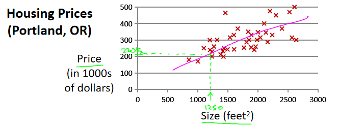

上例中的房屋交易数据集称为 **训练集** ，具体如下所示。

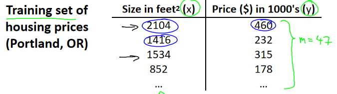

其中：

	m ：训练集中样本的数量
	x ：输入变量\特征
	y ：输出变量\目标变量

	(x,y) 表示训练集中的一个样本
	(x^i,y^i) 表示第 i 个样本

下图表示一个监督学习算法的工作方式

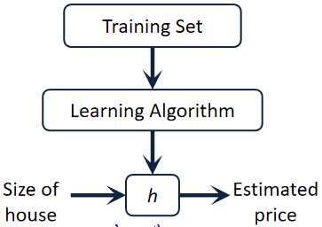

要解决房价预测问题，首先要将训练集输入给学习算法，进而学习得到一个假设 h，然后将要预测的房屋的尺寸作为输入变量输入给 h，预测出该房屋的交易价格作为输出变量输出为结果。

那么，如何表示 h 呢？【联系一元一次方程的图形表示理解】【因为训练集在坐标中的表示大致呈一元一次方程的形式】

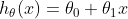

因为只含有一个特征/输入变量，因此这样的问题叫作 **单变量线性回归问题**。

那么，此时就可以输入 x 来确定 h 了，但需要先确定参数 θ0 和 θ1。

### 1.1、代价函数

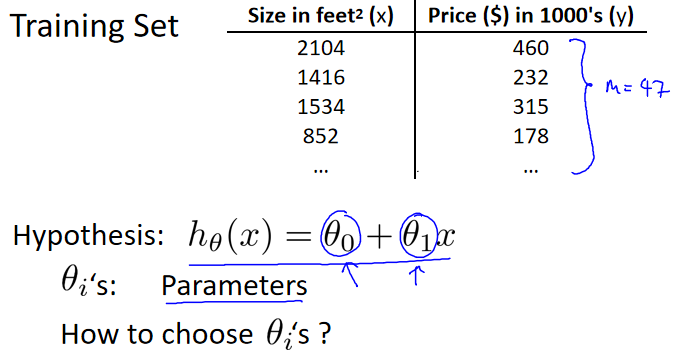

现在要做的便是为我们的模型选择合适的参数 θ0 和 θ1，在房价问题这个例子中便是**直线的斜率和在 y 轴上的截距**。

下面是选择的几种类型：

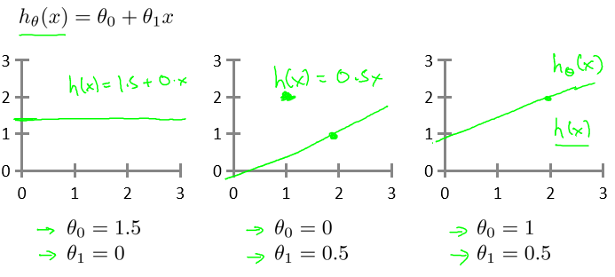

所以，选择参数后所形成的直线，要尽量拟合图中训练集的数据点。

即，**对于参数确定后的数据模型，当输入 x，数据模型的输出 h(x) 要尽可能的等于样本的 y 值。**

使用公式表示就是：【均方根误差】

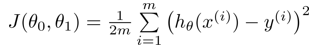

【此时，针对上图的公式来看，自变量是 θ0 和 θ1，因变量是 J】

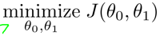

J 表示代价函数，**目标是选择参数 θ0 和 θ1 后，J 的值最小。**

### 1.2、对线性回归目标的理解

现在假设 θ0=0，那么假设函数、代价函数变成如下样子：

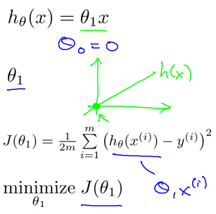

	假设函数 h 成为一条过原点的直线，关于 x 的函数。

	代价函数 J 成为一条U型曲线，关于 θ1 的函数。如下：

当 θ1=1 时：

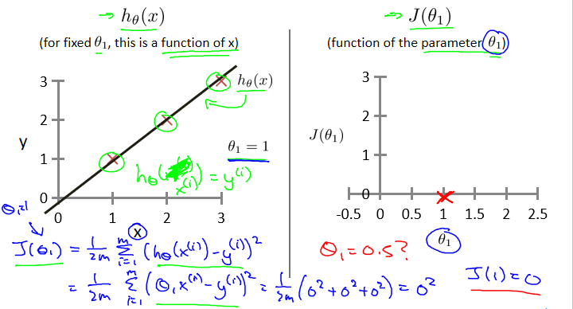

h=x， 过 (0,0)、(1,1)、(2,2)... ，那么 J=0 ，此时 h等于y

当 θ1=0.5 时：

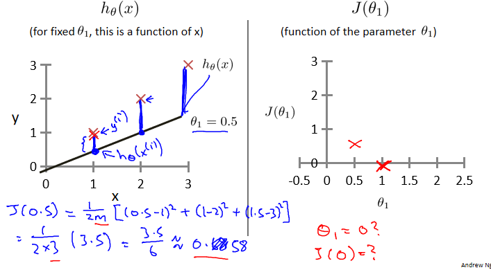

h=0.5x，J=0.65，此时 h 和 y 间有差值，如图。

当 θ1=0 时：

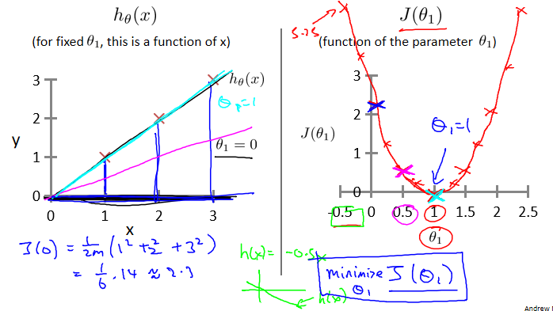

h=0，J=2.3，此时 h 和 y 间有差值，如图。

所以，由以上三张图，可知：

	θ1 确定一个值，对应左图的一条直线，对应右图一个点。

	当取多个 θ1 时，J 呈 U 型曲线，其最小值是为 θ1=1 时，此时左图中h等于y。

-------------------------------------------------------------

θ0 和 θ1 同时取值时

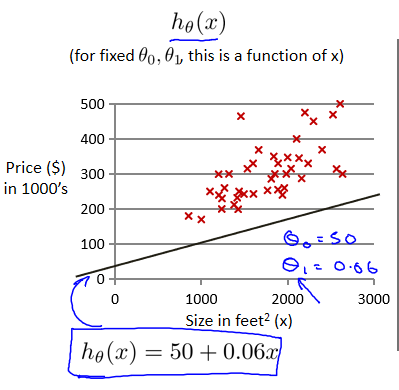

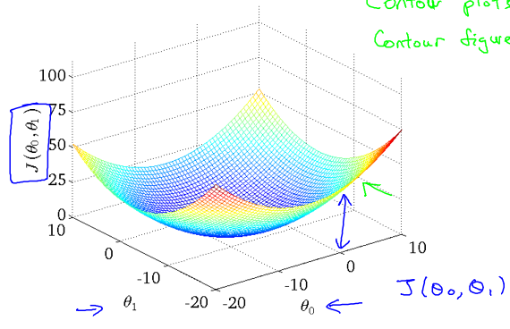

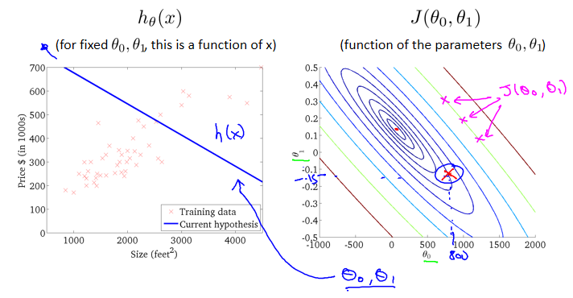

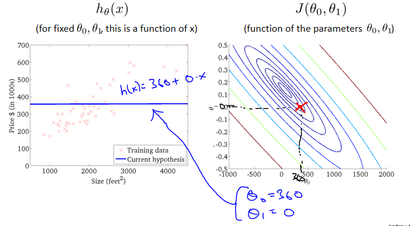

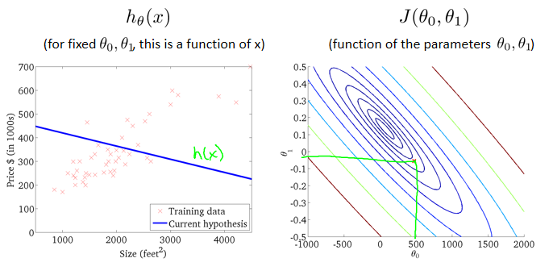


可以看出在三维空间中存在一个使得代价函数最小的点。

-------------------------------------------------------------
 
**那么，现在问题是如何确定 θ0、θ1，使代价函数最小。**

梯度下降是一个用来求函数最小值的算法，我们将使用梯度下降算法来求出代价函数J的最小值

### 1.3、梯度下降

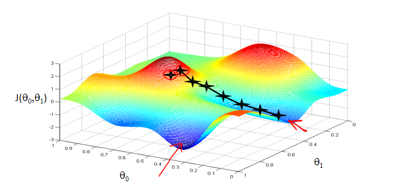

想象一下你正站立在山的这一点上，站立在你想象的公园这座红色山上，在梯度下降算法中，我们要做的就是旋转 360 度，看看我们的周围，选择最佳的下山方向，迈着小碎步下山，到了一个新的点后，重复上面的步骤，直到接近局部最低点的位置。

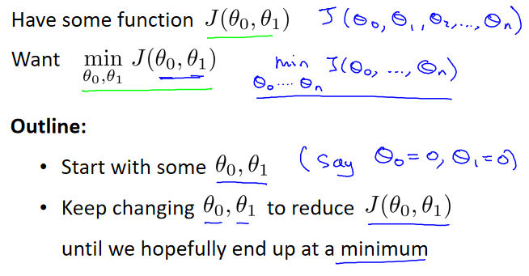

思路：先对 θ0、θ1 取一个初始值，一般都取0，然后**同时更新**这两个参数，使 J 变小，直到得到 J 一个局部最小值。

	选择不同的初始参数，可能会找到不同的局部最小值。

梯度下降公式为：

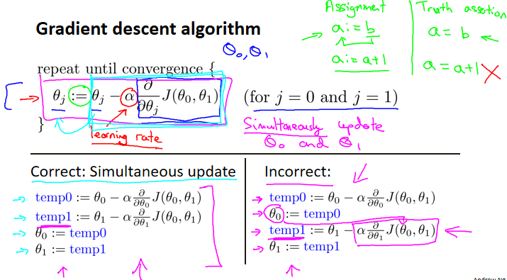

#### 1.3.1、理解梯度下降公式

这里取 θ0=0。

**对偏导数部分**

J 的图形表示如下：

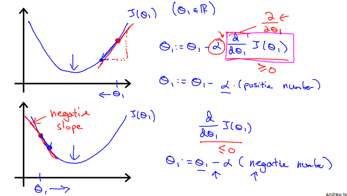

	偏导数表示在正切该点的直线的斜率。

当点在最小值的右边时，斜率为正数，即原点减去一个长度向下走。

当点在最小值的左边时，斜率为负数，即原点加上一个长度向下走。

随着迭代的进行，图中红点会一直向下移动，切线的斜率也会逐渐变小。

【偏导数部分理解成走多少步】

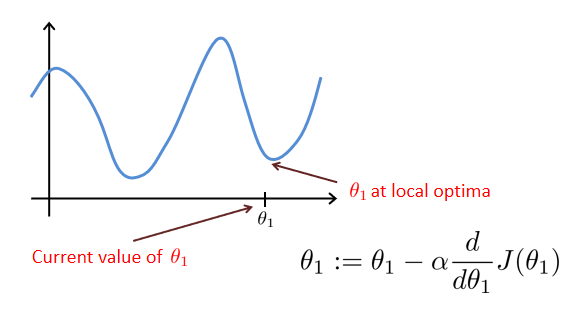

当走到最小值处，斜率为0。这意味着你已经在局部最优点，它使得 θ1不再改变，也就是新的 θ1等于原来的 θ1，因此，如果你的参数已经处于局部最低点，那么梯度下降法更新其实什么都没做，它不会改变参数的值。这也解释了为什么即使学习速率 α 保持不变时，梯度下降也可以收敛到局部最低点。


**对α**

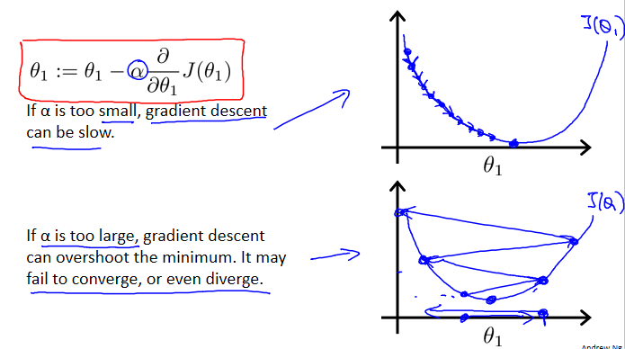

α 为学习速率，理解成下山的步子迈多大。

如果 α 太小了，即学习速率太小，这样就需要很多步才能到达最低点。

如果 α 太大，那么可能会越过最低点，甚至可能无法收敛。

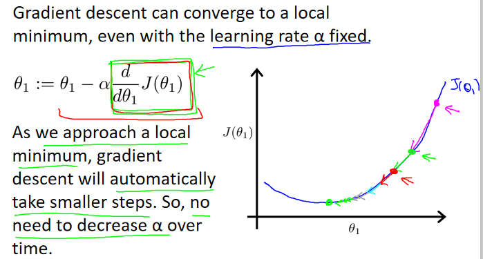

当越来越接近最小值时，步子会自动越迈越小，即 α 会越迈越小，所以不需要手动减少 α 。 

### 1.4、单变量线性回归的梯度下降算法

将梯度下降和代价函数结合，并将其应用于具体的拟合直线的线性回归算法里。

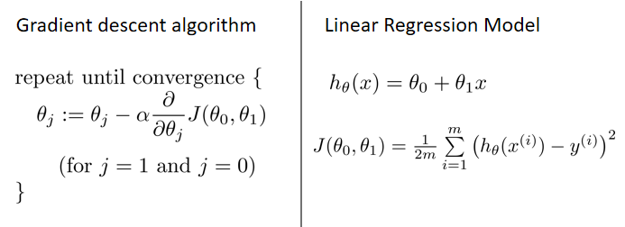

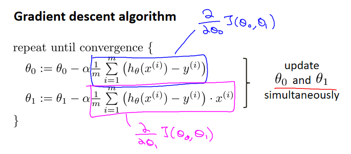

【逐渐拟合的演示见视频】

有时也称为批量梯度下降，指的是在梯度下降的每一步中，我们都用到了所有的训练样本，在梯度下降中，在计算微分求导项时，我们需要进行求和运算，所以，在一个单独的梯度下降中，我们最终都要计算这样一个东西，这个项需要对所有 m 个训练样本求和。因此，批量梯度下降法这个名字说明了我们需要考虑所有这一"批"训练样本。

在后面的课程中，我们也会谈到这个方法，它可以在不需要多步梯度下降的情况下，也能解出代价函数 J 的最小值，这是另一种称为正规方程(normal equations)的方法。实际上在数据量较大的情况下，梯度下降法比正规方程要更适用一些。

## 2、多变量线性回归

在上面的房屋交易例子中，只有一个变量(特征)房子大小。当变量增多时，如：

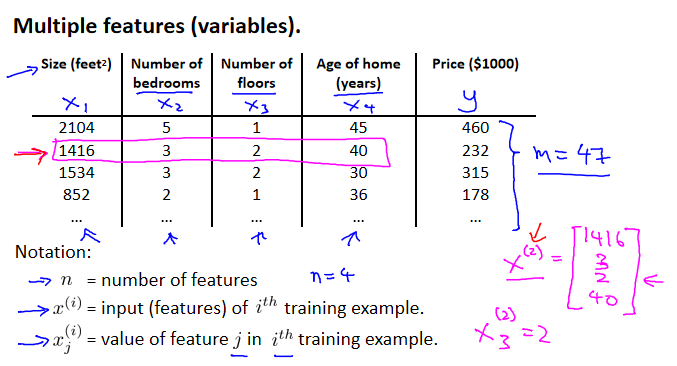

此时，假设函数也随之变化：

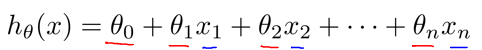

这里的 x0=1.

转换成矩阵形式：

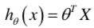

即：

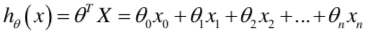

这就是 **多变量线性回归**

### 2.1、多变量的梯度下降

**线性回归的目标是：确定参数 θn(n=0,1...,n)，使代价函数 J 最小**

那么，多变量情况下的代价函数为：

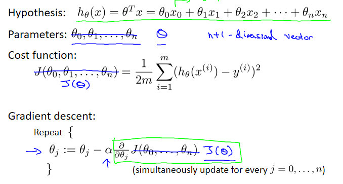

其中，参数 θ 看作一个 (n+1) 维向量

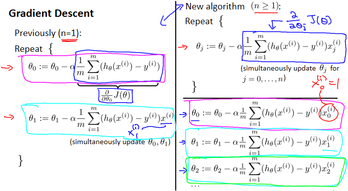

其中，左边部分是变量为一个时的情况。右边部分是变量大于等于二个时的情况。右边部分的下部是变量等于二个时的情况。**这里的 x0=1**

### 2.2、特征缩放

在多变量线性回归中，因为存在多个变量，不同变量的数据范围可能差异很大，这样会导致使用梯度下降时，收敛很慢。

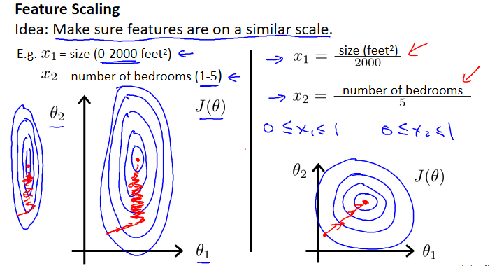

以房价问题为例，假设我们使用两个特征，房屋的尺寸和房间的数量，尺寸的值为 0-2000 平方英尺，而房间数量的值则是 0-5，以两个参数分别为横纵坐标，绘制代价函数的等高线图能，看出图像会显得很扁，梯度下降算法需要非常多次的迭代才能收敛。

所以需要进行特征缩放。在特征缩放时，一般时变量 xi 在 [-1,1] 间，其中 x1 的范围可以是 [0,3]，x2 的范围可以是 [-2,0.5]，这样会很接近 [-1,1] 。但 x3 不能是 [-100,100]，x4 不能是 [-0.0001，0.0001]。

所以，和 [-1,1] 的差值不要太大，加减3或1/3都可以。

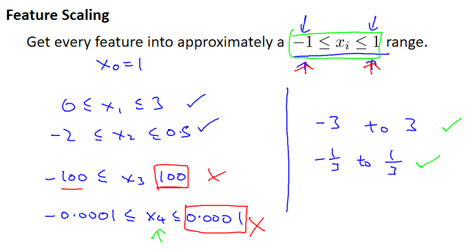

均值归一化：

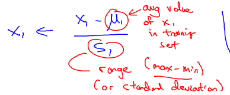

分子为均值，分母为最大值减最小值，或者是方差。

### 2.3、再次理解学习速率α

梯度下降算法收敛所需要的迭代次数根据模型的不同而不同，我们不能提前预知，但**可以绘制迭代次数和代价函数的图表来观测算法在何时趋于收敛**。

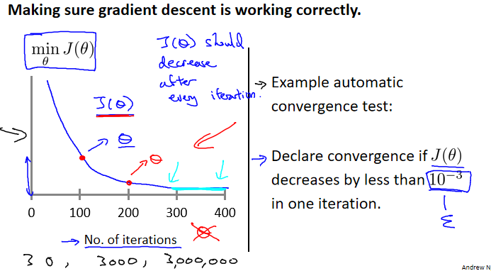

由上图可知，随着迭代次数的增加，曲线逐渐平缓，这就表明算法逐渐趋于收敛。

也有一些自动测试是否收敛的方法，例如将代价函数的变化值与某个阀值（例如 0.001）
进行比较，但通常看上面这样的图表更好。

下图就表示算法没能正常工作，可能的原因就是学习速率 α 设置的过大，出现了上升情况：

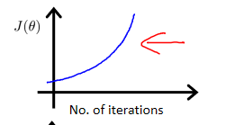

所以，梯度下降算法的每次迭代受到学习速率 α 的影响：

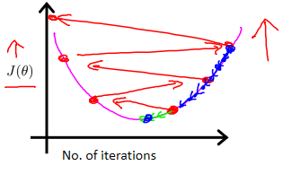


上图就是学习速率 α 设置的过大，可能会越过局部最小值导致无法收敛。

此时，就需要将 α 设置的小些。

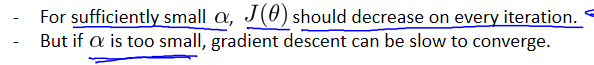

所以，只要 α 设置的足够小，代价函数在每次迭代后，都是下降的。但如果设置的过小，那么收敛就会很慢。

总结：

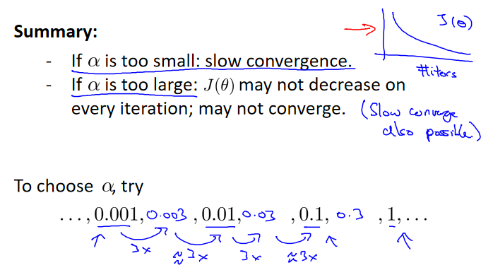

### 2.4、特征选择与多项式回归

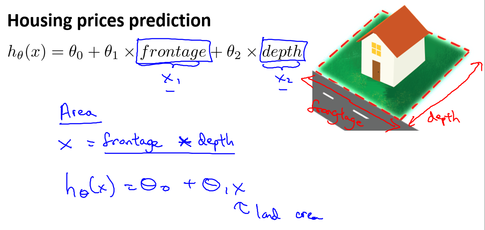

如上图所示，x1 和 x2 变量表示宽度和长度，此时表示的是一个多变量线性回归。

但如果想要预测房价，真正关心的变量应该是房子的面积，所以创建一个新的变量 x ，表示房子的面积，此时就表示的是一个单变量线性回归。

所以，选择不同的特征，取决于你的看问题的角度，同时也会得到一个不同的模型，可能这个模型能更好的拟合数据。

和选择特征类似的，就是多项式回归。

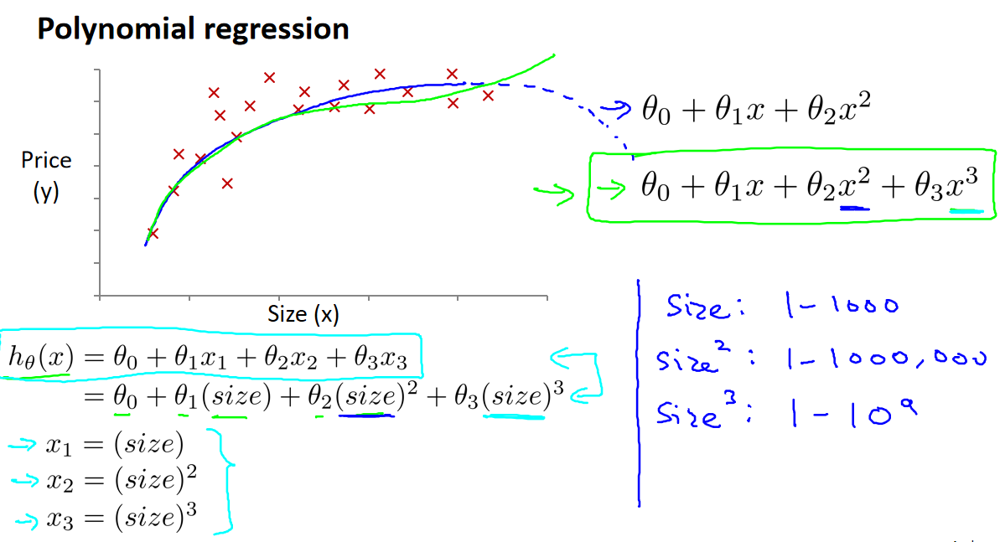

对于上图数据集，会有不同的模型来拟合。可以选择二次模型来拟合，但效果并不好，因为曲线会在最高点后下降，和实际数据情况不符。所以可以选择三次函数，能够更好的拟合。

那么，就可以得到上图下部分的假设函数，就可以使用线性回归方法进行拟合。

这种情况下，特征缩放就变得十分重要，因为三个变量的数量级有很大的差距。

除了上述的三次函数拟合，还可以选择如下的方式：

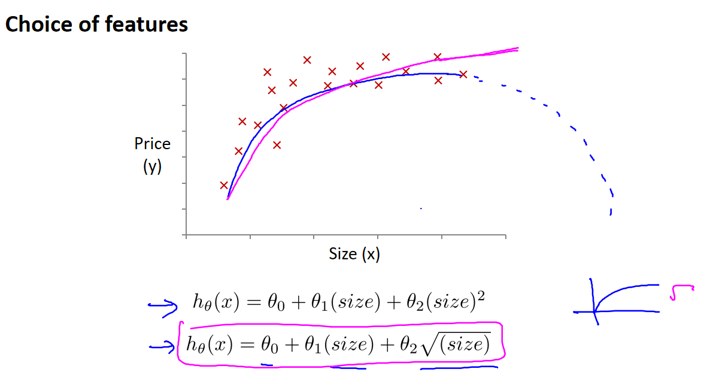

拟合的曲线是红色的那条，会慢慢上升，逐渐平缓。

【所以，模型的选择要注意观察数据的分布情况。】

### 2.5、正规方程

前面我们计算参数 θ 的最优值，使用的是梯度下降算法来迭代求解，但是对于某些线性回归问题，正规方程方法是更好的解决方案，可以一次性求解。

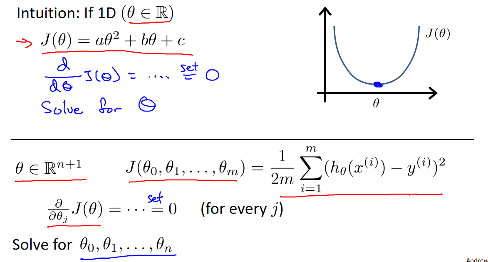

当 θ 是一个实数时，可以对 J 求 θ 的偏导数，再令其为0，得到最优 θ 。

但当 θ 是一个 (n+1) 维向量时，分别求偏导不太现实。

可以如下操作：

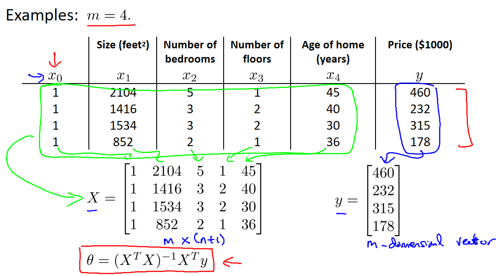

将 X 表示为一个 mx(n+1) 维矩阵，y 表示一个 m 维向量。那么就可以得到如图的公式。

更通用的表示法如下：

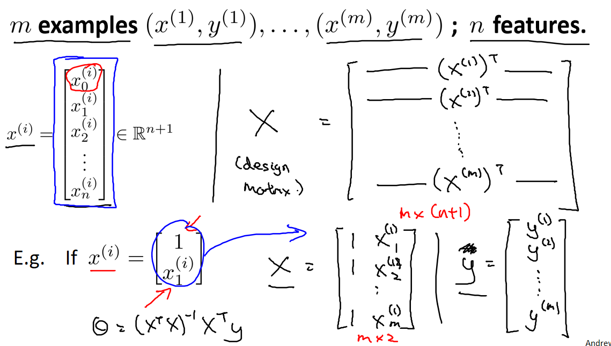

由上图可知，这种方法需要计算矩阵的逆矩阵。

所以，对于那些不可逆的矩阵（通常是因为特征之间不独立，如同时包含英尺为单位的尺
寸和米为单位的尺寸两个特征，也有可能是特征数量大于训练集的数量），正规方程方法是
不能用的。 

梯度下降和正规方程的区别如下：

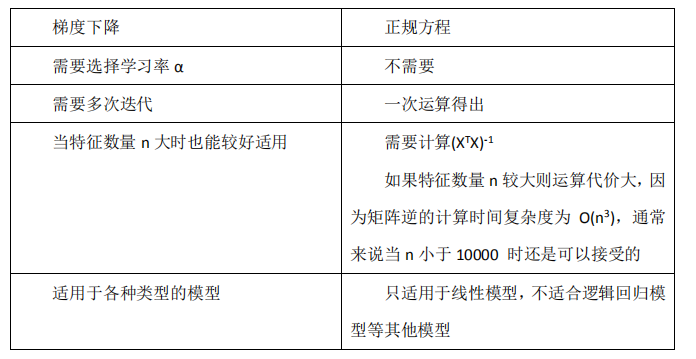


总结一下，只要特征变量的数目并不大，标准方程是一个很好的计算参数 θ 的替代方法。具体地说，只要特征变量数量小于一万，我通常使用标准方程法，而不使用梯度下降法。

随着我们要讲的学习算法越来越复杂，例如，当我们讲到分类算法，像逻辑回归算法，
我们会看到， 实际上对于那些算法，并不能使用标准方程法。**对于那些更复杂的学习算法，
我们将不得不仍然使用梯度下降法**。因此，梯度下降法是一个非常有用的算法，可以用在有大量特征变量的线性回归问题。或者我们以后在课程中，会讲到的一些其他的算法，因为标准方程法不适合或者不能用在它们上。**但对于这个特定的线性回归模型，标准方程法是一个比梯度下降法更快的替代算法**。所以，根据具体的问题，以及你的特征变量的数量，这两种算法都是值得学习的。

#### 2.5.1、解决矩阵不可逆

首先，看特征值里是否有一些多余的特征，像这些 x1 和 x2 是线性相关的，互为线性函数。同时，当有一些多余的特征时，可以**删除这两个重复特征里的其中一个**，无须两个特征同时保留，将解决不可逆性的问题。如果特征数量实在太多，我会删除些，用较少的特征来反映尽可能多内容，否则我会考虑使用**正规化方法**。

如果矩阵 X'X 是不可逆的，（通常来说，不会出现这种情况），如果在 Octave 里，可以用**伪逆函数 pinv ( ) 来实现**。这种使用不同的线性代数库的方法被称为伪逆。即使 X'X 的结果是不可逆的，但算法执行的流程是正确的。

总之，出现不可逆矩阵的情况极少发生，所以在大多数实现线性回归中，出现不可逆的问题不应该过多的关注 XTX 是不可逆的。

## 3、示例

```python
>>> import numpy as np
>>> from sklearn.linear_model import LinearRegression
>>> X = np.array([[1, 1], [1, 2], [2, 2], [2, 3]])
>>> # y = 1 * x_0 + 2 * x_1 + 3
>>> y = np.dot(X, np.array([1, 2])) + 3
>>> reg = LinearRegression().fit(X, y)
>>> reg.score(X, y)
1.0
>>> reg.coef_
array([1., 2.])
>>> reg.intercept_
3.0000...
>>> reg.predict(np.array([[3, 5]]))
array([16.])
```