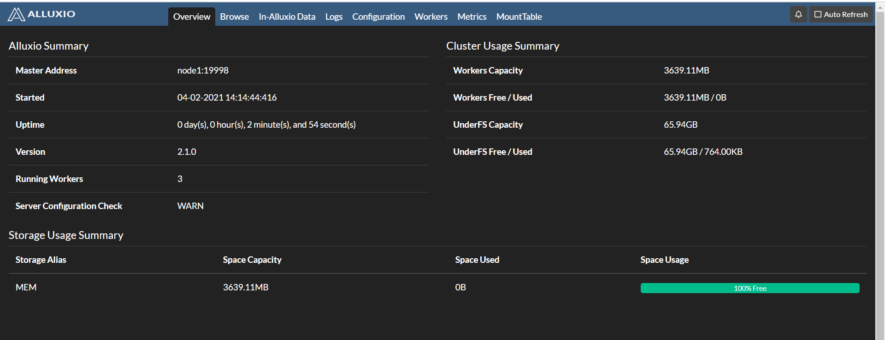
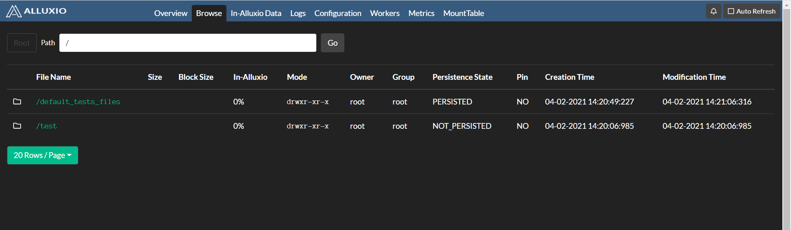

# Alluxio+HDFS+MapReduce

[TOC]

包括两部分：

- 在 HDFS 上配置 Alluxio 
- 在 Alluxio 上运行 MapReduce

## 1、在 HDFS 上配置 Alluxio 

注意：这里使用单个 master。 但是，这个单个 master 在 Alluxio 集群中存在单点故障(SPOF)，即如果该机器或进程不可用，整个集群将不可用。

### 1.1、节点角色

采用 3 台虚拟机

主机名  |     IP地址       |  角色
---|:---|:---
node1  | 192.168.xxx.xx1  |  master
node2  | 192.168.xxx.xx2  |  worker
node3  | 192.168.xxx.xx3  |  worker


### 1.2、软件版本

软件	    |    版本
---|:---
JDK     |   jdk1.8.0_281
HADOOP  |	hadoop-2.7.3
ALLUXIO |   alluxio-2.1.0


### 1.3、准备工作

#### 1.3.1、设置 SSH 免密登录

三台虚拟机可以互相免密登录

#### 1.3.2、安装 JDK

#### 1.3.3、安装 Hadoop

完全分布式安装

以上配置安装参考：[https://github.com/ZGG2016/knowledgesystem/blob/master/06%20Hadoop/%E7%8E%AF%E5%A2%83%E6%90%AD%E5%BB%BA/%E7%8E%AF%E5%A2%83%E6%90%AD%E5%BB%BA%EF%BC%9A%E5%AE%8C%E5%85%A8%E5%88%86%E5%B8%83.md](https://github.com/ZGG2016/knowledgesystem/blob/master/06%20Hadoop/%E7%8E%AF%E5%A2%83%E6%90%AD%E5%BB%BA/%E7%8E%AF%E5%A2%83%E6%90%AD%E5%BB%BA%EF%BC%9A%E5%AE%8C%E5%85%A8%E5%88%86%E5%B8%83.md)

### 1.4、安装 Alluxio

在 node1 上，下载、解压、配置环境变量：

```sh
[root@node1 opt]# tar -zxvf alluxio-2.1.0-bin.tar.gz

[root@node1 opt]# ls
alluxio-2.1.0  alluxio-2.1.0-bin.tar.gz  hadoop-2.7.3

[root@node1 opt]# vi  /etc/profile
[root@node1 opt]# source  /etc/profile 
[root@node1 opt]# cat  /etc/profile      
# /etc/profile
...

export JAVA_HOME=/opt/jdk1.8.0_281
export HADOOP_HOME=/opt/hadoop-2.7.3
export ALLUXIO_HOME=/opt/alluxio-2.1.0

export PATH=.:$HADOOP_HOME/bin:$JAVA_HOME/bin:$ALLUXIO_HOME/bin:$PATH
```

将 `/etc/profile` 文件分发到其他三个节点，并执行 `source /etc/profile`

```sh
[root@node1 opt]# scp /etc/profile node2:/etc
.....

[root@node1 opt]# source /etc/profile
```

配置配置文件：

```sh
[root@node1 conf]# pwd
/opt/alluxio-2.1.0/conf

[root@node1 conf]# cat alluxio-site.properties 
...
alluxio.master.hostname=node1
# 要先创建此目录，不然在验证阶段会出现如下错误：
# Unable to access under file system path hdfs://node1:9000/alluxio/: File does not exist: hdfs://node1:9000/alluxio/.
alluxio.master.mount.table.root.ufs=hdfs://node1:9000/alluxio

[root@node1 conf]# cat masters
node1

[root@node1 conf]# cat workers
node2
node3
node4

[root@node1 conf]# cat alluxio-env.sh
export JAVA_HOME=/opt/jdk1.8.0_281
```

将配置文件复制到所有其他 Alluxio 节点：

```sh
# 要在各个节点安装RSYNC：yum -y install RSYNC
[root@node1 alluxio-2.1.0]# bin/alluxio copyDir conf/
RSYNC'ing /opt/alluxio-2.1.0/conf to masters...
node1
RSYNC'ing /opt/alluxio-2.1.0/conf to workers...
node2
node3
node4
```

将 Alluxio 挂载到本地磁盘

```sh
[root@node1 alluxio-2.1.0]# bin/alluxio-mount.sh Mount workers
```

检查 Alluxio 运行环境

```sh
[root@node1 alluxio-2.1.0]# bin/alluxio validateEnv master
[root@node1 alluxio-2.1.0]# bin/alluxio validateEnv workers
```

在 node1 节点上，使用以下命令进行格式化

```sh
# 在首次启动Alluxio之前，必须先格式化
[root@node1 alluxio-2.1.0]# bin/alluxio format
Executing the following command on all worker nodes and logging to /opt/alluxio-2.1.0/logs/task.log: /opt/alluxio-2.1.0/bin/alluxio formatWorker
Waiting for tasks to finish...
All tasks finished
Executing the following command on all master nodes and logging to /opt/alluxio-2.1.0/logs/task.log: /opt/alluxio-2.1.0/bin/alluxio formatJournal
Waiting for tasks to finish...
All tasks finished
```

在 node1 节点上，使用以下命令启动 Alluxio 集群

```sh
[root@node1 alluxio-2.1.0]# bin/alluxio-start.sh all

[root@node1 alluxio-2.1.0]# jps
1809 NameNode
2082 ResourceManager
57514 AlluxioMaster
57836 AlluxioJobMaster
59004 Jps
58317 AlluxioProxy

[root@node2 opt]# jps
30433 AlluxioWorker
1988 NodeManager
1815 DataNode
30585 AlluxioJobWorker
30762 AlluxioProxy
31165 Jps
1902 SecondaryNameNode
```

浏览器输入 `http://node1:19999/` 查看 web 界面



测试：

```sh
[root@node1 alluxio-2.1.0]# bin/alluxio fs mkdir /test
Successfully created directory /test
[root@node1 alluxio-2.1.0]# bin/alluxio fs ls /
drwxr-xr-x  root           root                         0   NOT_PERSISTED 04-02-2021 14:20:06:985  DIR /test

# 在 Alluxio 中读写示例文件
[root@node1 alluxio-2.1.0]# bin/alluxio runTests

# 挂载目录下查看
[root@node1 alluxio-2.1.0]# hadoop fs -ls /alluxio
Found 1 items
drwxr-xr-x   - root root          0 2021-04-02 14:21 /alluxio/default_tests_files
```

再次在 web 查看



### 1.5、问题

问题一：安装 2.5.0 版本时，出现 `No Under File System Factory found for: hdfs://node1:9000/alluxio/underFSStorage` 错误。


问题二：执行 `alluxio-start.sh all` 命令重新启动 Alluxio 后，AlluxioWorker 进程启动失败，出现 `WARN  RetryUtils - Failed to load cluster default configuration with master (attempt 16): alluxio.exception.status.UnavailableException: Failed to handshake with master node1:19998 to load cluster default configuration values: UNAVAILABLE: io exception`。执行 `alluxio-start.sh all Mount` 则成功启动。

### 1.6、添加内嵌挂载点

在 alluxio 根目录下挂载多个存储系统。

命令：

```sh
bin/alluxio fs mount <alluxio path> <ufs path>
```

例如：

```sh
# 挂载本地文件系统下的目录：
bin/alluxio fs mount /lustre file:///mnt/lustre/alluxio

# 挂载 HDFS 下的目录：
bin/alluxio fs mount /hdfstest  hdfs://node1:9000/in
```

如：

```sh
[root@node1 alluxio-2.1.0]# alluxio fs ls /
drwxr-xr-x  root           supergroup                   0       PERSISTED 06-08-2021 15:03:51:621  DIR /hdfstest
drwxr-xr-x  root           root                         2       PERSISTED 06-09-2021 11:29:07:000  DIR /lustre
```

## 2、在 Alluxio 上运行 MapReduce

### 2.1、前提

- 已安装 JDK
- 已安装 Alluxio

### 2.2、配置

将 Alluxio Client 的 Jar 包包含在各个 MapReduce 节点的 classpaths 中。

```sh
[root@node1 ~]# cd /opt/alluxio-2.1.0/client/
[root@node1 client]# ls
alluxio-2.1.0-client.jar  presto

[root@node1 client]# cp alluxio-2.1.0-client.jar /opt/hadoop-2.7.3/share/hadoop/mapreduce/

[root@node1 client]# scp alluxio-2.1.0-client.jar node2:/opt/hadoop-2.7.3/share/hadoop/mapreduce/
.....
```

在 node1 节点上，将以下两个属性添加到 core-site.xml 文件中

```xml
<property>
    <name>fs.alluxio.impl</name>
    <value>alluxio.hadoop.FileSystem</value>
    <description>The Alluxio FileSystem (Hadoop 1.x and 2.x)</description>
</property>
<property>
    <name>fs.AbstractFileSystem.alluxio.impl</name>
    <value>alluxio.hadoop.AlluxioFileSystem</value>
    <description>The Alluxio AbstractFileSystem (Hadoop 2.x)</description>
</property>
```

在 node1 节点上，修改 hadoop-env.sh 文件中的 $HADOOP_CLASSPATH

```sh
[root@node1 hadoop]# cat hadoop-env.sh
.....
export HADOOP_CLASSPATH=/opt/alluxio-2.1.0/client/alluxio-2.1.0-client.jar:${HADOOP_CLASSPATH}
.....
```

将上述修改的 core-site.xml 和 hadoop-env.sh 文件分发到其他节点

```sh
[root@node1 hadoop]# scp hadoop-env.sh node2:/opt/hadoop-2.7.3/etc/hadoop/
.....
[root@node1 hadoop]# scp core-site.xml node2:/opt/hadoop-2.7.3/etc/hadoop/
.....
```

检查 MapReduce 与 Alluxio 的集成

```sh
[root@node1 alluxio-2.1.0]# integration/checker/bin/alluxio-checker.sh mapreduce
.....
***** Integration test passed. *****
```

### 2.3、测试 WordCount

在 Alluxio 中加入输入文件，在 Alluxio 目录中运行：

```sh
[root@node1 ~]# alluxio fs copyFromLocal wc.txt /
Copied file:///root/wc.txt to /

[root@node1 ~]# alluxio fs cat /wc.txt
aa
bb
aa
cc

[root@node1 ~]# alluxio fs ls /
-rw-r--r--  root           root                        12       PERSISTED 04-03-2021 21:58:56:558 100% /wc.txt
```

运行一个 WordCount 的 MapReduce 作业

```sh
[root@node1 ~]# hadoop jar share/hadoop/mapreduce/hadoop-mapreduce-examples-2.7.3.jar wordcount \
alluxio://node1:19998/wc.txt \
alluxio://node1:19998/wc-out
```

查看结果

```sh
[root@node1 ~]# alluxio fs ls /wc-out
-rw-r--r--  root           root                         0       PERSISTED 04-03-2021 22:01:52:905 100% /wc-out/_SUCCESS
-rw-r--r--  root           root                        15       PERSISTED 04-03-2021 22:01:51:718 100% /wc-out/part-r-00000

[root@node1 ~]# alluxio fs cat /wc-out/part-r-00000
aa      2
bb      1
cc      1
```