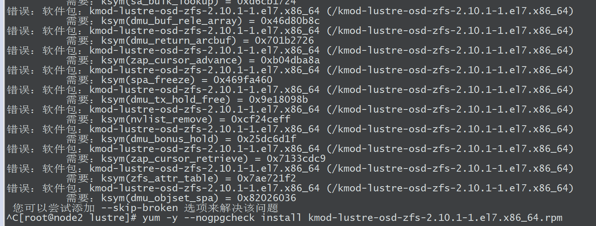

# 环境搭建

[TOC]


## 1、节点角色

主机名  |     IP地址       |  角色
---|:---|:---
node1  | 192.168.xxx.xx1  |  Client
node2  | 192.168.xxx.xx2  |  MGS MGT MDS MDT
node3  | 192.168.xxx.xx3  |  OSS OST
node4  | 192.168.xxx.xx4  |  OSS OST

## 2、硬件配置

主机名   | 角色              |   磁盘               |  内存  |  备注
---|:---|:---|:---|:---
node1   |  Client           |   一块（20GB）       |  2GB   |
node2   |  MGS MGT MDS MDT  |   两块（25GB+20GB）  |  2GB   |  两块磁盘是系统盘加存储盘
node3   |  OSS OST          |   两块（25GB+20GB）  |  2GB   |  同上
node4   |  OSS OST          |   两块（25GB+20GB）  |  2GB   |  同上

```sh
[root@node2 lustre]# fdisk -l

磁盘 /dev/sda：26.8 GB, 26843545600 字节，52428800 个扇区
Units = 扇区 of 1 * 512 = 512 bytes
扇区大小(逻辑/物理)：512 字节 / 512 字节
I/O 大小(最小/最佳)：512 字节 / 512 字节
磁盘标签类型：dos
磁盘标识符：0x000c5f94

   设备 Boot      Start         End      Blocks   Id  System
/dev/sda1   *        2048     2099199     1048576   83  Linux
/dev/sda2         2099200    52428799    25164800   8e  Linux LVM

磁盘 /dev/sdb：21.5 GB, 21474836480 字节，41943040 个扇区
Units = 扇区 of 1 * 512 = 512 bytes
扇区大小(逻辑/物理)：512 字节 / 512 字节
I/O 大小(最小/最佳)：512 字节 / 512 字节


磁盘 /dev/mapper/centos-root：23.6 GB, 23613931520 字节，46120960 个扇区
Units = 扇区 of 1 * 512 = 512 bytes
扇区大小(逻辑/物理)：512 字节 / 512 字节
I/O 大小(最小/最佳)：512 字节 / 512 字节


磁盘 /dev/mapper/centos-swap：2147 MB, 2147483648 字节，4194304 个扇区
Units = 扇区 of 1 * 512 = 512 bytes
扇区大小(逻辑/物理)：512 字节 / 512 字节
I/O 大小(最小/最佳)：512 字节 / 512 字节
```

## 3、软件版本

软件	    |    版本
---|:---
Lustre  | lustre-2.10.1

## 4、安装软件包

安装时注意：

- 先关闭selinux和防火墙
- 设置机器间的免密登录
- 软件间的依赖关系、安装顺序	
- 软件版本一致
- 系统内核和lustre版本一致

### 4.1、安装 e2fsprogs 相关包

	yum -y --nogpgcheck install
	....

下载地址：[https://downloads.whamcloud.com/public/e2fsprogs/latest/el7/RPMS/x86_64/](https://downloads.whamcloud.com/public/e2fsprogs/latest/el7/RPMS/x86_64/)

### 4.2、安装 kernel 相关包

	yum -y --nogpgcheck install
	kernel-3.10.0-693.2.2.el7_lustre.x86_64.rpm
	kernel-devel-3.10.0-693.2.2.el7_lustre.x86_64.rpm
	kernel-headers-3.10.0-693.2.2.el7_lustre.x86_64.rpm
	kernel-tools-libs-3.10.0-693.2.2.el7_lustre.x86_64.rpm
	kernel-tools-3.10.0-693.2.2.el7_lustre.x86_64.rpm
	kernel-tools-libs-devel-3.10.0-693.2.2.el7_lustre.x86_64.rpm

修改开机时默认使用的内核

	grub2-set-default 'CentOS Linux (kernel-3.10.0-693.2.2.el7_lustre.x86_64) 7 (Core)'

下载地址：[https://downloads.whamcloud.com/public/lustre/lustre-2.10.1/el7/server/RPMS/x86_64/](https://downloads.whamcloud.com/public/lustre/lustre-2.10.1/el7/server/RPMS/x86_64/)

如何修改默认启动内核：[https://blog.csdn.net/sinat_25606165/article/details/106693725](https://blog.csdn.net/sinat_25606165/article/details/106693725)

### 4.3、客户端安装

下载地址：[https://downloads.whamcloud.com/public/lustre/lustre-2.10.1/el7/client/RPMS/x86_64/](https://downloads.whamcloud.com/public/lustre/lustre-2.10.1/el7/client/RPMS/x86_64/)

	yum -y --nogpgcheck install 
    lustre-client-2.10.1-1.el7.x86_64.rpm
	lustre-client-dkms-2.10.1-1.el7.noarch.rpm
    lustre-iokit-2.10.1-1.el7.x86_64.rpm
    kmod-lustre-client-2.10.1-1.el7.x86_64.rpm
    lustre-osd-ldiskfs-mount-2.10.1-1.el7.x86_64.rpm       
	lustre-osd-zfs-mount-2.10.1-1.el7.x86_64.rpm 

执行 `rpm -qa | grep lustre` 查看是否安装成功。

安装完成后，需要重启机器。

重启后，执行如下命令，加载 lustre 模块。

```sh
[root@node1 ~]# cd /opt/lustre/
[root@node1 lustre]# modprobe lustre  # 如果安装成功，则不会报错。
```

关闭后，需要在各个节点再次运行 `modprobe lustre` 命令。

### 4.4、服务器端安装

下载地址：[https://downloads.whamcloud.com/public/lustre/lustre-2.10.1/el7/server/RPMS/x86_64/](https://downloads.whamcloud.com/public/lustre/lustre-2.10.1/el7/server/RPMS/x86_64/)

	yum -y --nogpgcheck install
	libzpool2-0.7.1-1.el7.x86_64.rpm
	libuutil1-0.7.1-1.el7.x86_64.rpm
	libnvpair1-0.7.1-1.el7.x86_64.rpm
	perf-3.10.0-693.2.2.el7_lustre.x86_64.rpm 
	python-perf-3.10.0-693.2.2.el7_lustre.x86_64.rpm
	libzfs2-0.7.1-1.el7.x86_64.rpm 
	libzfs2-devel-0.7.1-1.el7.x86_64.rpm
	spl-dkms-0.7.1-1.el7.noarch.rpm
	spl-0.7.1-1.el7.x86_64.rpm
	zfs-dkms-0.7.1-1.el7.noarch.rpm
	zfs-0.7.1-1.el7.x86_64.rpm
	kmod-lustre-2.10.1-1.el7.x86_64.rpm 
	lustre-osd-ldiskfs-mount-2.10.1-1.el7.x86_64.rpm
	lustre-osd-zfs-mount-2.10.1-1.el7.x86_64.rpm
	kmod-lustre-osd-ldiskfs-2.10.1-1.el7.x86_64.rpm
	lustre-dkms-2.10.1-1.el7.noarch.rpm
	lustre-iokit-2.10.1-1.el7.x86_64.rpm
	lustre-2.10.1-1.el7.x86_64.rpm                               

安装 `kmod-lustre-osd-zfs-2.10.1-1.el7.x86_64.rpm` 中，会报如下错误，暂未解决，但不影响后期配置。

                   

执行 `rpm -qa | grep lustre` 查看是否安装成功。

安装完成后，需要重启。

重启后，执行如下命令，加载 lustre 和 ldiskfs 模块。

```sh
[root@node2 lustre]# cd /opt/lustre/
[root@node2 lustre]# modprobe lustre
[root@node2 lustre]# modprobe ldiskfs

# 其他两个节点执行同样操作
[root@node3 lustre]# ....
[root@node4 lustre]# ....
```

### 4.5、配置

以上均执行完毕，进行配置。

在块设备上创建 MGS\MDT 组合文件系统。在 MDS 节点上运行：

```sh
# 这里的 /dev/sdb 就是新增的 20GB 的磁盘空间。新增磁盘后，执行 `fdisk -l` ，能找到即成功。
# 添加 --reformat 项是因为：
# mkfs.lustre FATAL: Device /dev/sdb was previously formatted for lustre. Use --reformat to reformat it, or tunefs.lustre to modify.
[root@node2 ~]# mkfs.lustre --reformat --fsname=lustrefs --mgs --mdt --index=0 /dev/sdb
Failed to initialize ZFS library: 256

   Permanent disk data:
Target:     lustrefs:MDT0000
Index:      0
Lustre FS:  lustrefs
Mount type: ldiskfs
Flags:      0x65
              (MDT MGS first_time update )
Persistent mount opts: user_xattr,errors=remount-ro
Parameters:

device size = 20480MB
formatting backing filesystem ldiskfs on /dev/sdb
        target name   lustrefs:MDT0000
        4k blocks     5242880
        options        -J size=819 -I 1024 -i 2560 -q -O dirdata,uninit_bg,^extents,dir_nlink,quota,huge_file,flex_bg -E lazy_journal_init -F
mkfs_cmd = mke2fs -j -b 4096 -L lustrefs:MDT0000  -J size=819 -I 1024 -i 2560 -q -O dirdata,uninit_bg,^extents,dir_nlink,quota,huge_file,flex_bg -E lazy_journal_init -F /dev/sdb 5242880
Writing CONFIGS/mountdata
```

在块设备上装入 MGS\MDT 组合文件系统。在 MDS 节点上运行：

```sh
[root@node2 mnt]# mount.lustre /dev/sdb /mnt/mdt/
Failed to initialize ZFS library: 256
mount.lustre: increased /sys/block/sdb/queue/max_sectors_kb from 512 to 4096

[root@node2 lustre]# df -h
文件系统                 容量  已用  可用 已用% 挂载点
devtmpfs                 899M     0  899M    0% /dev
tmpfs                    912M     0  912M    0% /dev/shm
tmpfs                    912M  9.5M  903M    2% /run
tmpfs                    912M     0  912M    0% /sys/fs/cgroup
/dev/mapper/centos-root   22G  8.2G   14G   38% /
/dev/sda1               1014M  197M  818M   20% /boot
tmpfs                    183M     0  183M    0% /run/user/0
/dev/sdb                  12G  2.3M   11G    1% /mnt/mdt
```

本例中，OSTs（ost0和ost1）在不同 OSSs（oss0和oss1）节点上创建。

在 oss0 上创建 ost0：

```sh 
# 这里是 node2 的 IP 地址
# 为增加调试日志的可读性，并更方便为多个接口调试配置，建议使用 IP 地址
[root@node3 ~]# mkfs.lustre --reformat --fsname=lustrefs --mgsnode=192.168.xxx.xx2@tcp  --ost  --index=0 /dev/sdb
Failed to initialize ZFS library: 256

   Permanent disk data:
Target:     lustrefs:OST0000
Index:      0
Lustre FS:  lustrefs
Mount type: ldiskfs
Flags:      0x62
              (OST first_time update )
Persistent mount opts: ,errors=remount-ro
Parameters: mgsnode=192.168.xxx.xx2@tcp

device size = 20480MB
formatting backing filesystem ldiskfs on /dev/sdb
        target name   lustrefs:OST0000
        4k blocks     5242880
        options        -J size=400 -I 512 -i 69905 -q -O extents,uninit_bg,dir_nlink,quota,huge_file,flex_bg -G 256 -E resize="4290772992",lazy_journal_init -F
mkfs_cmd = mke2fs -j -b 4096 -L lustrefs:OST0000  -J size=400 -I 512 -i 69905 -q -O extents,uninit_bg,dir_nlink,quota,huge_file,flex_bg -G 256 -E resize="4290772992",lazy_journal_init -F /dev/sdb 5242880
Writing CONFIGS/mountdata
```

在 OSS 上，载入 ost0，在 oss0 上运行：

```sh
[root@node3 mnt]# mkdir ost0

[root@node3 mnt]# mount.lustre /dev/sdb /mnt/ost0
Failed to initialize ZFS library: 256
mount.lustre: increased /sys/block/sdb/queue/max_sectors_kb from 512 to 4096

[root@node3 lustre]# df -h
文件系统                 容量  已用  可用 已用% 挂载点
devtmpfs                 899M     0  899M    0% /dev
tmpfs                    912M     0  912M    0% /dev/shm
tmpfs                    912M  9.5M  903M    2% /run
tmpfs                    912M     0  912M    0% /sys/fs/cgroup
/dev/mapper/centos-root   22G  8.2G   14G   38% /
/dev/sda1               1014M  197M  818M   20% /boot
tmpfs                    183M     0  183M    0% /run/user/0
/dev/sdb                  20G  1.1M   19G    1% /mnt/ost1
```

在 oss1 上创建 ost1：

```sh
[root@node4 mnt]# mkfs.lustre --reformat --fsname=lustrefs --mgsnode=192.168.xxx.xx2@tcp --ost --index=1 /dev/sdb
```

在 OSS 上，载入 ost1，在 oss1 上运行：

```sh
[root@node4 mnt]# mount.lustre /dev/sdb /mnt/ost1
```

在客户端上挂载 Lustre 文件系统，在客户端节点运行：

```sh
[root@node1 mnt]# mkdir /mnt/lustre
[root@node1 mnt]# mount.lustre 192.168.xxx.xx2@tcp:/lustrefs /mnt/lustre
```

## 5、启动与关闭

启动文件系统，各组件按如下顺序启动：

	挂载MGT --> 挂载MDT --> 挂载OST(s) --> 挂载Client

按如下顺序关闭，文件系统将完全关闭：

	Client --> MDS --> MGS --> OST(s)
	
	umount -a -t lustre
		其中，`-a -t lustre`不是文件系统名称，指代的是卸载 `/etc/mtab` 所有条目中的 lustre 类型。

## 6、测试

确认文件系统已成功启动，并正常工作。

运行如下命令，创建一个全为字符 0 的文件来验证写入功能：

```sh
# 执行 `dd --help` 查看 dd 命令用法
[root@node1 mnt]# dd if=/dev/zero of=/mnt/lustre/test.img bs=1M count=4500
记录了4500+0 的读入
记录了4500+0 的写出
4718592000字节(4.7 GB)已复制，11.3127 秒，417 MB/秒

[root@node2 mnt]# ....
[root@node3 mnt]# ....
[root@node4 mnt]# ....   
```

运行如下命令，查看每个 OST 和 MDT 的空间使用情况：

```sh
[root@node1 ~]# lfs df -h
UUID                       bytes        Used   Available Use% Mounted on
lustrefs-MDT0000_UUID       11.1G        2.3M       10.1G   0% /mnt/lustre[MDT:0]
lustrefs-OST0000_UUID       19.3G        1.2M       18.3G   0% /mnt/lustre[OST:0]
lustrefs-OST0001_UUID       19.3G        1.2M       18.3G   0% /mnt/lustre[OST:1]

filesystem_summary:        38.5G        2.4M       36.5G   0% /mnt/lustre
```

测试创建、删除目录：

```sh
# 执行 `lfs --list-commands` 查看 lfs 命令用法
# 创建一个目录，由 mdt0 提供服务
[root@node1 ~]# lfs mkdir -i 0 /mnt/lustre/test
[root@node1 ~]# cd /mnt/lustre/
[root@node1 lustre]# ls
test 

# 删除该目录
[root@node1 ~]# lfs rm_entry /mnt/lustre/test
[root@node1 ~]# ll /mnt/lustre/
总用量 0
```

使用 `lfs setstripe` 创建文件，并指定文件布局：

```sh
# 文件条带大小为4MB
[root@node1 ~]# lfs setstripe -S 4M /mnt/lustre/test.txt

[root@node1 ~]# ll /mnt/lustre/
总用量 0
-rw-r--r-- 1 root root 0 4月   8 11:32 test.txt

[root@node1 ~]# lfs getstripe /mnt/lustre/test.txt
/mnt/lustre/test.txt
lmm_stripe_count:  1
lmm_stripe_size:   4194304
lmm_pattern:       1
lmm_layout_gen:    0
lmm_stripe_offset: 0
        obdidx           objid           objid           group
             0              66           0x42                0
```

## 7、问题

问题一：安装 `spl-dkms-0.7.1-1.el7.noarch.rpm`，出现要求 dkms 大于 2.2.0.2，如果直接 yum 安装会出现 `没有可用软件包`。此时需要先执行 `yum install -y epel-release`，再安装 dkms。


问题二：安装 `libcom_err-...rpm`，出现类似 `已安装该包的较低版本，需要更高版本` 的错误，如果直接 `yum remove`，会出现 `错误：尝试移除受保护的 "systemd"` 这种错误。采用 `rpm -e --nodeps 包名` 的方式删除，但删除后，如果直接 `yum install` 安装，会出现 `libcom_err.so.2: cannot open shared object file: No such file or directory
` 错误，需要 `rpm -ivh 包名` 这种方式安装。

问题三：如果客户端没有识别 OST，查看 OST 机器上的防火墙有没有关闭，或者查看有没有设置免密登录。


参考：

[https://blog.csdn.net/spring_color/article/details/79301167](https://blog.csdn.net/spring_color/article/details/79301167)

[https://doc.lustre.org/lustre_manual.xhtml#configuringlustre](https://doc.lustre.org/lustre_manual.xhtml#configuringlustre)

[https://blog.csdn.net/tengh/article/details/9567763?utm_medium=distribute.pc_relevant_download.none-task-blog-2~default~BlogCommendFromBaidu~default-2.nonecase&dist_request_id=1328760.199.16171701704387499&depth_1-utm_source=distribute.pc_relevant_download.none-task-blog-2~default~BlogCommendFromBaidu~default-2.nonecas](https://blog.csdn.net/tengh/article/details/9567763?utm_medium=distribute.pc_relevant_download.none-task-blog-2~default~BlogCommendFromBaidu~default-2.nonecase&dist_request_id=1328760.199.16171701704387499&depth_1-utm_source=distribute.pc_relevant_download.none-task-blog-2~default~BlogCommendFromBaidu~default-2.nonecas)

[https://mp.weixin.qq.com/s/eJknjD6JCdKkrUeVnDGEjg](https://mp.weixin.qq.com/s/eJknjD6JCdKkrUeVnDGEjg)

[https://www.jianshu.com/p/f5fd95f0bd09](https://www.jianshu.com/p/f5fd95f0bd09)

[https://blog.csdn.net/weixin_39757626/article/details/111267468](https://blog.csdn.net/weixin_39757626/article/details/111267468)

[http://hmli.ustc.edu.cn/doc/linux/lustre/](http://hmli.ustc.edu.cn/doc/linux/lustre/)