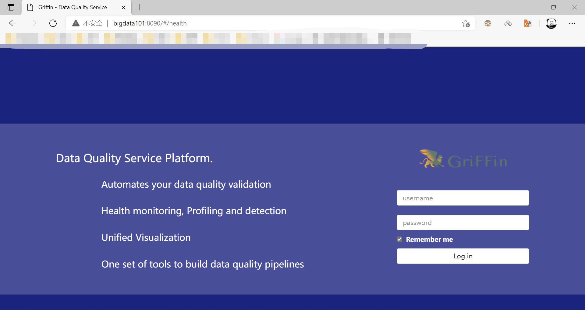

# 环境搭建

[TOC]

## 1 准备

为了减少安装中出现的错误，下载 griffin 后，查看下 `measure/pom.xml` 和 `service/pom.xml`文件，确定需要提前安装的软件的版本。

软件|  版本
---|:---
JDK | jdk1.8.0_271
MySQL | mysql5.6.24
Hadoop | hadoop-2.7.3
Hive  | hive-1.2.1
Spark | spark-2.2.1
Livy  | livy-0.7.1
ES | es-7.16.2 
MAVEN | maven-3.8.4

注：部分软件没有和 griffin 内部指定的版本对应，暂时没出现问题，但最好对应。

### mysql

安装方法见 `file` 目录下的 `尚硅谷MySQL安装`。

在 mysql 中创建数据库 `quartz`，然后执行 [Init_quartz_mysql_innodb.sql](https://github.com/apache/griffin/blob/master/service/src/main/resources/Init_quartz_mysql_innodb.sql) 脚本初始化表信息：

```sql
mysql> create database quartz;
Query OK, 1 row affected (0.00 sec)

mysql> use quartz;
Database changed

mysql> source /root/Init_quartz_mysql_innodb.sql;
Query OK, 0 rows affected, 1 warning (0.01 sec)
...

mysql> show tables;
+--------------------------+
| Tables_in_quartz         |
+--------------------------+
| QRTZ_BLOB_TRIGGERS       |
| QRTZ_CALENDARS           |
| QRTZ_CRON_TRIGGERS       |
| QRTZ_FIRED_TRIGGERS      |
| QRTZ_JOB_DETAILS         |
| QRTZ_LOCKS               |
| QRTZ_PAUSED_TRIGGER_GRPS |
| QRTZ_SCHEDULER_STATE     |
| QRTZ_SIMPLE_TRIGGERS     |
| QRTZ_SIMPROP_TRIGGERS    |
| QRTZ_TRIGGERS            |
+--------------------------+
11 rows in set (0.00 sec)
```

### hadoop\hive

hadoop 安装方法点 [这里](https://github.com/ZGG2016/knowledgesystem/tree/master/06%20Hadoop/%E7%8E%AF%E5%A2%83%E6%90%AD%E5%BB%BA)

hive 安装方法点 [这里](https://github.com/ZGG2016/knowledgesystem/blob/master/07%20Hive/%E7%8E%AF%E5%A2%83%E6%90%AD%E5%BB%BA.md)

在 hdfs 上创建 `/home/spark_conf` 目录，并将 `hive-site.xml` 上传到该目录下：

```SH
[root@bigdata101 opt]# hadoop fs -mkdir -p /home/spark_conf

[root@bigdata101 opt]# hadoop fs -put /opt/hive-1.2.1/conf/hive-site.xml /home/spark_conf/

[root@bigdata101 opt]# hadoop fs -ls /home/spark_conf
Found 1 items
-rw-r--r--   3 root supergroup       1259 2021-12-25 18:18 /home/spark_conf/hive-site.xml
```

启动 metastore

```sh
[root@bigdata101 opt]# nohup /opt/hive-1.2.1/bin/hive --service metastore >/dev/null 2>&1 &
[1] 3748
```

### livy

下载：[http://archive.apache.org/dist/incubator/livy/](http://archive.apache.org/dist/incubator/livy/)

```sh
[root@bigdata101 livy-0.7.1]# cat conf/livy.conf 
livy.server.host = bigdata101
livy.spark.master = yarn
livy.spark.deployMode = client
livy.repl.enableHiveContext = true
livy.server.port = 8998
```

执行命令 `bin/livy-server start` 启动

### spark

下载解压后，进行如下配置即可。

```sh
[root@bigdata101 conf]# cat spark-defaults.conf
spark.eventLog.enabled true
spark.eventLog.dir hdfs://bigdata101:9000/spark_directory

[root@bigdata101 conf]# cat spark-env.sh
YARN_CONF_DIR=/opt/hadoop-2.7.3/etc/hadoop 
export SPARK_HISTORY_OPTS="-Dspark.history.ui.port=18080 -Dspark.history.retainedApplications=30 -Dspark.history.fs.logDirectory=hdfs://bigdata101:9000/spark_directory"
```

把 hive 中 `lib/datanucleus-*.jar` 包拷贝到 spark 的 `jars/` 路径下。

把 hive 中 `conf/hive-site.xml` 包拷贝到 spark 的 `conf/` 路径下。

### es

安装方法点 [这里](https://github.com/ZGG2016/knowledgesystem/blob/master/21%20ElasticSearch/%E9%9B%86%E7%BE%A4%E7%8E%AF%E5%A2%83%E6%90%AD%E5%BB%BA.md)

启动 es 后，在 es 里创建 griffin 索引，并查看

```sh
# 来自https://blog.csdn.net/weixin_40004348/article/details/107191430
[root@cdh1 env]# curl -k -H "Content-Type: application/json" -X PUT http://cdh2:9200/griffin?include_type_name=true \
 -d '{
    "aliases": {},
    "mappings": {
        "accuracy": {
            "properties": {
                "name": {
                    "fields": {
                        "keyword": {
                            "ignore_above": 256,
                            "type": "keyword"
                        }
                    },
                    "type": "text"
                },
                "tmst": {
                    "type": "date"
                }
            }
        }
    },
    "settings": {
        "index": {
            "number_of_replicas": "2",
            "number_of_shards": "5"
        }
    }
}'


# 查看所有索引
[zgg@bigdata101 es-7.16.2]$ curl -X GET http://bigdata101:9200/_cat/indices
green open .geoip_databases HDSgUJ23Qwe-TI6KZ4e6Rw 1 1 43 46 224.8mb 111.9mb
green open griffin          h9fUJ3IpT9Sxcr4RbZKEKQ 5 2  0  0   3.3kb   1.1kb

# 查看索引griffin内容
[zgg@bigdata101 es-7.16.2]$ curl -X GET http://bigdata101:9200/griffin/_search?pretty
{
  "took" : 27,
  "timed_out" : false,
  "_shards" : {
    "total" : 5,
    "successful" : 5,
    "skipped" : 0,
    "failed" : 0
  },
  "hits" : {
    "total" : {
      "value" : 0,
      "relation" : "eq"
    },
    "max_score" : null,
    "hits" : [ ]
  }
}
```

### maven

下载：[https://maven.apache.org/download.cgi](https://maven.apache.org/download.cgi)

```xml
[root@bigdata101 maven-3.8.4]# cat conf/settings.xml
<!-- 添加阿里云镜像--> 
<mirror> 
	<id>nexus-aliyun</id> 
	<mirrorOf>central</mirrorOf> 
	<name>Nexus aliyun</name> 
	<url>http://maven.aliyun.com/nexus/content/groups/public</url>
</mirror> 
<mirror> 
	<id>UK</id> 
	<name>UK Central</name> 
	<url>http://uk.maven.org/maven2</url> 
	<mirrorOf>central</mirrorOf> 
</mirror> 
<mirror> 
	<id>repo1</id> 
	<mirrorOf>central</mirrorOf> 
	<name>Human Readable Name for this Mirror.</name> 
	<url>http://repo1.maven.org/maven2/</url> 
</mirror> 
<mirror> 
	<id>repo2</id> 
	<mirrorOf>central</mirrorOf> 
	<name>Human Readable Name for this Mirror.</name> 
	<url>http://repo2.maven.org/maven2/</url> 
</mirror>
```

### 配置环境变量

```sh
[root@bigdata101 opt]# cat /etc/profile   
export JAVA_HOME=/opt/jdk1.8.0_271
export HADOOP_HOME=/opt/hadoop-2.7.3
export HIVE_HOME=/opt/hive-1.2.1
export SCALA_HOME=/opt/scala-2.13.7
export SPARK_HOME=/opt/spark-3.2.0
export MAVEN_HOME=/opt/maven-3.8.4
export GRIFFIN_HOME=/opt/griffin-0.5.0
export LIVY_HOME=/opt/livy-0.7.1
export HADOOP_COMMON_HOME=/opt/hadoop-2.7.3
export HADOOP_COMMON_LIB_NATIVE_DIR=/opt/hadoop-2.7.3/lib/native
export HADOOP_HDFS_HOME=/opt/hadoop-2.7.3
export HADOOP_INSTALL=/opt/hadoop-2.7.3
export HADOOP_MAPRED_HOME=/opt/hadoop-2.7.3
export HADOOP_USER_CLASSPATH_FIRST=true
export HADOOP_CONF_DIR=$HADOOP_HOME/etc/hadoop

export PATH=.:$LIVY_HOME/bin:$GRIFFIN_HOME/bin:$MAVEN_HOME/bin:$SPARK_HOME/bin:$SCALA_HOME/bin:$HIVE_HOME/bin:$HIVE_HOME/sbin:$HADOOP_HOME/bin:$HADOOP_HOME/sbin:$JAVA_HOME/bin:$PATH
```

## 2 安装griffin

下载：[https://griffin.apache.org/docs/download.html](https://griffin.apache.org/docs/download.html)

### 配置配置文件

下载解压后，配置配置文件，如下：

`service/src/main/resources/application.properties`

```sh
# griffin server启动默认端口8080
server.port=8090
spring.application.name=griffin_service
spring.datasource.url=jdbc:mysql://bigdata101:3306/quartz?autoReconnect=true&useSSL=false
spring.datasource.username=root
spring.datasource.password=000000
spring.jpa.generate-ddl=true
spring.datasource.driver-class-name=com.mysql.jdbc.Driver
spring.jpa.show-sql=true
# Hive metastore
hive.metastore.uris=thrift://bigdata101:9083
hive.metastore.dbname=default
hive.hmshandler.retry.attempts=15
hive.hmshandler.retry.interval=2000ms
#Hive jdbc
hive.jdbc.className=org.apache.hive.jdbc.HiveDriver
hive.jdbc.url=jdbc:hive2://localhost:10000/
hive.need.kerberos=false
hive.keytab.user=xxx@xx.com
hive.keytab.path=/path/to/keytab/file
# Hive cache time
cache.evict.hive.fixedRate.in.milliseconds=900000
# Kafka schema registry
kafka.schema.registry.url=http://bigdata101:8081
# Update job instance state at regular intervals
jobInstance.fixedDelay.in.milliseconds=60000
# Expired time of job instance which is 7 days that is 604800000 milliseconds.Time unit only supports milliseconds
jobInstance.expired.milliseconds=604800000
# schedule predicate job every 5 minutes and repeat 12 times at most
#interval time unit s:second m:minute h:hour d:day,only support these four units
predicate.job.interval=5m
predicate.job.repeat.count=12
# external properties directory location
external.config.location=
# external BATCH or STREAMING env
external.env.location=
# login strategy ("default" or "ldap")
login.strategy=default
# ldap
ldap.url=ldap://hostname:port
ldap.email=@example.com
ldap.searchBase=DC=org,DC=example
ldap.searchPattern=(sAMAccountName={0})
# hdfs default name
fs.defaultFS=hdfs://bigdata101:9000
# elasticsearch
elasticsearch.host=bigdata101
elasticsearch.port=9200
elasticsearch.scheme=http
# elasticsearch.user = user
# elasticsearch.password = password
# livy
livy.uri=http://bigdata101:8998/batches
livy.need.queue=false
livy.task.max.concurrent.count=20
livy.task.submit.interval.second=3
livy.task.appId.retry.count=3
livy.need.kerberos=false
livy.server.auth.kerberos.principal=livy/kerberos.principal
livy.server.auth.kerberos.keytab=/path/to/livy/keytab/file
# yarn url
yarn.uri=http://bigdata102:8088
# griffin event listener
internal.event.listeners=GriffinJobEventHook

logging.file=logs/griffin-service.log
```

`service/src/main/resources/quartz.properties`

```sh
org.quartz.scheduler.instanceName=spring-boot-quartz
org.quartz.scheduler.instanceId=AUTO
org.quartz.threadPool.threadCount=5
org.quartz.jobStore.class=org.quartz.impl.jdbcjobstore.JobStoreTX
# If you use postgresql as your database,set this property value to org.quartz.impl.jdbcjobstore.PostgreSQLDelegate
# If you use mysql as your database,set this property value to org.quartz.impl.jdbcjobstore.StdJDBCDelegate
# If you use h2 as your database, it's ok to set this property value to StdJDBCDelegate, PostgreSQLDelegate or others
org.quartz.jobStore.driverDelegateClass=org.quartz.impl.jdbcjobstore.PostgreSQLDelegate
org.quartz.jobStore.useProperties=true
org.quartz.jobStore.misfireThreshold=60000
org.quartz.jobStore.tablePrefix=QRTZ_
org.quartz.jobStore.isClustered=true
org.quartz.jobStore.clusterCheckinInterval=20000
```

`service/src/main/resources/sparkProperties.json`

```sh
{
  "file": "hdfs://bigdata101:9000/griffin/griffin-measure.jar",
  "className": "org.apache.griffin.measure.Application",
  "queue": "default",
  "numExecutors": 2,
  "executorCores": 1,
  "driverMemory": "1g",
  "executorMemory": "1g",
  "conf": {
    "spark.yarn.dist.files": "hdfs://bigdata101:9000/home/spark_conf/hive-site.xml"
  },
  "files": [
  ]
}

```

`service/src/main/resources/env/env_batch.json`

```sh
{
  "spark": {
    "log.level": "INFO"
  },
  "sinks": [
    {
      "name": "console",
      "type": "CONSOLE",
      "config": {
        "max.log.lines": 10
      }
    },
    {
      "name": "hdfs",
      "type": "HDFS",
      "config": {
        "path": "hdfs://bigdata101:9000/griffin/persist",
        "max.persist.lines": 10000,
        "max.lines.per.file": 10000
      }
    },
    {
      "name": "elasticsearch",
      "type": "ELASTICSEARCH",
      "config": {
        "method": "post",
        "api": "hdfs://bigdata101:9000/griffin/accuracy",
        "connection.timeout": "1m",
        "retry": 10
      }
    }
  ],
  "griffin.checkpoint": []
}
```

`service/src/main/resources/env/env_streaming.json`

```sh
{
  "spark": {
    "log.level": "WARN",
    "checkpoint.dir": "hdfs://bigdata101:9000/griffin/checkpoint/${JOB_NAME}",
    "init.clear": true,
    "batch.interval": "1m",
    "process.interval": "5m",
    "config": {
      "spark.default.parallelism": 4,
      "spark.task.maxFailures": 5,
      "spark.streaming.kafkaMaxRatePerPartition": 1000,
      "spark.streaming.concurrentJobs": 4,
      "spark.yarn.maxAppAttempts": 5,
      "spark.yarn.am.attemptFailuresValidityInterval": "1h",
      "spark.yarn.max.executor.failures": 120,
      "spark.yarn.executor.failuresValidityInterval": "1h",
      "spark.hadoop.fs.hdfs.impl.disable.cache": true
    }
  },
  "sinks": [
    {
      "type": "CONSOLE",
      "config": {
        "max.log.lines": 100
      }
    },
    {
      "type": "HDFS",
      "config": {
        "path": "hdfs://bigdata101:9000/griffin/persist",
        "max.persist.lines": 10000,
        "max.lines.per.file": 10000
      }
    },
    {
      "type": "ELASTICSEARCH",
      "config": {
        "method": "post",
        "api": "hdfs://bigdata101:9000/griffin/accuracy"
      }
    }
  ],
  "griffin.checkpoint": [
    {
      "type": "zk",
      "config": {
        "hosts": "zk:2181",
        "namespace": "griffin/infocache",
        "lock.path": "lock",
        "mode": "persist",
        "init.clear": true,
        "close.clear": false
      }
    }
  ]
}
```

`service/pom.xml`

```xml
<!-- <dependency> 
	<groupId>org.postgresql</groupId> 
	<artifactId>postgresql</artifactId> 
	<version>${postgresql.version}</version> 
</dependency> --> 
<dependency> 
	<groupId>mysql</groupId> 
	<artifactId>mysql-connector-java</artifactId> 
</dependency> 
<!-- 注意:版本号删除掉 -->
```

### 编译

```sh
[root@bigdata101 griffin-0.5.0-src]# mvn clean
[root@bigdata101 griffin-0.5.0-src]# mvn -T2C install -DskipTests

[INFO] ------------------------------------------------------------------------
[INFO] Reactor Summary for Apache Griffin 0.5.0 0.5.0:
[INFO] 
[INFO] Apache Griffin 0.5.0 ............................... SUCCESS [  3.069 s]
[INFO] Apache Griffin :: UI :: Default UI ................. SUCCESS [02:05 min]
[INFO] Apache Griffin :: Web Service ...................... SUCCESS [01:02 min]
[INFO] Apache Griffin :: Measures ......................... SUCCESS [01:39 min]
[INFO] ------------------------------------------------------------------------
[INFO] BUILD SUCCESS
[INFO] ------------------------------------------------------------------------
[INFO] Total time:  02:08 min (Wall Clock)
[INFO] Finished at: 2021-12-26T12:04:02+08:00
[INFO] ------------------------------------------------------------------------
```

### 部署jar包

```sh
# 环境变量已在上面配置
[root@bigdata101 opt]# mkdir griffin-0.5.0

# 将 measure-0.5.0.jar 复制到 griffin-0.5.0 目录下，并重命名
[root@bigdata101 griffin-0.5.0-src]# cp measure/target/measure-0.5.0.jar $GRIFFIN_HOME/griffin-measure.jar

# 将 service-0.5.0.jar 复制到 griffin-0.5.0 目录下，并重命名
[root@bigdata101 griffin-0.5.0-src]# cp service/target/service-0.5.0.jar $GRIFFIN_HOME/griffin-service.jar

[root@bigdata101 griffin-0.5.0]# ls
griffin-measure.jar  griffin-service.jar

[root@bigdata101 griffin-0.5.0]# hadoop fs -mkdir -p /griffin/persist

[root@bigdata101 griffin-0.5.0]# hadoop fs -mkdir -p /griffin/checkpoint

# 将 griffin-measure.jar 上传到 hdfs
[root@bigdata101 griffin-0.5.0]# hadoop fs -put $GRIFFIN_HOME/griffin-measure.jar /griffin/

[root@bigdata101 griffin-0.5.0]# hadoop fs -ls /griffin
Found 3 items
drwxr-xr-x   - root supergroup          0 2021-12-26 12:27 /griffin/checkpoint
-rw-r--r--   3 root supergroup   46538384 2021-12-26 12:27 /griffin/griffin-measure.jar
drwxr-xr-x   - root supergroup          0 2021-12-26 12:27 /griffin/persist
```

```sh
[root@bigdata101 griffin-0.5.0]# nohup java -jar $GRIFFIN_HOME/griffin-service.jar >$GRIFFIN_HOME/service.out 2>&1 &

[root@bigdata101 griffin-0.5.0]# jps
2098 DataNode
2996 Master
3748 RunJar
2646 -- process information unavailable
2374 NodeManager
5206 griffin-service.jar
5271 Jps
3064 Worker
1994 NameNode
2555 LivyServer
```

浏览器输入 `http://bigdata101:8090/`，查看：



默认账户和密码都是无，直接点登录即可。  


## 3 测试

获取[源数据](https://griffin.apache.org/data/batch)

```sh
[root@bigdata101 griffin-0.5.0]# mkdir data/

wget https://griffin.apache.org/data/batch/create-table.hql
wget https://griffin.apache.org/data/batch/delta_src
wget https://griffin.apache.org/data/batch/delta_tgt
wget https://griffin.apache.org/data/batch/demo_basic
wget https://griffin.apache.org/data/batch/demo_src
wget https://griffin.apache.org/data/batch/demo_tgt
wget https://griffin.apache.org/data/batch/gen-hive-data.sh
wget https://griffin.apache.org/data/batch/gen_delta_src.sh
wget https://griffin.apache.org/data/batch/gen_demo_data.sh
wget https://griffin.apache.org/data/batch/insert-data.hql.template

[root@bigdata101 data]# ls
create-table.hql  delta_tgt   demo_src  gen_delta_src.sh  gen-hive-data.sh
delta_src         demo_basic  demo_tgt  gen_demo_data.sh  insert-data.hql.template

[root@bigdata101 data]# chmod 777 *

# 修改 create-table.hql 中的 LOCATION 路径
[root@bigdata101 data]# vi create-table.hql
...
LOCATION
  'hdfs://bigdata101:9000/griffin/data/batch/demo_src';
...
LOCATION
  'hdfs://bigdata101:9000/griffin/data/batch/demo_tgt';


# 生成测试数据
[root@bigdata101 data]# ./gen-hive-data.sh

hive> select * from demo_src limit 5; 
OK
0       1       1       20211226        13
0       2       2       20211226        13
0       3       3       20211226        13
0       4       4       20211226        13
0       5       5       20211226        13

hive> desc demo_src;
OK
id                      bigint                                      
age                     int                                         
desc                    string                                      
dt                      string                                      
hour                    string                                      
                 
# Partition Information          
# col_name              data_type               comment             
                 
dt                      string                                      
hour                    string  

hive> select * from demo_tgt limit 5; 
OK
0       1       1       20211226        13
0       2       2       20211226        13
0       3       3       20211226        13
0       4       4       20211226        13
0       5       5       20211226        13

hive> desc demo_tgt;
OK
id                      bigint                                      
age                     int                                         
desc                    string                                      
dt                      string                                      
hour                    string                                      
                 
# Partition Information          
# col_name              data_type               comment             
                 
dt                      string                                      
hour                    string                                      
Time taken: 0.468 seconds, Fetched: 11 row(s) 
```

创建数据质量规则

```sh
[root@bigdata101 griffin-0.5.0]# mkdir measures
[root@bigdata101 measures]# vi dq.json
{
  "name": "batch_accu",
  "process.type": "batch",
  "data.sources": [
    {
      "name": "src",
      "baseline": true,
      "connectors": [
        {
          "type": "hive",
          "version": "1.2",
          "config": {
            "database": "default",
            "table.name": "demo_src"
          }
        }
      ]
    }, {
      "name": "tgt",
      "connectors": [
        {

          "type": "hive",
          "version": "1.2",
          "config": {
            "database": "default",
            "table.name": "demo_tgt"
          }
        }
      ]
    }
  ],
  "evaluate.rule": {
    "rules": [
      {
        "dsl.type": "griffin-dsl",
        "dq.type": "accuracy",
        "out.dataframe.name": "accu",
        "rule": "src.id = tgt.id AND src.age = tgt.age AND src.desc = tgt.desc",
        "details": {
          "source": "src",
          "target": "tgt",
          "miss": "miss_count",
          "total": "total_count",
          "matched": "matched_count"
        },
        "out": [
          {
            "type": "metric",
            "name": "accu"
          },
          {
            "type": "record",
            "name": "missRecords"
          }
        ]
      }
    ]
  },
  "sinks": ["CONSOLE", "HDFS"]
}
```

指定结果存储路径

```sh
[root@bigdata101 measures]# vi env.json
{
  "spark": {
    "log.level": "WARN"
  },
  "sinks": [
    {
      "type": "CONSOLE",
      "config": {
        "max.log.lines": 10
      }
    },
    {
      "type": "HDFS",
      "config": {
        "path": "hdfs://bigdata101:9000/griffin/persist",
        "max.persist.lines": 10000,
        "max.lines.per.file": 10000
      }
    },
    {
      "type": "ELASTICSEARCH",
      "config": {
        "method": "post",
        "api": "http://bigdata101:9200/griffin/accuracy",
        "connection.timeout": "1m",
        "retry": 10
      }
    }
  ],
  "griffin.checkpoint": []
}
```

提交job

```sh
spark-submit --class org.apache.griffin.measure.Application --master yarn --deploy-mode client --queue default --driver-memory 1g --executor-memory 1g --num-executors 2 /opt/griffin-0.5.0-src/measure/target/griffin-measure.jar measures/env.json measures/dq.json
```

报错，见a.txt文件

## 4 问题

### 问题1

```sh
[INFO] ------------------------------------------------------------------------
[INFO] Reactor Summary for Apache Griffin 0.6.0 0.6.0:
[INFO] 
[INFO] Apache Griffin 0.6.0 ............................... SUCCESS [  6.164 s]
[INFO] Apache Griffin :: UI :: Default UI ................. FAILURE [06:54 min]
[INFO] Apache Griffin :: Web Service ...................... SUCCESS [02:10 min]
[INFO] Apache Griffin :: Measures ......................... SUCCESS [02:44 min]
[INFO] ------------------------------------------------------------------------
[INFO] BUILD FAILURE
[INFO] ------------------------------------------------------------------------
[INFO] Total time:  07:01 min (Wall Clock)
[INFO] Finished at: 2021-12-26T11:55:52+08:00
[INFO] ------------------------------------------------------------------------
[ERROR] Failed to execute goal com.github.eirslett:frontend-maven-plugin:1.6:npm (npm install) on project ui: Failed to run task: 'npm install' failed. org.apache.commons.exec.ExecuteException: Process exited with an error: 1 (Exit value: 1) -> [Help 1]
```

修改 `ui\pom.xml` 的如下内容：

原内容：

```xml
<!-- It will install nodejs and npm -->
<execution>
    <id>install node and npm</id>
    <goals>
        <goal>install-node-and-npm</goal>
    </goals>
    <configuration>
        <nodeVersion>v10.16.3</nodeVersion>
        <npmVersion>6.11.3</npmVersion>
		<nodeVersion>${node.version}</nodeVersion>
        <npmVersion>${npm.version}</npmVersion>
    </configuration>
</execution>
```

修改后：

```xml
<!-- It will install nodejs and npm -->
<execution>
    <id>install node and npm</id>
    <goals>
        <goal>install-node-and-npm</goal>
    </goals>
    <configuration>
        <nodeVersion>v10.16.3</nodeVersion>
        <npmVersion>6.11.3</npmVersion>
        <nodeDownloadRoot>http://nodejs.org/dist/</nodeDownloadRoot>
        <!-- <npmDownloadRoot>http://registry.npmjs.org/npm/</npmDownloadRoot> -->
        <npmDownloadRoot>http://registry.npm.taobao.org/npm/</npmDownloadRoot>
    </configuration>
</execution>
```     

### 问题2

```sh
[ERROR]
[ERROR] ERROR in /opt/soft/griffin-0.5.0/ui/angular/node_modules/@types/jquery/JQuery.d.ts (4137,26): Cannot find name 'SVGElementTagNameMap'.
[ERROR] ERROR in /opt/soft/griffin-0.5.0/ui/angular/node_modules/@types/jquery/JQuery.d.ts (4137,89): Cannot find name 'SVGElementTagNameMap'.
[ERROR]
[ERROR] npm ERR! Linux 3.10.0-514.el7.x86_64
[ERROR] npm ERR! argv "/opt/soft/griffin-0.5.0/ui/.tmp/node/node" "/opt/soft/griffin-0.5.0/ui/.tmp/node/node_modules/npm/bin/npm-cli.js" "run" "build         "
[ERROR] npm ERR! node v6.11.3
[ERROR] npm ERR! npm  v3.10.10
[ERROR] npm ERR! code ELIFECYCLE
[ERROR] npm ERR! griffin@0.0.0 build: `ng build`
[ERROR] npm ERR! Exit status 1
[ERROR] npm ERR!
[ERROR] npm ERR! Failed at the griffin@0.0.0 build script 'ng build'.
[ERROR] npm ERR! Make sure you have the latest version of node.js and npm installed.
[ERROR] npm ERR! If you do, this is most likely a problem with the griffin package,
[ERROR] npm ERR! not with npm itself.
[ERROR] npm ERR! Tell the author that this fails on your system:
[ERROR] npm ERR!     ng build
[ERROR] npm ERR! You can get information on how to open an issue for this project with:
[ERROR] npm ERR!     npm bugs griffin
[ERROR] npm ERR! Or if that isn't available, you can get their info via:
[ERROR] npm ERR!     npm owner ls griffin
[ERROR] npm ERR! There is likely additional logging output above.
[ERROR]
[ERROR] npm ERR! Please include the following file with any support request:
[ERROR] npm ERR!     /opt/soft/griffin-0.5.0/ui/angular/npm-debug.log
[INFO] ------------------------------------------------------------------------
[INFO] Reactor Summary for Apache Griffin 0.5.0 0.5.0:
[INFO]
[INFO] Apache Griffin 0.5.0 ............................... SUCCESS [ 16.497 s]
[INFO] Apache Griffin :: UI :: Default UI ................. FAILURE [24:12 min]
[INFO] Apache Griffin :: Web Service ...................... SKIPPED
[INFO] Apache Griffin :: Measures ......................... SKIPPED
[INFO] ------------------------------------------------------------------------
[INFO] BUILD FAILURE
[INFO] ------------------------------------------------------------------------
[INFO] Total time:  24:28 min
[INFO] Finished at: 2020-06-30T15:04:04+08:00
[INFO] ------------------------------------------------------------------------
[ERROR] Failed to execute goal com.github.eirslett:frontend-maven-plugin:1.6:npm (npm build) on project ui: Failed to run task: 'npm run build' faile         d. org.apache.commons.exec.ExecuteException: Process exited with an error: 1 (Exit value: 1) -> [Help 1]
[ERROR]
[ERROR] To see the full stack trace of the errors, re-run Maven with the -e switch.
[ERROR] Re-run Maven using the -X switch to enable full debug logging.
[ERROR]
[ERROR] For more information about the errors and possible solutions, please read the following articles:
[ERROR] [Help 1] http://cwiki.apache.org/confluence/display/MAVEN/MojoFailureException
[ERROR]
[ERROR] After correcting the problems, you can resume the build with the command
```
`vi /opt/soft/griffin-0.5.0/ui/angular/node_modules/@types/jquery/JQuery.d.ts`

删除4137这行

```
find<K extends keyof SVGElementTagNameMap>(selector_element: K | JQuery<K>): JQuery<SVGElementTagNameMap[K]>;
```

### 问题3

```sh
[INFO] ------------------------------------------------------------------------
[INFO] Reactor Summary for Apache Griffin 0.5.0 0.5.0:
[INFO]
[INFO] Apache Griffin 0.5.0 ............................... SUCCESS [  9.715 s]
[INFO] Apache Griffin :: UI :: Default UI ................. SKIPPED
[INFO] Apache Griffin :: Web Service ...................... FAILURE [02:55 min]
[INFO] Apache Griffin :: Measures ......................... SKIPPED
[INFO] ------------------------------------------------------------------------
[INFO] BUILD FAILURE
[INFO] ------------------------------------------------------------------------
[INFO] Total time:  03:08 min (Wall Clock)
[INFO] Finished at: 2019-05-27T14:27:07+08:00
[INFO] ------------------------------------------------------------------------
[ERROR] Failed to execute goal on project service: Could not resolve dependencies for project org.apache.griffin:service:jar:0.5.0: Could not find artifact io.confluent:kafka-schema-registry-client:jar:3.2.0 in nexus-aliyun (http://maven.aliyun.com/nexus/content/groups/public) -> [Help 1]
[ERROR]
[ERROR] To see the full stack trace of the errors, re-run Maven with the -e switch.
[ERROR] Re-run Maven using the -X switch to enable full debug logging.
[ERROR]
[ERROR] For more information about the errors and possible solutions, please read the following articles:
[ERROR] [Help 1] http://cwiki.apache.org/confluence/display/MAVEN/DependencyResolutionException
[ERROR]
[ERROR] After correcting the problems, you can resume the build with the command
[ERROR]   mvn <goals> -rf :service
```

[下载 kafka-schema-registry-client](https://github.com/Xiwu1994/griffin-kafka-schema-registry-client)，手动添加

```sh
mvn install:install-file -DgroupId=io.confluent -DartifactId=kafka-schema-registry-client -Dversion=3.2.0 -Dpackaging=jar -Dfile=kafka-schema-registry-client-3.2.0.jar
```

### 问题4

griffin-0.6.0 编译成功，但在执行 `nohup java -jar $GRIFFIN_HOME/griffin-service.jar >$GRIFFIN_HOME/service.out 2>&1 &` 时，依次出现如下错误：

```
/opt/griffin-0.6.0/griffin-service.jar中没有主清单属性
```

```
Error: A JNI error has occurred, please check your installation and try again
Exception in thread "main" java.lang.NoClassDefFoundError: javax/servlet/Filter

Caused by: java.lang.ClassNotFoundException: javax.servlet.Filter
```

未解决。

使用 0.5.0 版本没有出现此问题。

### 问题5

在测试提交 spark job 时，出现如下错误：

```
NoSuchMethodError: org.apache.spark.SparkConf.setAll(Lscala/collection/Traversable;)Lorg/apache/spark/SparkConf
```

安装的 spark 的版本与 griffin 内部指定的版本不一致，查看 `measure/pom.xml` 文件，更换对应的 spark 版本。

---------------------------------------------

参考：

[https://blog.csdn.net/weixin_40004348/article/details/107191430](https://blog.csdn.net/weixin_40004348/article/details/107191430)

[https://blog.csdn.net/github_39577257/article/details/90607081](https://blog.csdn.net/github_39577257/article/details/90607081)

[尚硅谷griffin]()

[https://blog.csdn.net/guanghuotainkong/article/details/112168871](https://blog.csdn.net/guanghuotainkong/article/details/112168871)