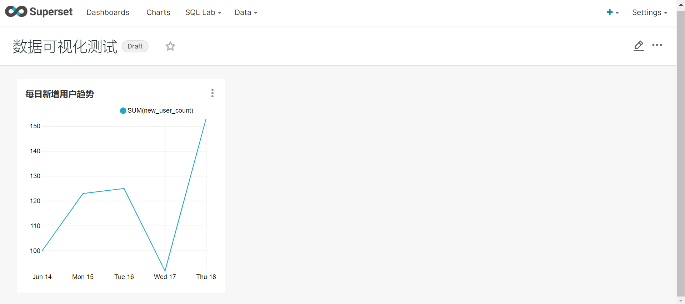

# superset连接mysql

安装依赖

```sh
(superset) [root@bigdata101 ~]# conda install mysqlclient
```

重启 superset

```sh
(superset) [root@bigdata101 ~]# superset.sh restart
重启 Superset
```

尚硅谷 superset 教程提供了详细的 web 页面操作过程，点 [这里](https://www.bilibili.com/video/BV1SL4y1a7WK?spm_id_from=333.999.0.0) 进入。

最终测试图如下：

