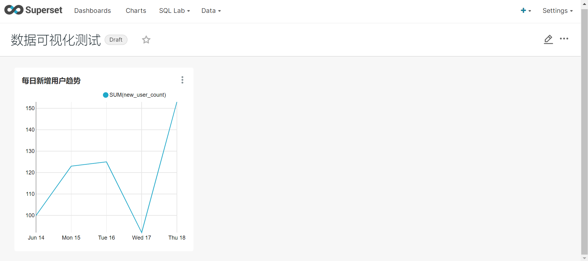

# 环境搭建及基本功能测试

[TOC]

## 1 准备

### 1.1 安装miniconda

下载 miniconda：[https://repo.anaconda.com/miniconda/Miniconda3-latest-Linux-x86_64.sh](https://repo.anaconda.com/miniconda/Miniconda3-latest-Linux-x86_64.sh)

安装 miniconda

```sh
bash Miniconda3-latest-Linux-x86_64.sh
```

在安装过程中，会提示指定安装路径

加载环境变量配置文件，使之生效

```sh
source ~/.bashrc
```

miniconda 安装完成后，每次打开终端都会激活其默认的 base 环境，我们可通过以下命令，禁止激活默认 base 环境。

```sh
conda config --set auto_activate_base false
```

### 1.2 创建python3.7环境

配置 conda 国内镜像

```sh
conda config --add channels https://mirrors.tuna.tsinghua.edu.cn/anaconda/pkgs/free

conda config --add channels https://mirrors.tuna.tsinghua.edu.cn/anaconda/pkgs/main
```

创建 python3.7 环境

```sh
conda create --name superset python=3.7
```

conda 环境管理常用命令:

	创建环境：conda create -n env_name python=3.7
	查看所有环境：conda info --envs
	删除一个环境：conda remove -n env_name --all

激活 superset 环境

```sh
(base) [root@bigdata101 ~]# conda activate superset
(superset) [root@bigdata101 ~]# 
```

退出当前环境

```sh
(superset) [root@bigdata101 ~]# conda deactivate
```

安装以下所需依赖

```sh
yum install -y gcc gcc c++ libffi-devel python-devel python-pip python-wheel python setuptools openssl-devel cyrus-sasl-devel openldap-devel
```

安装（更新）setuptools 和 pip

```sh
pip install --upgrade setuptools pip -i https://pypi.douban.com/simple/
```

## 2 部署

### 2.1 安装

安装 supetset

```sh
pip install apache-superset -i https://pypi.douban.com/simple/
```

初始化 supetset 数据库

```sh
superset db upgrade
```

创建管理员用户

```sh
(superset) [root@bigdata101 ~]# export FLASK_APP=superset
(superset) [root@bigdata101 ~]# superset fab create-admin
logging was configured successfully
2022-01-01 14:52:41,669:INFO:superset.utils.logging_configurator:logging was configured successfully
2022-01-01 14:52:41,675:INFO:root:Configured event logger of type <class 'superset.utils.log.DBEventLogger'>
/opt/miniconda3/envs/superset/lib/python3.7/site-packages/flask_caching/__init__.py:202: UserWarning: Flask-Caching: CACHE_TYPE is set to null, caching is effectively disabled.
  "Flask-Caching: CACHE_TYPE is set to null, "
Username [admin]: zgg
User first name [admin]:   # 这里可以空下
User last name [user]: 
Email [admin@fab.org]: 
Password: 
Repeat for confirmation: 
Recognized Database Authentications.
Admin User zgg created.
```

这里设置的用户名和密码需要在登录页面时使用。

superset 初始化

```sh
superset init
```

### 2.2 启动

安装 gunicorn

```sh
pip install gunicorn -i https://pypi.douban.com/simple/
```

启动 superset

```sh
gunicorn --workers 5 --timeout 120 --bind bigdata101:8787 "superset.app:create_app()" --daemon
```

访问 `http://bigdata101:8787`，登录 superset


### 2.3 停止

停掉 gunicorn 进程

```sh
ps -ef | awk '/superset/ && !/awk/{print $2}' | xargs kill -9
```

退出 superset 环境

```sh
conda deactivate
```

### 2.4 启停脚本

创建 superset.sh 文件

```sh
#!/bin/bash
superset_status(){
    result=`ps -ef | awk '/gunicorn/ && !/awk/{print $2}' | wc 
-l`
    if [[ $result -eq 0 ]]; then
        return 0
    else
        return 1
    fi
}
superset_start(){
    source ~/.bashrc
    superset_status >/dev/null 2>&1
    if [[ $? -eq 0 ]]; then
        conda activate superset ; gunicorn --workers 5 --timeout 120 --bind bigdata101:8787 --daemon 'superset.app:create_app()'
    else
         echo "superset 正在运行"
    fi
}
superset_stop(){
    superset_status >/dev/null 2>&1
    if [[ $? -eq 0 ]]; then
        echo "superset 未在运行"
    else
        ps -ef | awk '/gunicorn/ && !/awk/{print $2}' | xargs kill -9
    fi
}
case $1 in
    start )
        echo "启动 Superset"
        superset_start
    ;;
    stop )
        echo "停止 Superset"
        superset_stop
    ;;
    restart )
        echo "重启 Superset"
        superset_stop
        superset_start
    ;;
    status )
        superset_status >/dev/null 2>&1
        if [[ $? -eq 0 ]]; then
            echo "superset 未在运行"
        else
            echo "superset 正在运行"
        fi
esac
```

加执行权限

```sh
chmod +x superset.sh
```

启动 superset

```sh
superset.sh start
```

停止 superset

```sh
superset.sh stop
```

## 3 windows下部署

参考：[https://www.jianshu.com/p/8b27ff71429f](https://www.jianshu.com/p/8b27ff71429f)

[https://www.cnblogs.com/calmzeal/p/7359144.html](https://www.cnblogs.com/calmzeal/p/7359144.html)

相关问题解决：

[https://www.cnblogs.com/gambler/p/12949162.html](https://www.cnblogs.com/gambler/p/12949162.html)

[https://blog.csdn.net/seek97/article/details/109552886](https://blog.csdn.net/seek97/article/details/109552886)

[https://blog.csdn.net/sinat_29297223/article/details/89363726](https://blog.csdn.net/sinat_29297223/article/details/89363726)

## 4 问题

### 4.1 问题1

superset 创建 admin 用户失败报错：`Error! User already exists admin`

删除 superset.db 数据库文件，重新初始化数据库即可

```sh
[root@bigdata101 ~]# find / -name superset.db
/root/.superset/superset.db
[root@bigdata101 ~]# cd /root/.superset/
[root@bigdata101 .superset]# ls
superset.db
[root@bigdata101 .superset]# rm -f superset.db
```

### 4.2 问题2

安装中出现 `No PIL installation found`，手动安装即可，`pip install pillow`


## 5 对接mysql测试

安装依赖

```sh
(superset) [root@bigdata101 ~]# conda install mysqlclient
```

重启 superset

```sh
(superset) [root@bigdata101 ~]# superset.sh restart
重启 Superset
```

尚硅谷 superset 教程提供了详细的 web 页面操作过程，链接见文末。

最终测试图如下：




-------------------------------------------------

参考：

[尚硅谷superset教程](https://www.bilibili.com/video/BV1SL4y1a7WK?spm_id_from=333.999.0.0)

[https://blog.csdn.net/qq_33659001/article/details/109478889?utm_term=superset%E7%9A%84%E7%94%A8%E6%88%B7%E5%90%8D%E5%AF%86%E7%A0%81%E6%80%8E%E4%B9%88%E6%89%BE&utm_medium=distribute.pc_aggpage_search_result.none-task-blog-2~all~sobaiduweb~default-0-109478889&spm=3001.4430](https://blog.csdn.net/qq_33659001/article/details/109478889?utm_term=superset%E7%9A%84%E7%94%A8%E6%88%B7%E5%90%8D%E5%AF%86%E7%A0%81%E6%80%8E%E4%B9%88%E6%89%BE&utm_medium=distribute.pc_aggpage_search_result.none-task-blog-2~all~sobaiduweb~default-0-109478889&spm=3001.4430)

